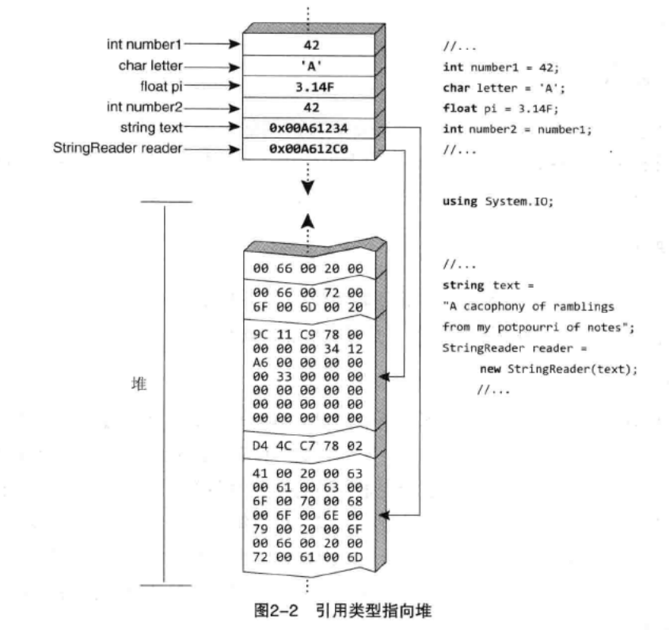
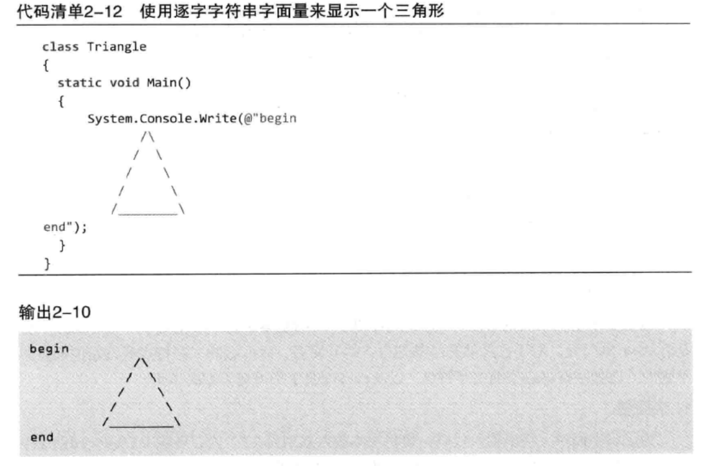
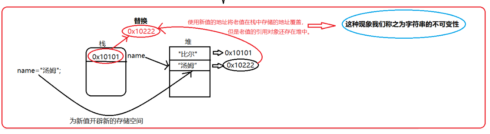
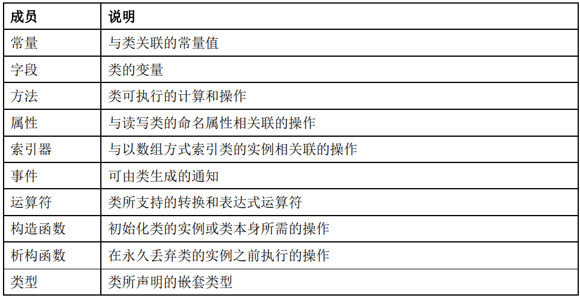
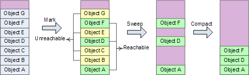
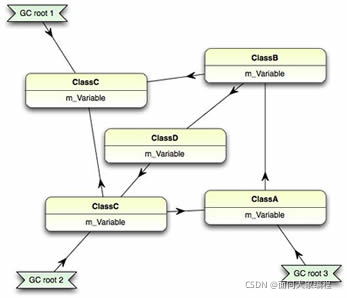
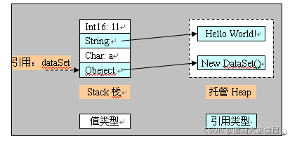

# C# 2.0

> C#语言规范5.0

## 1 介绍

### 1.1 Hello World

```c#
using System;
class Hello{
	static void Main(){
		Console.WriteLine("Hello,World!");
	}
}
```

### 1.2 程序结构

C#中组织结构的关键概念是：程序(program)、命名空间(namespace)、类型(type)、成员(member)和程序集(assembly)。

程序中声明类型，类型包含成员。类和接口就是类型的实例，字段(field)、方法、属性和事件是成员的示例。

在编译C#程序时，他们被物理地打包成程序集。程序集通常具有文件扩展名.exe或.dll，具体取决于它们是实现应用程序(application)还是实现库(library)（没有Main入口点的代码）。

### 1.3 类型和变量

#### 1.3.1 值类型和引用类型

C#的类型有两种：值类型(value type)和引用类型(reference type)。值类型的变量存储数据，而引用类型的变量存储对数据的引用（对象）。

##### 1 值类型

值类型直接包含值，换言之，变量引用的位置就是值在内存中实际存储的位置。因此，将第一个变量的值赋给第二个变量，会在新变量的位置创建原始变量的值的一个内存副本。类似的，将值类型的实例传给方法，如Console.WriteLine()，也会生成一个内存副本，在方法内部对参数值进行任何修改都不会影响原始值。

对于值类型，每个变量都有它们自己的数据副本（ref和out参数除外）。


##### 2 引用类型

相反，引用类型的变量存储的是对数据存储位置的引用，而不是直接存储数据。因此，为了访问数据，“运行时”要先从变量中读取内存位置，再“跳转”到包含数据的内存位置。



引用类型复制引用而不需要复制所引用的数据，表现为在栈内开辟一块新的空间，存储复制数据在堆中的地址，因此当有一个引用类型变量复制了另一个引用类型变量，该变量的改变也会引起另一个变量的改变。

#### 1.3.2 类型的进一步划分

而值类型和引用类型可以进一步划分：


八种整数类型分别支持8位、16位、32位和64位整数值的有符号和无符号形式。

两种浮点类型：float和double，分别使用32位单精度和64位双精度的IEEE 754格式表示。

decimal类型是128位的数据类型，适合用于财务计算和货币计算。

char类型表示一个UTF-16编码单元，string类型表示UTF-16编码单元的序列。


#### 1.3.3 用户可定义类型

C#程序使用类型声明创建新类型，类型声明指定新类型的名称和成员。在C#类型分类中，有五类是用户可定义的：

- 类类型(class type)【支持泛型】
  - 定义了一个包含数据成员（字段）和函数成员（方法、属性等）的数据结构。
- 结构类型(struct type)【支持泛型】
  - 定义了一个包含数据成员和函数成员的数据结构。但与类不同，结构是一种值类型，不需要堆分配。它不支持用户指定的继承，所有结构类型都隐式地从object继承。
- 接口类型(interface type)【支持泛型】
  - 接口类型定义了一个协定，作为一个公共函数成员的命名集。实现某个接口的类或结构必须提供该接口的函数成员的实现。一个接口可以从多个接口继承，而一个类或结构可以实现多个接口。
- 枚举类型(enum type)
  - 枚举类型是具有命名常量的特殊类型。每种枚举类型都有一个基础类型（八种整型之一）。
- 委托类型(delegate type)【支持泛型】
  - 委托类型表示对具有特定参数列表和返回类型的方法的引用。通过委托，我们能够将方法作为实体赋值给变量和作为参数传递。委托类似于其他语言中函数指针的概念，但与函数指针不同，委托是面向对象的，并且是类型安全的。

#### 1.3.6 string

##### @符号

在C#中，可以在字符串前面使用@符号，指明转义序列不被处理，结果是一个逐字字符串字面量，它会将反斜杠当作普通字符处理，还会逐字解释所有空白字符。

如以下代码中的三角形会在控制台上原样输出：



##### 字符串的不可变性

字符串的不可变性指的是当你给一个字符串重新赋值，会在堆中重新开辟一块空间存储新值，并将栈内存储的地址修改为新开辟空间的地址，而老的值会继续存在于堆中，等到垃圾回收时再被销毁。

字符串的不可变性是因为字符串底层的数组是由final修饰的。



#### 1.3.7 null&void&可空修饰符？

null值表示变量不引用任何有效的对象，void表示没有类型，或者没有任何值。

而对于每个不可以为null的值类型T，都有一个相应的可以为null的类型T?。该类型可以容纳附加值null。

#### 1.3.8 装箱和拆箱

装箱：值类型转换为引用类型。

拆箱：引用类型转换为值类型。

```c#
using System;
class Test{
	static void Main(){
		int i = 123;
		object o = i;     //Boxing
		int j = (int)o;   //Unboxing
	}
}
```

### 1.4 表达式


### 1.5 语句


try...catch：捕获在块的执行期间发生的异常。

try...finally：指定终止代码，不管是否发生异常，该代码都始终要执行。

checked和unchecked用于控制整型算术运算和转换的溢出检查上下文。

lock用于获取某个给定对象的互斥锁，执行一个语句，然后释放该锁。

using用于获取一个资源，执行一个语句，然后释放该资源。

### 1.6 类和对象

#### 1.6.1 简单类声明

```c#
public class Point{
	public int x,y;
	public Point(int x,int y){
		this.x = x;
		this.y = y;
	}
}
```

#### 1.6.2 成员

类成员或者是静态成员(static member)，或者是实例成员(instance member)。静态成员属于类，实例成员属于对象（类的实例）。

以下是类所能包含的成员种类：



#### 1.6.3 可访问性


- 命名空间隐式地具有public可访问性，在命名空间声明中不允许使用访问修饰符。
- 编译单元或命名空间中声明的类型可以具有public或internal可访问性，默认为internal。
- 类成员可以是五种可访问性的任意一种，默认为private。
- 结构成员可以具有public、internal或private中任意一种可访问性，默认为private，结构的成员若是在此结构中声明的（不是该结构从它的基类中继承的），则不能具有protected或protected internal可访问性。
- 接口成员隐式地具有public可访问性，在命名空间声明中不允许使用访问修饰符。
- 枚举成员隐式地具有public可访问性，在命名空间声明中不允许使用访问修饰符。

测试题1：

各访问修饰符的运用实例。


测试题2：

私有成员的可访问域只包括声明该成员的类型的程序文本。

```c#
class A{
	int x;
	static void F(B b){
		b.x = 1;        //ok
	} 
}
class B : A{
	static void F(B b){
		b.x = 1;        //error
	}
}
```

测试题3：

protected的访问范围。

```c#
class A{
	protected int x;
	static void F(A a,B b){
		a.x = 1;  //ok
		b.x = 1;  //ok
	}
}
class B : A{
	static void F(A a,B b){
		a.x = 1;  //error
		b.x = 1;  //ok
	}
}
```

在A中可以通过A和B的实例访问x，这是因为在两种情况下访问都通过A的实例或从A派生的类发生。

但是在B中，由于A不从B派生，所以不可能通过A的实例访问x。 

#### 1.6.4 类型参数（泛型

可以在类名后添加类型参数列表，用于声明类成员。

```c#
//联想：List<int>/List<string>...
public class Point<TFirst,TSecond>{
	public TFirst First;
	public TSecond Second;
}
public class Test{
    public static void Main(){
        Point<int,string> point = new Point<int,string>{First = 1,Second = "two"};
        int i = point.First;
        string s = point.Second;
    }
}
```

称在类名后添加类型参数列表的类类型为泛型类类型。

#### 1.6.5 基类

```c#
public class Point{
	public int x,y;
	public Point(int x,int y){
		this.x = x;
		this.y = y;
	}
}
public class Point3D : Point{
	public int z;
	public Point3D(int x,int y,int z):base(x,y){
		this.z = z;
	}
}
```

#### 1.6.6 字段

使用static修饰符声明的值字段定义了一个静态字段(static field)。无论对一个类创建多少实例，一个静态字段只有一个副本。

不使用static修饰符声明的字段定义了一个实例字段(instance field)。类的每个实例都为该类的所有实例字段包含一个单独副本。

#### 1.6.7 方法

##### 1 方法签名

方法的签名(signature)在声明该方法的类中必须唯一。方法的签名由方法的名称、类型参数的数目以及该方法的参数的数目、修饰符和类型组成。方法的签名不包含返回类型和params修饰符（可用于指定最右边的形参），也不包含可选类型形参约束。

如：

```c#
void Method(int a,int b){...}  //方法
Method(int,int)                //方法签名
```

##### 2 参数

参数用于向方法传递值或变量引用，有四类参数：值参数、引用参数、输出参数和参数数组。

**值参数(value parameter)**用于传递输入参数，一个值参数相当于一个局部变量（实际上，方法内操作的是值参数的副本），因此对值参数的修改不影响为该形参传递的实参。

**引用参数(reference parameter)**用于传递输入和输出参数，方法执行期间，引用参数和实参变量表示同一存储位置。引用参数可用**ref**修饰符声明。

```c#
using System;
class Test{
	static void Main(){
		int i = 1,j = 2;
		Swap(ref i,ref j);
		Console.WriteLine("{0} {1}",i,j);  //outputs"2 1"
	}
	static void Swap(ref int x,ref int y){
		int temp = x;
		x = y;
		y = temp;
	}
}
```

**输出参数(output parameter)**用于传递输出参数，对于输出参数来说，调用方提供的实参的初始值并不重要。输出参数可用**out**声明。

```c#
using System;
class Test{
	static void Main(){
		int res;
		Divide(10,3,out res);
		Console.WriteLine("{0}",res);  //outputs"3"
	}
	static void Divide(int x,int y,out int result){
		result = x/y;
	}
}
```

**参数数组(parameter array)**允许向方法传递可变数量的实参。参数数组用**params**修饰符声明，只有方法的最后一个参数才可以是参数数组，并且参数数组的类型必须是一维数组类型。

```c#
public class Console{
	public static void write(string fmt,params object[] args){...}
}
```

```c#
Console.Write("x={0}",x);
```

##### 3 静态方法和实例方法

静态方法(static method)通过类来访问，它只能访问静态成员。

实例方法(instance method)通过类的实例来访问，能够访问静态成员和实例成员。

##### 4 虚方法、重写方法和抽象方法

**虚方法(virtual)**

虚方法用virtual修饰，可以在派生类中重写(override)。当某个实例方法声明包括override修饰符时，该方法将重写所继承的具有相同签名的虚方法。虚方法声明用于引入新方法，而重写方法声明则用于使现有的虚方法专用化。

**抽象方法(abstract)**

抽象方法是没有实现的虚方法，只允许出现在同样被声明为abstract的类中。抽象方法必须在每个非抽象派生类中重写。

##### 5 方法重载(overloading)

方法重载允许同一类中的多个方法具有相同名称，条件是它们的签名在该类、结构或接口中是唯一的。

例如以下两个方法，虽然返回类型不同，但方法签名均为Method(int,int)，因此签名不唯一，不属于方法重载，会发生编译错误。

```c#
string Method(int a,int b){...}
int Method(int a,int b){...}
int Method(int a,params int b){...}
```

另外，虽然以下方法的方法签名不同，但ref和out不能仅作为签名区分的依据，因此也不属于方法重载，会发生编译错误。

```c#
void F(ref int n){...}   //F(ref int)  
void F(out int n){...}   //F(out int)
```

另外，在签名中，类型object和dynamic也被视为是相同的。

##### 6 构造函数&析构函数

**构造函数**

C#支持两种构造函数：静态构造函数和实例构造函数。实例构造函数是实现初始化类实例时所需操作的成员。静态构造函数是一种用于在第一次加载类本身时实现其初始化所需的成员。

**析构函数**

析构函数是一种实现销毁类实例所需操作的成员，垃圾回收期间会自动调用所涉及实例的析构函数。

##### 7 属性(property)

**示例代码**

```c#
public class Person{
	private string name;
	public string Name{
		get{return name;}
		set{name = value;}
	}
}
public class Program{
	Person person = new Person();
	person.Name = "manqi";
	Console.WriteLine(person.Name);
}
```

**联系**

在C#中，对于一些公有字段我们可以无限制地访问，但这样做可能导致我们不慎修改字段中的值。

属性中的get和set解决了访问字段时出现的问题。

**优点**

- 安全性：将读、写权限分开：get和set是分开实现的，保证了数据安全。
- 灵活性：给属性赋值或取值时，可以根据自己的需求实现各种不同的赋值或取值逻辑。

##### 8 索引器(indexer)

索引器支持按照索引数组的方法来索引对象。

例如List类就声明了一个索引器，该索引器接受一个int参数，使通过int值对List实例进行索引成为可能。

```c#
List<string> names = new List<string>();
names.Add("manqi");
Console.WriteLine(names[0]);
```

##### 9 事件(event)

事件是一种使类或对象能够提供通知的成员。事件的声明与字段类似，不同的是事件的声明包含event关键字，并且类型必须是委托类型。

客户端通过事件处理程序(event handle)来响应事件。事件处理程序使用+=运算符附加，使用-=运算符移除。

List类声明了一个名为Changed的事件成员，它指示已将一个新项添加到列表中。

下面的示例向Changed附加一个事件处理程序。

```c#
using Sysytem;
class Test{
	static int count;
	static void ListChanged(object sender,EventArgs e){
		count++;
	} 
	static void Main(){
		List<string> names = new List<string>();
		names.Changed += new EventHandle(ListChanged);
		names.Add("manqi");
		Console.WriteLine(count);  //output "1"
	}
}
```

### 1.7 结构(struct)

定义了一个包含数据成员和函数成员的数据结构。但与类不同，结构是一种值类型，不需要堆分配。它不支持用户指定的继承，所有结构类型都隐式地从object继承。

结构可以简单地视为值类型的类。

```c#
struct point{
	public int x,y;
	public Point(int x,int y){
		this.x = x;
		this.y = y;
	}
}
class Test{
	static void Main(){
		Point a = new Point(10,10);
		Point b = a;
		a.x = 20;
		Console.WriteLine(b.x);  //output: 10
	}
}
```

以上示例中，用a给b赋值实际上是创建了一个a的副本，因此对a.x的修改不会影响b.x。

可见结构相对于类的劣势是，复制整个结构通常不如复制对象引用的效率高。

### 1.8 数组

#### 1.8.1 数组类型

```
int[] 一维数组
int[,] 二维数组
int[,,] 三维数组
int[][] 一维数组的一维数组（交错数组
```

#### 1.8.2 一维数组

```c#
int[] array = new int[n];
```

#### 1.8.3 二维数组

```c#
int[,] array = new int[n,n];
int len = array.Length;       //len=n*n
```

#### 1.8.4 交错数组

```c#
int[][] array = new int[n][];
for(int i=0;i<n;i++) array[i] = new int[n];
int len1 = array.Length;
int len2 = array[0].Length;
```

### 1.9 接口(interface)

接口定义了一个可由类和结构实现的协定。接口可以包含方法、属性、事件和索引器。接口不提供它所定义的成员的实现，仅指定实现该接口的类或结构必须提供的成员。

接口支持多继承。

#### 1.9.1 接口的声明

```c#
interface IControl{
	void Paint();
}
interface ITextBox : IControl{
	void SetText(string text);
}
public class EditBox : IControl{
    public void Paint(){...}
}
```

#### 1.9.2 接口的显式和隐式转换

当类或结构实现某个特定接口时，该类或结构的实例可以隐式转换为该接口类型。

```c#
EditBox b = new EditBox();
IControl i = b;
```

在无法静态知道某个实例是否实现某个特定接口的情况下，可以使用动态类型强制转换。

```c#
Object b = new EditBox();
IControl i = (IControl)b;
```

#### 1.9.3 显式接口成员实现和访问

C#还支持显式接口成员实现，用来避免成员声明为public（如上述EditBox的Paint()成员）。

```c#
public class EditBox : IControl{
	void IControl.Paint(){...}
}
```

显式接口成员只能通过接口类型来访问。

```c#
EditBox b = new EditBox();
IControl c = b;
c.Paint();
```

### 1.10 枚举类型(enum)

枚举类型是具有一组命名常量的独特的值类型。

```c#
using System;
enum Color{
	Red,
	Green,
	Blue
}
class Test{
    static void Main(){
        Color c = Color.Red;
        PrintColor(c);
    }
	static void PrintColor(Color color){
		switch(color){
			case Color.Red:
				Console.WriteLine("Red");
				break;
			case Color.Green:
				Console.WriteLine("Green");
				break;
			case Color.Blue:
				Console.WriteLine("Blue");
				break;
			default:
				Console.WriteLine("Unknown color");
				break;
		}
	}
}
```

每个枚举类型都有一个相应的整型类型，称为该枚举类型的基础类型。没有显式声明基础类型的枚举类型默认基础类型是int。

```c#
enum Test : sbyte{
	Left = -1;
}
```

如上示例所示，枚举成员的声明中包含常量表达式，用于指定该成员的值。如果枚举成员声明未显式指定一个值，该成员将被赋予值0（如果它是该枚举类型中的第一个值）或前一个枚举成员（按照文本顺序）的值加1。

```c#
int i = (int)Color.Blue;  //i=2;
Color c = (Color)2;       //c=Color.Blue;
```

### 1.11 委托类型(delegate)

委托类型表示对具有特定参数列表和返回类型的方法的引用。通过委托，我们能够将方法作为实体赋值给变量和作为参数传递。委托类似于其他语言中函数指针的概念，但与函数指针不同，委托是面向对象的，并且是类型安全的。

下面的示例声明并使用一个名为Function的委托类型：


委托既可以引用静态方法（如上例中Square()和Math.Sin()），也可以引用实例方法（例如前一示例中的m.Multiply()）。

也可以用匿名类型创建委托，这是即时创建的“内联方法”。匿名函数可以查看外层方法的局部变量。因此，可以在不使用Mulitplier类的情况下更容易写出上面的乘法器：

```c#
double[] doubles = Apply(a,(double x)=>x*2.0);
```

## 3 基本概念

### 3.7 范围

在命名空间、类、结构或枚举成员的范围内，可以在位于该成员的声明之前的文本位置引用该成员，例如：

```c#
class A{
	void F(){
		i = 1;
	}
	int i = 0;
}
```

但在局部变量的范围内，在位于该局部变量之前的文本位置引用该局部变量是编译时错误，例如：

```c#
class A{
	int i = 0;
	void F(){
		i = 1;   //error
		int i;   
		i = 2;
	}
}
```

### 3.8 垃圾回收(GC)

#### 3.8.1 概念

**在创建对象的时候公共语言运行时（CLR）会从托管堆中为该对象分配内存，但是托管堆中的地址空间不是无限的，所以需要对已经不再使用的对象进行释放以回收内存空间，这个过程叫垃圾回收。**

在公共语言运行时 (CLR) 中，垃圾收集器 (GC) 充当自动内存管理器，管理应用程序的内存分配和释放。对于使用托管代码的开发人员来说，这意味着不必编写代码来执行内存管理任务。

GC以应用程序的root为基础，遍历应用程序在托管堆上上动态分配的所有对象，通过识别它们是否被引用来确定对象是否死亡。已经不再被应用程序的root或者别的对象所引用的对象就是已经死亡的对象，即所谓的垃圾，需要被回收。这就是GC工作的原理。为了实现这个原理，GC有多种算法。比较常见的算法有Reference Counting，Mark Sweep，Copy Collection等等。目前主流的虚拟系统.NET CLR，Java VM和Rotor都是采用的Mark Sweep算法。

#### 3.8.2 优点

GC有以下优点

- 使开发人员不必手动释放内存。
- 有效地在托管堆上分配内存空间。
- 回收不再使用的对象，使内存可用于其他分配。
- 通过确保一个对象不能使用分配给另一个对象的内存来保证内存安全。

总的说来就是GC可以使程序员可以从复杂的内存问题中摆脱出来，从而提高了软件开发的速度、质量和安全性。

#### 3.8.3 GC过程

##### 1 GC条件

- 系统内存过低时执行。
- 分配给各个对象的内存超过预先设定阈值。
- 手动调用GC.Collect

##### 2 GC步骤

- 标记（Mark）：从Root开始进行引用标记，未被标记到的为不可达内存，不可达内存为GC对象。
- 重新分配地址（Relocate）：更新所有活动对象列表中的所有对象的引用，以便它们指向对象将在压缩阶段重定位到的新位置。
- 压缩（Compact）：当部分内存被清除后，原本的内存空间变得不连续，因此剩余的存活对象需要按照原始顺序从基址开始重新排列。

##### 3 Mark-Compact 标记压缩算法

简单地把.NET的GC算法看作Mark-Compact算法。

**阶段1**：Mark-Sweep 标记清除阶段，先假设heap中所有对象都可以回收，然后找出不能回收的对象，给这些对象打上标记，最后heap中没有打标记的对象都是可以被回收的；

**阶段2**：Compact 压缩阶段，对象回收之后heap内存空间变得不连续，在heap中移动这些对象，使他们重新从heap基地址开始连续排列，类似于磁盘空间的碎片整理。Heap内存经过回收、压缩之后，可以继续采用前面的heap内存分配方法，即仅用一个指针记录heap分配的起始地址就可以。



主要处理步骤：

将线程挂起→确定roots→创建reachable objects graph→对象回收→heap压缩→指针修复。

可以这样理解roots：heap中对象的引用关系错综复杂（交叉引用、循环引用），形成复杂的graph，roots是CLR在heap之外可以找到的各种入口点。

GC搜索roots的地方包括全局对象、静态变量、局部对象、函数调用参数、当前CPU寄存器中的对象指针（还有finalization queue）等。主要可以归为2种类型：已经初始化了的静态变量、线程仍在使用的对象（stack+CPU register） 。

Reachable objects：指根据对象引用关系，从roots出发可以到达的对象。例如当前执行函数的局部变量对象A是一个root object，他的成员变量引用了对象B，则B是一个reachable object。从roots出发可以创建reachable objects graph，剩余对象即为unreachable，可以被回收 。



指针修复是因为compact过程移动了heap对象，对象地址发生变化，需要修复所有引用指针，包括stack、CPU register中的指针以及heap中其他对象的引用指针。

##### 4 Generational 分代算法

GC算法的设计考虑到了几个因素：

- 对于较大内存的对象，频繁的进行GC将耗费大量的资源，成本很高且效果较差。
- 大量新创建的对象生命周期都较短，老对象的生命周期都较长。
- 小部分的进行GC比大块的进行GC效率更高，消耗更少
  新创建的对象在内存分配上多为连续，且关联程度较强，关联度较强有利于CPU Cache命中。

基于此，按照寿命长短，托管堆被分为了三个年龄层，分别是Generation 0，Generation 1， Generation 2。垃圾收集器在第 0 代存储新对象。在应用程序生命周期早期创建的在收集过程中幸存下来的对象被提升并存储在第 1 代和第 2 代中。因为压缩托管堆的一部分比压缩整个堆要快，因此该方案允许垃圾收集器在特定代中释放内存，而不是在每次执行收集时释放整个托管堆的内存。

第 0 代。这是最年轻的一代，包含生命周期很短的对象。短期对象的一个例子是临时变量。垃圾收集在这一代发生得最频繁。新分配的对象形成了第0代的对象，并且是隐式的第 0 代集合。但是，对象很大，它们将进入大对象堆 (LOH)，有时也称为第3 代。第3 代可以理解为物理代，作为第二代的衍生。 大多数对象在第 0 代被回收用于垃圾收集，并且不会存活到下一代。

如果应用程序在第 0 代已满时尝试创建新对象，垃圾收集器将执行收集以尝试释放对象的地址空间。垃圾收集器首先检查第 0代中的对象，而不是托管堆中的所有对象。单独的第 0 代集合通常会回收足够的内存，使应用程序能够继续创建新对象。

第 1 代。这一代包含短期对象，并作为短期对象和长期对象之间的缓冲区。在垃圾收集器执行第 0代的收集后，它会压缩可访问对象的内存并将它们提升到第 1代。因为在收集中幸存下来的对象往往具有更长的生命周期，所以将它们提升到更高的代是有意义的。垃圾收集器不必在每次执行第 0 代收集时重新检查第 1 代和第 2 代中的对象。 如果第 0 代的集合没有为应用程序回收足够的内存来创建新对象，则垃圾收集器可以执行第1 代的收集，然后是第 2 代。第 1 代中在集合中幸存下来的对象将被提升到第 2 代。

第 2 代。这一代包含长期存在的对象。长寿命对象的一个示例是服务器应用程序中的对象，其中包含在进程持续期间有效的静态数据。在集合中存活的第 2 代对象将保留在第 2 代中，直到它们被确定在未来的集合中不可访问。 大对象堆（有时称为第3 代）上的对象也在第 2代中收集。
当条件允许时，垃圾收集发生在特定的世代。收集一代意味着收集该一代及其所有年轻一代的对象。第 2 代垃圾回收也称为完整垃圾回收，因为它回收所有代中的对象（即托管堆中的所有对象）。

当垃圾收集器检测到某一代存活率较高时，会增加该代的分配阈值。 下一个集合获得大量回收内存。 CLR 不断平衡两个优先级：不让应用程序的工作集因延迟垃圾收集而变得太大，以及不让垃圾收集运行得太频繁。

#### 3.8.4 托管和非托管资源

##### 1 托管资源

.NET中的所有类型都是（直接或间接）从System.Object类型派生的。

通用类型系统（CTS）区分两种基本类型：值类型和引用类型。它们之间的根本区别在于它们在内存中的存储方式。.NET使用两种不同的物理内存快来存储数据——栈和托管堆：


值类型在栈里，先进后出，值类型变量的生命有先后顺序，这个确保了值类型变量在退出作用域以前会释放资源。比引用类型更简单和高效。堆栈是从高地址往低地址分配内存。

引用类型分配在托管堆(Managed Heap)上，声明一个变量在栈上保存，当使用new创建对象时，会把对象的地址存储在这个变量里。托管堆相反，从低地址往高地址分配内存，如图：




##### 2 非托管资源

ApplicationContext, Brush, Component, ComponentDesigner, Container, Context, Cursor, FileStream, Font, Icon, Image, Matrix, Object, OdbcDataReader, OleDBDataReader, Pen, Regex, Socket, StreamWriter, Timer, Tooltip, 文件句柄, GDI资源, 数据库连接等等资源。

#### 3.8.5 GC注意事项

- 只管理内存，非托管资源需要用户管理。
- 循环引用，网状结构等的实现会变得简单。GC的标志——压缩算法能有效的检测这些关系，并将不再被引用的网状结构整体删除。
- GC在一个独立的线程中运行来删除不再被引用的内存。
- NET GC使用“代”（generations）的概念来优化性能。代帮助GC更迅速的识别那些最可能成为垃圾的对象。在上次执行完垃圾回收后新创建的对象为第0代对象。经历了一次GC周期的对象为第1代对象。经历了两次或更多的GC周期的对象为第2代对象。代的作用是为了区分局部变量和需要在应用程序生存周期中一直存活的对象。大部分第0代对象是局部变量。成员变量和全局变量很快变成第1代对象并最终成为第2代对象。


