# C#

## 1 垃圾回收（GC

### 1.1 概念

**在创建对象的时候公共语言运行时（CLR）会从托管堆中为该对象分配内存，但是托管堆中的地址空间不是无限的，所以需要对已经不再使用的对象进行释放以回收内存空间，这个过程叫垃圾回收。**

在公共语言运行时 (CLR) 中，垃圾收集器 (GC) 充当自动内存管理器，管理应用程序的内存分配和释放。对于使用托管代码的开发人员来说，这意味着不必编写代码来执行内存管理任务。

GC以应用程序的root为基础，遍历应用程序在托管堆上上动态分配的所有对象，通过识别它们是否被引用来确定对象是否死亡。已经不再被应用程序的root或者别的对象所引用的对象就是已经死亡的对象，即所谓的垃圾，需要被回收。这就是GC工作的原理。为了实现这个原理，GC有多种算法。比较常见的算法有Reference Counting，Mark Sweep，Copy Collection等等。目前主流的虚拟系统.NET CLR，Java VM和Rotor都是采用的Mark Sweep算法。

### 1.2 优点

GC有以下优点

- 使开发人员不必手动释放内存。
- 有效地在托管堆上分配内存空间。
- 回收不再使用的对象，使内存可用于其他分配。
- 通过确保一个对象不能使用分配给另一个对象的内存来保证内存安全。

总的说来就是GC可以使程序员可以从复杂的内存问题中摆脱出来，从而提高了软件开发的速度、质量和安全性。

### 1.3 GC过程

#### 1 GC条件

- 系统内存过低时执行。
- 分配给各个对象的内存超过预先设定阈值。
- 手动调用GC.Collect

#### 2 GC步骤

- 标记（Mark）：从Root开始进行引用标记，未被标记到的为不可达内存，不可达内存为GC对象。
- 重新分配地址（Relocate）：更新所有活动对象列表中的所有对象的引用，以便它们指向对象将在压缩阶段重定位到的新位置。
- 压缩（Compact）：当部分内存被清除后，原本的内存空间变得不连续，因此剩余的存活对象需要按照原始顺序从基址开始重新排列。

#### 3 Mark-Compact 标记压缩算法

简单地把.NET的GC算法看作Mark-Compact算法。

**阶段1**：Mark-Sweep 标记清除阶段，先假设heap中所有对象都可以回收，然后找出不能回收的对象，给这些对象打上标记，最后heap中没有打标记的对象都是可以被回收的；

**阶段2**：Compact 压缩阶段，对象回收之后heap内存空间变得不连续，在heap中移动这些对象，使他们重新从heap基地址开始连续排列，类似于磁盘空间的碎片整理。Heap内存经过回收、压缩之后，可以继续采用前面的heap内存分配方法，即仅用一个指针记录heap分配的起始地址就可以。

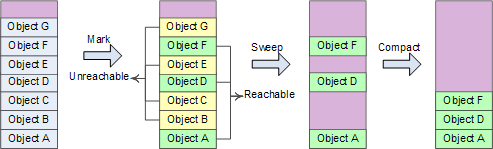

主要处理步骤：

将线程挂起→确定roots→创建reachable objects graph→对象回收→heap压缩→指针修复。

可以这样理解roots：heap中对象的引用关系错综复杂（交叉引用、循环引用），形成复杂的graph，roots是CLR在heap之外可以找到的各种入口点。

GC搜索roots的地方包括全局对象、静态变量、局部对象、函数调用参数、当前CPU寄存器中的对象指针（还有finalization queue）等。主要可以归为2种类型：已经初始化了的静态变量、线程仍在使用的对象（stack+CPU register） 。

Reachable objects：指根据对象引用关系，从roots出发可以到达的对象。例如当前执行函数的局部变量对象A是一个root object，他的成员变量引用了对象B，则B是一个reachable object。从roots出发可以创建reachable objects graph，剩余对象即为unreachable，可以被回收 。

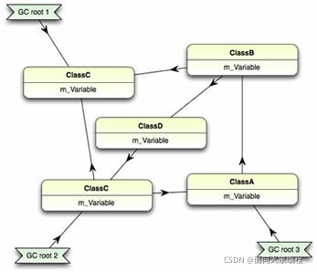

指针修复是因为compact过程移动了heap对象，对象地址发生变化，需要修复所有引用指针，包括stack、CPU register中的指针以及heap中其他对象的引用指针。

#### 4 Generational 分代算法

GC算法的设计考虑到了几个因素：

- 对于较大内存的对象，频繁的进行GC将耗费大量的资源，成本很高且效果较差。
- 大量新创建的对象生命周期都较短，老对象的生命周期都较长。
- 小部分的进行GC比大块的进行GC效率更高，消耗更少
  新创建的对象在内存分配上多为连续，且关联程度较强，关联度较强有利于CPU Cache命中。

基于此，按照寿命长短，托管堆被分为了三个年龄层，分别是Generation 0，Generation 1， Generation 2。垃圾收集器在第 0 代存储新对象。在应用程序生命周期早期创建的在收集过程中幸存下来的对象被提升并存储在第 1 代和第 2 代中。因为压缩托管堆的一部分比压缩整个堆要快，因此该方案允许垃圾收集器在特定代中释放内存，而不是在每次执行收集时释放整个托管堆的内存。

第 0 代。这是最年轻的一代，包含生命周期很短的对象。短期对象的一个例子是临时变量。垃圾收集在这一代发生得最频繁。新分配的对象形成了第0代的对象，并且是隐式的第 0 代集合。但是，对象很大，它们将进入大对象堆 (LOH)，有时也称为第3 代。第3 代可以理解为物理代，作为第二代的衍生。 大多数对象在第 0 代被回收用于垃圾收集，并且不会存活到下一代。

如果应用程序在第 0 代已满时尝试创建新对象，垃圾收集器将执行收集以尝试释放对象的地址空间。垃圾收集器首先检查第 0代中的对象，而不是托管堆中的所有对象。单独的第 0 代集合通常会回收足够的内存，使应用程序能够继续创建新对象。

第 1 代。这一代包含短期对象，并作为短期对象和长期对象之间的缓冲区。在垃圾收集器执行第 0代的收集后，它会压缩可访问对象的内存并将它们提升到第 1代。因为在收集中幸存下来的对象往往具有更长的生命周期，所以将它们提升到更高的代是有意义的。垃圾收集器不必在每次执行第 0 代收集时重新检查第 1 代和第 2 代中的对象。 如果第 0 代的集合没有为应用程序回收足够的内存来创建新对象，则垃圾收集器可以执行第1 代的收集，然后是第 2 代。第 1 代中在集合中幸存下来的对象将被提升到第 2 代。

第 2 代。这一代包含长期存在的对象。长寿命对象的一个示例是服务器应用程序中的对象，其中包含在进程持续期间有效的静态数据。在集合中存活的第 2 代对象将保留在第 2 代中，直到它们被确定在未来的集合中不可访问。 大对象堆（有时称为第3 代）上的对象也在第 2代中收集。
当条件允许时，垃圾收集发生在特定的世代。收集一代意味着收集该一代及其所有年轻一代的对象。第 2 代垃圾回收也称为完整垃圾回收，因为它回收所有代中的对象（即托管堆中的所有对象）。

当垃圾收集器检测到某一代存活率较高时，会增加该代的分配阈值。 下一个集合获得大量回收内存。 CLR 不断平衡两个优先级：不让应用程序的工作集因延迟垃圾收集而变得太大，以及不让垃圾收集运行得太频繁。

### 1.4 托管和非托管资源

#### 1 托管资源

.NET中的所有类型都是（直接或间接）从System.Object类型派生的。

通用类型系统（CTS）区分两种基本类型：值类型和引用类型。它们之间的根本区别在于它们在内存中的存储方式。.NET使用两种不同的物理内存快来存储数据——栈和托管堆：

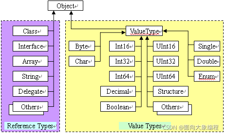

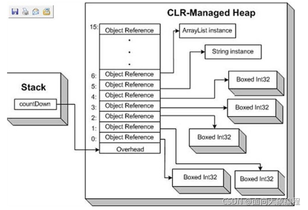

值类型在栈里，先进后出，值类型变量的生命有先后顺序，这个确保了值类型变量在退出作用域以前会释放资源。比引用类型更简单和高效。堆栈是从高地址往低地址分配内存。

引用类型分配在托管堆(Managed Heap)上，声明一个变量在栈上保存，当使用new创建对象时，会把对象的地址存储在这个变量里。托管堆相反，从低地址往高地址分配内存，如图：


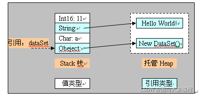

#### 2 非托管资源

ApplicationContext, Brush, Component, ComponentDesigner, Container, Context, Cursor, FileStream, Font, Icon, Image, Matrix, Object, OdbcDataReader, OleDBDataReader, Pen, Regex, Socket, StreamWriter, Timer, Tooltip, 文件句柄, GDI资源, 数据库连接等等资源。

### 1.5 GC注意事项

- 只管理内存，非托管资源需要用户管理。
- 循环引用，网状结构等的实现会变得简单。GC的标志——压缩算法能有效的检测这些关系，并将不再被引用的网状结构整体删除。
- GC在一个独立的线程中运行来删除不再被引用的内存。
- NET GC使用“代”（generations）的概念来优化性能。代帮助GC更迅速的识别那些最可能成为垃圾的对象。在上次执行完垃圾回收后新创建的对象为第0代对象。经历了一次GC周期的对象为第1代对象。经历了两次或更多的GC周期的对象为第2代对象。代的作用是为了区分局部变量和需要在应用程序生存周期中一直存活的对象。大部分第0代对象是局部变量。成员变量和全局变量很快变成第1代对象并最终成为第2代对象。

## 2 数据类型

### 2.1 基本数值类型

#### 1 整数类型

整数值通常默认为int。

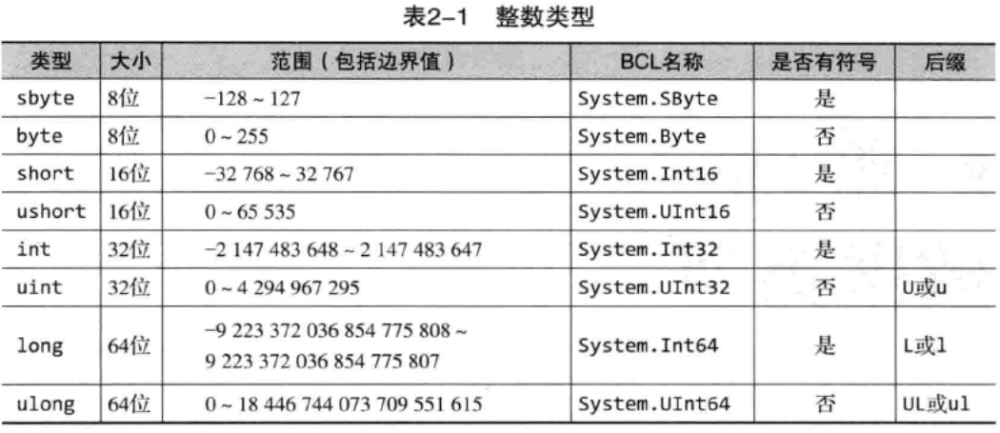

#### 2 浮点类型

带小数点值通常默认为double。

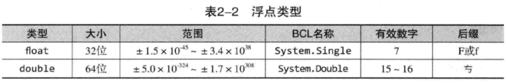

#### 3 decimal类型

与浮点数不同，decimal类型保证范围内所有十进制数都是精确的。它适合大而精确的计算，尤其是金融计算。

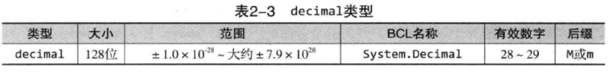

#### 4 字面值

表示源代码中的固定值。

PS：将数格式化成十六进制，必须使用x或X说明符，大小写决定了十六进制中字母的大小写。

eg：

```c#
System.Console.WriteLine("0x{0:X}",42);
```

输出：0x2A（42的十六进制

### 2.2 更多基本类型

#### 1 布尔类型（bool

true/false。

#### 2 字符类型（char

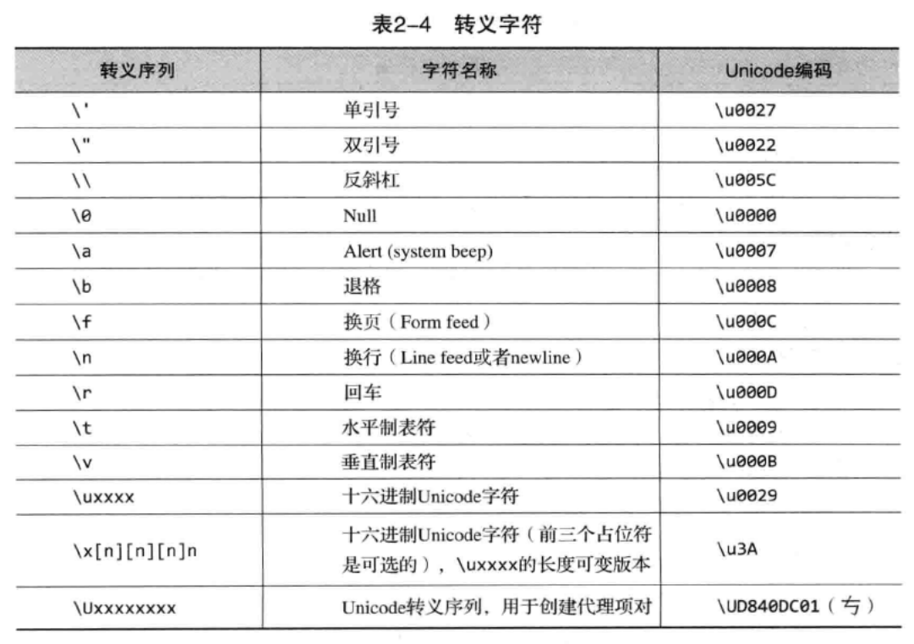

#### 3 字符串类型（string

##### @符号

在C#中，可以在字符串前面使用@符号，指明转义序列不被处理，结果是一个逐字字符串字面量，它会将反斜杠当作普通字符处理，还会逐字解释所有空白字符。

如以下代码中的三角形会在控制台上原样输出：

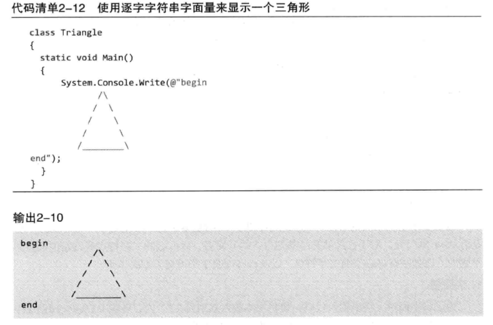

##### 字符串的不可变性

字符串的不可变性指的是当你给一个字符串重新赋值，会在堆中重新开辟一块空间存储新值，并将栈内存储的地址修改为新开辟空间的地址，而老的值会继续存在于堆中，等到垃圾回收时再被销毁。

字符串的不可变性是因为字符串底层的数组是由final修饰的。

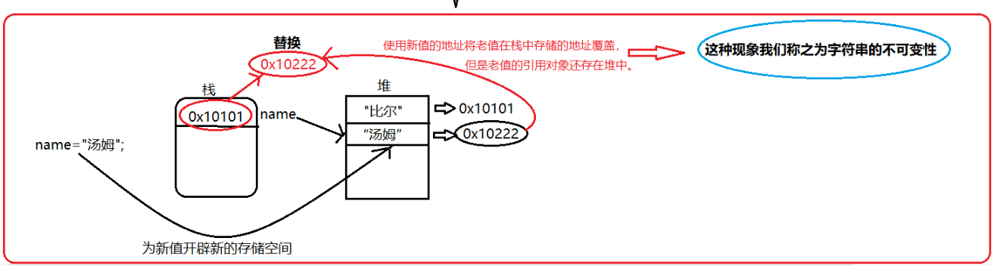

### 2.3 null和void

null值表示变量不引用任何有效的对象，void表示没有类型，或者没有任何值。

### 2.4 类型的分类

所有类型都可以划分为值类型和引用类型两类，它们的区别在于复制方式：值类型的数据总是进行值复制，而引用类型的数据总是进行引用复制。

#### 1 值类型

除了string，目前提到的所有预定义类型都是值类型，值类型直接包含值，换言之，变量引用的位置就是值在内存中实际存储的位置。因此，将第一个变量的值赋给第二个变量，会在新变量的位置创建原始变量的值的一个内存副本。类似的，将值类型的实例传给方法，如Console.WriteLine()，也会生成一个内存副本。在方法内部对参数值进行任何修改都不会影响原始值。

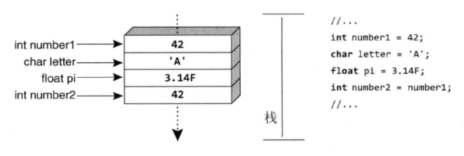

#### 2 引用类型

相反，引用类型的变量存储的是对数据存储位置的引用，而不是直接存储数据。因此，为了访问数据，“运行时”要先从变量中读取内存位置，再“跳转”到包含数据的内存位置。

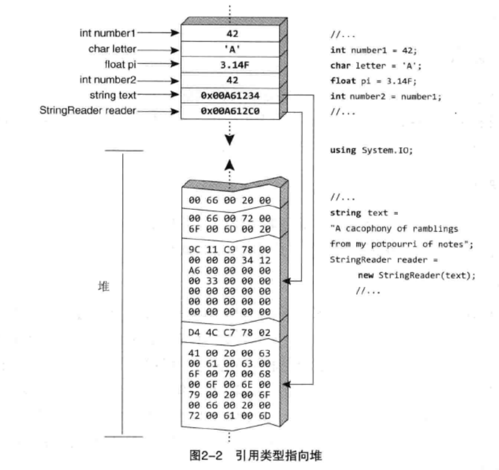

引用类型复制引用而不需要复制所引用的数据，表现为在栈内开辟一块新的空间，存储复制数据在堆中的地址，因此当有一个引用类型变量复制了另一个引用类型变量，该变量的改变也会引起另一个变量的改变。

### 2.5 可空修饰符

一般不能把null赋值给值类型，这是因为值类型不能包含引用，即便是对“无”的引用。

我们使用可空修饰符？声明可以存储null的值类型变量。

```c#
int? count = null;
while(count==null){...}
```

### 2.6 数据类型之间的转换

有可能造成大小变小或者引发异常的任何转换都需要执行显式转换，如long->int，而会造成大小变小或引发异常的任何转换都属于隐式转换。

#### 1 显式转换

##### 转型操作符（）

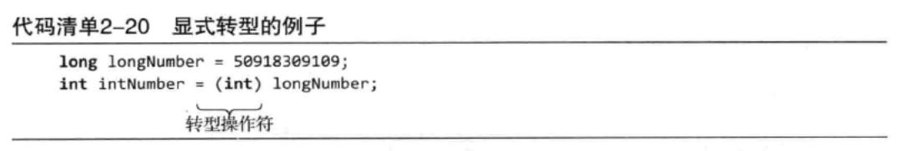

##### checked和unchecked转换

在checked块内，如果在运行时发生一次溢出的赋值，就会引发异常，如：

```c#
checked{
	int n = int.MaxValue;
	n = n+1;
	System.Console.WriteLine(n);
}
```

以上代码会使“运行时”引发System.OverflowException异常。

而C#还支持unchecked块，它强制不进行溢出检查，不会为块中溢出的赋值引发异常。

```c#
unchecked{
	int n = int.MaxValue;
	n = n+1;
	System.Console.WriteLine(n);
}
```

输出：

```c#
-2147483648
```

#### 2 隐式转换

int->long，不会发生精度丢失，所以代码只需指定赋值操作符，转换将隐式发生。

```c#
int nums = 31416;
long res = nums;
```

#### 3 不使用转型操作符的类型转换

##### Parse()

将字符串转换成对应的数据类型。

```c#
int.Parse(string)
float.Parse(string)
```

##### TryParse()

TryParse()和Parse()的区别是，假如转换失败，TryParse()不会引发异常。

```c#
double num;
string str = System.Console.ReadLine();
if(double.TryParse(str,out num)){
	...
}else System.Console.WriteLine("转换失败");
```

##### System.Convert

```c#
string str = "261.626";
double num = System.Convert.ToDouble(str);
```

##### ToString()

```c#
bool temp = true;
string str = temp.ToString();
Console.WriteLine(str);
```

对于大多数类型，ToString()方法只是返回数据类型的名称，而不是数据的字符串表示，只有在类型显式实现了ToString()方法的前提下才会返回字符串表示。

### 2.7 数组

**数组是存放在连续内存空间上的相同类型数据的集合。**

数组使用内存管理器实现按下标访问元素，所以访问时间复杂度为O(1)，但查找和删除均为O(n)。

一维数组：

```c#
int[] array = new int[n];
```

二维数组：

```c#
int[,] array = new int[n,n];
int len = array.Length;       //len=n*n
```

交错数组：

```c#
int[][] array = new int[n][];
for(int i=0;i<n;i++) array[i] = new int[n];
int len1 = array.Length;
int len2 = array[0].Length;
```

### 2.8 字段&属性

#### 1 示例代码

```c#
public class Person{
	private string name;
	public string Name{
		get{return name;}
		set{name = value;}
	}
}
public class Program{
	Person person = new Person();
	person.Name = "manqi";
	Console.WriteLine(person.Name);
}
```

#### 2 联系

在C#中，对于一些公有字段我们可以无限制地访问，但这样做可能导致我们不慎修改字段中的值。

属性中的get和set解决了访问字段时出现的问题。

#### 3 属性的优点

- 安全性：将读、写权限分开：get和set是分开实现的，保证了数据安全。
- 灵活性：给属性赋值或取值时，可以根据自己的需求实现各种不同的赋值或取值逻辑。

## 3 控制流&方法

省略了一些简单部分。

### 3.1 控制流语句

#### 1 foreach

必须注意，foreach循环期间禁止修改循环变量。

#### 2 switch

```c#
switch(expression){
	case constant:
		statements
	default:
		statements
}
```

expression：要与不同常量比较的值，该表达式的类型决定了switch的主导类型。

constant：与主导类型兼容的任何常量表达式。

```c#
switch(input){
	case"1":
	case"2":
		valid = true;
		break;
	case"":
	case"quit":
		valid = true;
		break;
	default:
		System.Console.WriteLine("...");
		break;
}
return valid;
```

#### 3 跳转语句goto

带有goto的switch语句：

```c#
switch(option){
	case"/out":
		...
		goto defalut;
	case...:
		...
	default:
		if(...){}
		else{}
		break;
}
```

### 3.2 方法的参数

#### 1 引用参数（ref

引用参数使参数按引用的方式进行传递。

```c#
static void Main(){
    string str1 = "Hello";
	string str2 = "World";
	Swap(ref str1,ref str2);
	Console.WriteLine(str1+" "+str2);
}
static void Swap(ref string str1,ref string str2){
    string temp = str1;
    str1 = str2;
    str2 = temp;
}
```

输出：

```
World Hello
```

#### 2 输出参数（out

如前所述，用作ref参数的变量必须在传给被调用方法前进行赋值。然而，方法经常要获取一个变量引用，并且只向变量中写入而不从中读取，这时更安全的做法是以传引用的方式传入一个未初始化的局部变量。

```
略，用法与ref相似，只是在传入前不需要赋值，而是在方法中进行赋值。
```

#### 3 string作为参数的传值特殊性

C#中的string是引用传递，但具有值传递的效果。

这是因为string具有不可变性，如果在方法内对string进行更改，其实是生成了另一个string，函数里的string指向新string，而函数外的string还是原来的string，因此具有值传递的效果。

```c#
public void Main(){
	string str = "H";
    Method(str);
    Console.WriteLine(str);
}
private void Method(string s){
	s = "Hello";
}
```

输出：

```
H
```

理解：string按引用进行传递，所以在传递时s变量指向的栈空间存储了str指向的栈空间存储的地址，而在对s进行改变时，由于string的不可变性，s存储了新值的地址，而原来的str仍存储原来的地址。

当使用ref作为参数前缀：

如果被调用的方法将参数指定为ref，那么调用者在调用这个方法的时候，提供的实参应该是附加了ref前缀的变量（而不是值），也就是说，ref参数只是传递的变量的别名，系统是直接对函数外的string变量进行操作的。

```c#
public void Main(){
	string str = "H";
    Method(ref str);
    Console.WriteLine(str);
}
private void Method(ref string s){
	s = "Hello";
}
```

输出：

```
Hello
```

### 3.3 方法重载

方法重载是一种编译时多态，指的是一个类包含两个或者更多同名的方法。

### 3.4 用异常实现基本错误处理

#### 1 捕捉错误

try块将可能引发异常的代码包围起来，而后紧跟一个或多个catch块（和一个finally块），catch块可选择指定异常类型，只要数据类型与异常类型匹配，对应catch块就会执行。

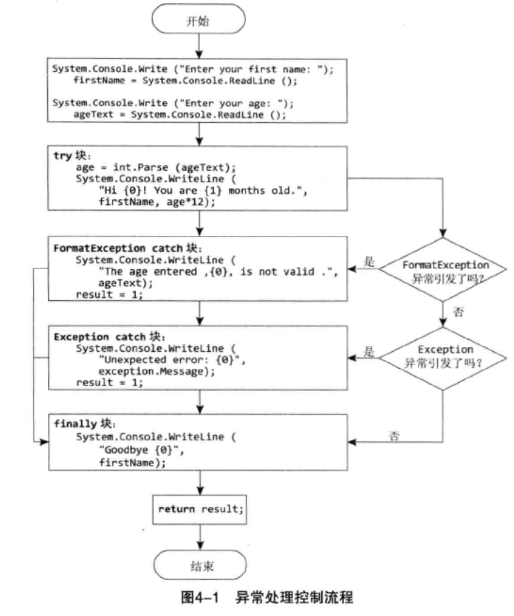

```c#
try{
	...
}catch(Exception exception){
	...
}finally{
	...
}
```

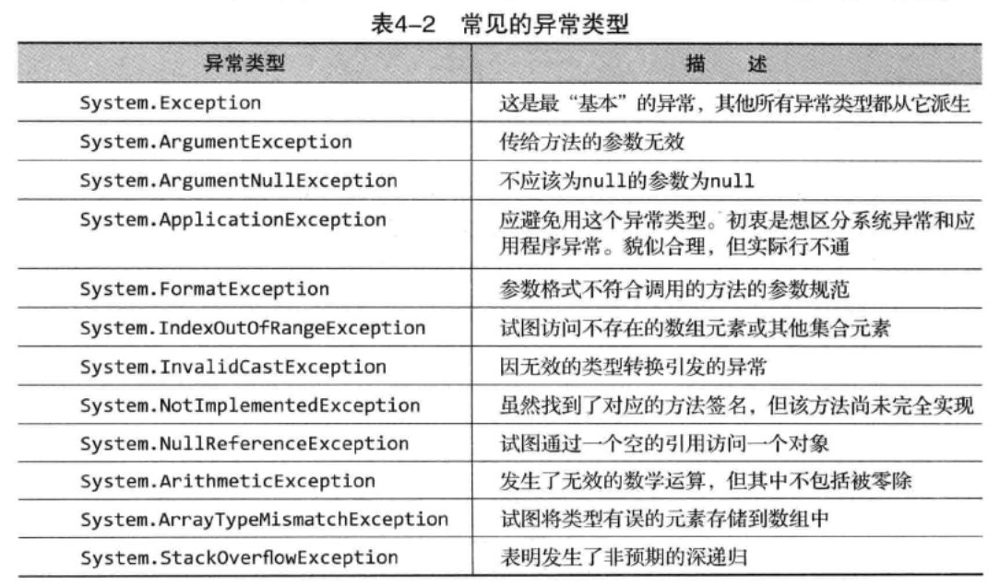

#### 2 使用throw语句报告错误

```c#
throw new Exception("... exception");
```

## 4 类

### 4.1 面向对象的三大特征

#### 1 封装

- 概念
  - 封装指的是对外隐藏细节，只提供简单易用的接口。
- 优点
  - 使复杂的代码变得容易理解。
  - 防止代码被破坏，提高数据安全性。
  - 提高代码复用性。
  - 使代码更易维护。
  - 可以实现高内聚低耦合，使不同对象、不同模块之间可以更好地协同。
- 访问权限
  - public（公开的）：都可见。
  - private（私有的）：仅自己可见。
  - protected（受保护的）：包内可见，包外仅子类可见。
  - 不指定默认为private

#### 2 继承

继承指的是一个新类可以直接拥有现有类的所有功能，不需要重复定义相同部分，只需要定义不同部分，在原有的功能上做扩展。

子类不会继承父类的构造方法，但是会调用（子类初始化前会初始化父类）。

注意：

- 子类无法继承被private修饰的属性和方法。

#### 3 多态

##### 3.1 概念

多态指的是一个实体具有多种形式。

表现：

- 继承。
- 父类引用指向子类对象。
- 方法重写和重载
  - 重写
    - 子类可以重写父类方法。
    - 特点
      - 方法名、参数、访问值类型相同。
      - 访问级别：不能比被重写方法强。
      - 不能重写标志为final、static的方法。
  - 重载
    - 同一个类中创建名字相同的不同方法。
      - 特点
        - 重载的名字必须相同，参数不同。
        - 可以改变修饰。

##### 3.2 类的多态

**1 向上转型**

向上转型其实就是父类对子类的引用。等边三角形是一种特殊的三角形，但是不管再怎么特殊它也是一个三角形。不管什么品种的狗我们都可以说它是一只动物。
这个特点其实就是设计原则中的里式替换原则的原理。子类至少是一个父类，所以父类出现的地方，其子类一定可以出现。

```c#
//Dog继承于Animals，所以可以向上转型，即用Animals引用Dog类
Animals animals = new Dog();
```

**2 向下转型**

向下转型是讲父类转型位子类，这种转型通常会出现问题，在具体使用向下转型的时候需要使用显式类型转换。

父类对象指向的是子类对象（实际上还是得先向上转型一下）。
再用强制类型转换进行转型向下转型通常配合 instanceof关键字使用，用于判断一个实例对象是否属于某个类，判断一个类是否实现了某个接口。

当我们使用向下转型时，可能会出现一些问题，所以在之前需要先判断一下。

```c#
Animals a = new Dog();
if(a instanceof Dog){
	Dog dog = (Dog)a;
}
```

##### 3.3 方法的多态

**1 重写（override**

子类重写父类的方法，名字、参数、返回值相同。

```c#
public class Person{
	public void Say(string name){
		System.Console.WriteLine("名字是："+name);
	}
}
public class Student extends Person{
	public void Say(string name){
		System.Console.WriteLine(name+"是一个学生");
	}
}
```

**2 重载（overload**

在同个类中使用相同名称定义多个成员方法。

```c#
class Sample{
	void Test(int A){}
	void Test(string A){}
}
```

### 4.2 构造器

#### 1 对象初始化器

C#3.0增加了对象初始化器，用于初始化对象中所有可以访问的字段和属性。具体地说，调用构造器创建对象时，可以在后面的一对大括号里添加成员初始化列表。

```c#
class Program{
	static void Main(){
		Employee employee1 = new Employee("Inigo","Montoya"){Titie = "Computer Nerd",Salary = "Not enough"};
	}
}
```

#### 2 使用this构造构造器链

从一个构造器中调用另一个构造器，C#采取的语法格式是在一个冒号后面添加this关键字，再添加被调用构造器的参数列表。

```c#
public Employee(string firstName,string lastName){
	FirstName = firstName;
	LastName = lastName;
}
public Employee(int id,string firstName,string lastName):this(firstName,lastName){
	Id = id;
}
```

#### 3 静态构造器

静态构造器不显式调用，而是在“运行时”首次访问类时自动调用，“首次访问类”可能发生在调用普通构造器的时候，也可能发生在访问类的静态方法或字段时。

由于静态构造器不能显式调用，所以不允许任何参数，并且由于其是运行时自动调用的，所以也不需要访问修饰符。

```c#
static Employee{}
```

另外，需要注意，假如对静态字段的赋值既在静态构造器中进行，又在声明时进行，那么只有静态构造器中的赋值起作用，它优先于声明时的赋值。

### 4.3 特殊类

#### 1 嵌套类

假如一个类在它的包容类外部没有多大意义，就适合把它设计成嵌套类。

#### 2 分部类

分部类是一个类的多个部分，这些部分可以合并成一个完整的类。它主要用于将一个类的定义划分到多个文件中。

## 5 继承

### 5.1 继承

#### 1 概念

```c#
public class PdaItem{
	public string name{get;set;}
	...
}
public class Contact : PdaItem{
	...
}
public class Program{
	public static void Main(){
		Contact c = new Contact();
		c.name = "manqi";
	}
}
```

#### 2 基类和派生类间的转型

```c#
public class Program{
	public static void Main(){
		Contact c = new Contact();
        //隐式转型
		PdaItem item = contact;
        //显式转型
		c = (Contact)item;
	}
}
```

派生类Contact属于PdaItem类，所以可以直接赋给PdaItem类型的变量，这称为隐式转型。

反之则不成立，从基类型转换为派生类型，要求执行显式转型，而显式转型在运行时可能会失败。

#### 3 单继承

C#是单继承语言，一个类不能同时从两个类继承。在极少需要多继承结构的时候，可以使用聚合——不是一个类从另一个类继承，而是一个类包含另一个类的实例。

#### 4 密封类（sealed

为了避免非预期的派生，可以将类标记为sealed。

### 5.2 基类的重写

#### 1 override

C#支持重写实例方法和属性，但不支持重写字段或者任何静态成员。

为了进行重写，必须在基类中将允许重写的每个成员标记为virtual，在子类中将重写的成员标记为override，假如一个public或protected成员没有标记为virtual，就说明它不允许子类重写。

```c#
public class PdaItem{
	public virtual string Name{get;set;}
	...
}
public class Contact : PdaItem{
	public override string Name{
		get{
			...
		}set{
			...
		}
	}
}
```

#### 2 new

```c#
public class Solution{
	public static void Main(){
		PdaItem a = new PdaItem();
		PdaItem b = new Contact();
		a.Method();  //输出1
		b.Method();  //输出2
	}
}
public class PdaItem{
    public virtual void Method(){
        Console.WriteLine("1");
    }
}
public class Contact : PdaItem{
    public override void Method(){
        Console.WriteLine("2");
    }
}
```

我们会发现，即便b被声明为PdaItem，也会在实例化了一个Contact的情况下调用Contact的Method方法，因为Contact的Method方法是派生得最远的重写。

但有时候我们希望当变量被声明为PdaItem时调用的是PdaItem的方法，那么我们需要将Contact中的Method方法标记为new，这时会在PdaItem面前隐藏派生类重写的方法，感觉就像是派生类没有重写该方法。

```c#
public class Solution{
	public static void Main(){
		PdaItem a = new PdaItem();
		PdaItem b = new Contact();
		a.Method();  //输出1
		b.Method();  //输出1
	}
}
public class PdaItem{
    public virtual void Method(){
        Console.WriteLine("1");
    }
}
public class Contact : PdaItem{
    public new void Method(){
        Console.WriteLine("2");
    }
}
```

#### 3 sealed

将虚成员标记为sealed会禁止该类的子类重写该虚成员。

```c#
class A{
	public virtual void Method(){}
}
class B : A{
	public override sealed void Method(){}
}
class C : B{
	//Error
	//public override void Method(){}
}
```

#### 4 base

用于调用基类的实现。

#### 5 构造器

实例化一个派生类时，“运行时”首先调用基类的构造器，以避免绕过对基类的初始化。然而，假如基类没有可访问的构造器，就会报错。

为了减少非必要的错误，程序员需要在派生类构造器头部显式指定要运行哪一个基类构造器。

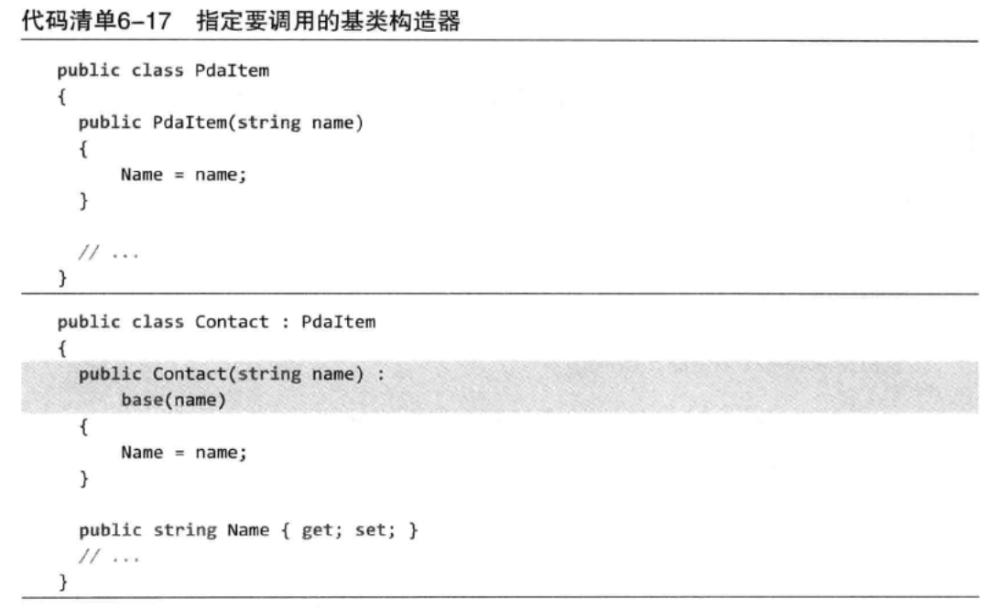

### 5.3 抽象类

抽象类本身无实例化意义，仅用于派生的类。与之相对的，不抽象、可以直接实例化的类称为具体类。

抽象类代表抽象的实体，其抽象成员定义了从抽象实体派生的对象应包含什么，但这种成员不包含实现。通常，抽象类中大多数功能都没有实现，一个类要从抽象类成员中成功地派生，必须为抽象基类中的抽象方法提供具体的实现。

要定义抽象类，C#要求为类定义添加abstract修饰符。

```c#
public abstract class PdaItem{
	public PdaItem(string name){
		Name = name;
	}
	public virtual string Name{get;set;}
	//抽象方法用abstract修饰，不包含方法体，以圆括号和分号结尾。由于抽象成员应当被重写，所以自动成为虚成员，不需要也不能用virtual标记它，也不能声明为私有。
	public abstract string GetSummary();
}
```

抽象方法必须在抽象类中，重写抽象方法需要用override声明。抽象方法必须被派生类重写，如果派生类中没有提供抽象方法的实现，会报错。

### 5.4 使用is验证基础类型

C#提供了is操作符来判断基础类型。

```c#
public static void Save(object data){
	if(data is string){...}
}
```

### 5.5 使用as操作符进行转换

as操作符会尝试将对象转换为特定数据类型，如果对象不能转换，as操作符会返回null。这一点与转型不同，因为它避免了可能因为转型而造成的异常。

## 6 接口

### 6.1 概述

接口可以将实现细节和提供的服务完全隔离开。

接口就像插座，电力是什么类型的、如何输送的，用户不必关心，只需要提供与之兼容的插头。

定义接口：

接口命名开头需为大写I。

```c#
interface IFileCompression{
	void Compress(string targetFileName,string[] fileList);
	void Uncompress(string c,string s);
}
```

接口的关键特点是既不包含实现，也不包含数据。

接口声明的成员描述了在实现该接口的类型中必须能够访问的成员，为了成员必须能够被访问到，C#不允许接口成员使用访问修饰符。所有成员都自动定义为公共成员。

### 6.2 接口实现

类可以实现多个接口，但只能从一个基类直接派生。

```c#
public class Contact : PdaItem, IListable, IComparable{
	...
}
```

一旦某个类声明自己要实现接口，接口的所有成员都必须实现。抽象类允许提供接口成员的抽象实现。

接口的一个重要特征是永远不能实例化，所以接口没有构造器或终结器。此外，接口不能包含静态成员。
