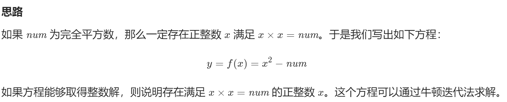
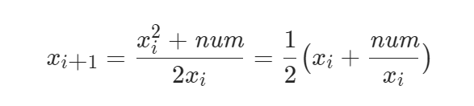
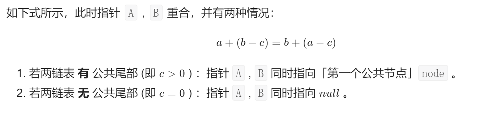

# 算法

@代码随想录

## 1 性能

### 1.1 时间复杂度

**时间复杂度是一个函数，它定性描述该算法的运行时间。**

通常会估算算法的操作单元数量来代表程序消耗的时间，这里默认CPU的每个单元运行消耗的时间都是相同的。

假设算法的问题规模为n，操作单元数量表示为f(n)，随着n的增大，算法执行时间的增长率和f(n)的增长率相同，这称为算法的渐近时间复杂度，简称时间复杂度，记为O(f(n))。

其中大O代表上界，我们平时主要关心一般数据规模下的时间复杂度。

在选择算法时，并不是时间复杂度越低越好（因为简化后的时间复杂度忽略了常数项等），要考虑数据规模。

时间复杂度排行：

```
O(1)常数阶<O(logn)对数阶<O(n)线性阶<O(n^2)平方阶<O(n^3)立方阶<O(2^n)指数阶
```

PS：logn是忽略底数的描述，可能以任何数为底。

### 1.2 递归的时间复杂度

**题目：Pow(x,n)**

时间复杂度为O(n^2)的递归：

```c#
public class Solution {
    //如果n存在数据int.MinValue，那么要用long类型，防止在取-n时溢出
    public double MyPow(double x, int n) {
        if(n==0) return 1;
        if(n<0) return 1/MyPow(x,-n);
        return x*MyPow(x,n-1);
    }
}
```

时间复杂度为O(logn)的递归：

```c#
public class Solution {
    //如果n存在数据int.MinValue，那么要用long类型，防止在取-n时溢出
    public double MyPow(double x,int n){
        if(n==0) return 1;
        if(n<0) return 1/Pow(x,-n);
        if(n%2==1) return x*Pow(x*x,n/2);
        return Pow(x*x,n/2);
    }
}
```

### 1.3 空间复杂度

**空间复杂度是对一个算法在运行过程中占用内存空间大小的量度。**

## 2 数组

### 2.1 概念

**数组是存放在连续内存空间上的相同类型数据的集合。**

#### 1 一维数组

```c#
int[] res = new int[n];
```

#### 2 二维数组

```c#
int[,] res = new int[n,m];
int len = res.Length;     //n*m
```

#### 3 交错数组

```c#
int[][] res = new int[n][];
for(int i=0;i<n;i++) res[i] = new int[n];
int len1 = res.Length;     //n
int len2 = res[0].Length;  //n
```

#### 4 声明方式

声明数组的同时进行赋值。

```c#
int[] str = {1,2,3};
```

声明数组后再进行赋值。

```c#
int[] str;
str = new int[]{1,2,3};
```

声明一个交错数组。

```c#
int[][] str = {
	new int[]{1,2,3};
	new int[]{2,1,3};
}
```

### 2.2 二分查找（Binary Search

#### 704 二分查找

```c#
public class Solution {
    public int Search(int[] nums, int target) {
        int left = 0;
        int right = nums.Length-1;
        while(left<=right){
            int mid = (left+right)/2;
            if(nums[mid]==target) return mid;
            else if(nums[mid]<target) left=mid+1;
            else right=mid-1;
        }
        return -1;
    }
}
```

#### 35 搜索插入位置

```c#
public class Solution {
    //插入位置为pos：nums[pos-1]<target<=nums[pos]
    //所以我们的目标是：在一个有序数组里找大于等于target的数的下标
    public int SearchInsert(int[] nums, int target) {
        int left = 0;
        int right = nums.Length-1;
        int pos = nums.Length;
        while(left<=right){
            int mid = (left+right)/2;
            if(nums[mid]==target) return mid;
            else if(nums[mid]<target) left = mid+1;
            else{
                right = mid-1;
                pos = mid;      //保留比target大的数
            }
        }
        return pos;
    }
}
```

#### 34 在排序数组中查找元素的第一个和最后一个位置*

```c#
public class Solution {
    public int[] SearchRange(int[] nums, int target) {
        int left = Find(nums,target,true);
        int right = Find(nums,target,false);
        return new int[]{left,right};
    }
    private int Find(int[] nums,int target,bool isLeft){
        int res = -1;
        int left = 0;
        int right = nums.Length-1;
        while(left<=right){
            int mid = (left+right)/2;
            if(nums[mid]==target){
                res = mid;
                if(isLeft) right = mid-1;
                else left = mid+1;
            }
            else if(nums[mid]<target) left = mid+1;
            else right = mid-1;
        }
        return res;
    }
}
```

#### 367 有效的完全平方数

##### 二分查找

```c#
public class Solution {
    public bool IsPerfectSquare(int num) {
        int left = 1;
        int right = num;
        while(left<=right){
            int mid = (left+right)/2;
            if((long)mid*mid==num) return true;
            else if((long)mid*mid<num) left = mid+1;
            else right = mid-1;
        }
        return false;
    }
}
```

##### 牛顿迭代法*

牛顿迭代公式：
$$
x_{n+1}=x_n-\frac{f(x_n)}{f'(x_n)}
$$





```c#
public class Solution {
    public bool IsPerfectSquare(int num) {
        int x0 = num;
        while(true){
            int x1 = (x0+num/x0)/2;
            if(x0-x1<1e-6){
                x0 = x1;
                break;
            }
            x0 = x1;
        }
        return x0*x0==num;
    }
}
```

### 2.3 移除元素

#### 27 移除元素

##### 快慢指针*

```c#
public class Solution {
    //快慢指针
    public int RemoveElement(int[] nums, int val) {
        int slow = 0;
        for(int fast = 0;fast<nums.Length;fast++){
            if(nums[fast]!=val){
                nums[slow] = nums[fast];
                slow++;
            }
        }
        return slow;
    }
}
```

#### 26 删除有序数组中的重复项

```c#
public class Solution {
    public int RemoveDuplicates(int[] nums) {
        int slow = 0;
        for(int fast=0;fast<nums.Length;fast++){
            if(nums[slow]!=nums[fast]){
                slow++;
                nums[slow] = nums[fast];
            }
        }
        return slow+1;
    }
}
```

#### 283 移动零

```c#
public class Solution {
    public void MoveZeroes(int[] nums) {
        int slow = 0;
        for(int fast=0;fast<nums.Length;fast++){
            if(nums[fast]!=0){
                while(slow<nums.Length){
                    if(nums[slow]==0) break;
                    else slow++;
                }
                if(fast>slow){
                    nums[slow] = nums[fast];
                    nums[fast] = 0;
                } 
            }
        }
    }
}
```

### 2.4 长度最小的子数组

#### 209 长度最小的子数组

```c#
public class Solution {
    public int MinSubArrayLen(int target, int[] nums) {
        int left = 0;
        int sum = 0;
        int len = int.MaxValue;
        for(int right=0;right<nums.Length;right++){
            sum+=nums[right];
            while(sum-nums[left]>=target) sum-=nums[left++];
            if(sum>=target) len = Math.Min(len,(right-left+1));
        }
        if(len!=int.MaxValue) return len;
        return 0;
    }
}
```

#### 904 水果成篮

##### 滑动窗口*

```c#
public class Solution {
    public int TotalFruit(int[] fruits) {
        Dictionary<int,int> dict = new Dictionary<int,int>();
        int left = 0;
        int res = 0;
        for(int right=0;right<fruits.Length;right++){
            if(dict.ContainsKey(fruits[right])) dict[fruits[right]]++;
            else{
                if(dict.Count==2){
                    res = Math.Max(res,(right-left));
                    while(dict.Count==2){
                        int temp = fruits[left];
                        dict[temp]--;
                        if(dict[temp]==0) dict.Remove(temp);
                        left++;
                    }
                }
                dict.Add(fruits[right],1);
            }
        }
        return Math.Max(res,(fruits.Length-left));
    }
}
```

#### 76 最小覆盖字串*

```c#
public class Solution {
    public string MinWindow(string s, string t) {
        if(s.Length<t.Length||t=="") return "";
        Dictionary<char,int> dict = new Dictionary<char,int>();
        for(int i=0;i<t.Length;i++){
            if(dict.ContainsKey(t[i])) dict[t[i]]++;
            else dict.Add(t[i],1);
        }
        int left = 0;
        int right = 0;
        int need = dict.Count;
        string str = s;
        while(right<s.Length){
            //步骤一：移动right使s[left..right]包含t中所有元素
            while(right<s.Length&&need>0){
                char c = s[right];
                if(dict.ContainsKey(c)){
                    dict[c]--;
                    if(dict[c]==0) need--;
                }
                right++;
            }
            if(need!=0){
                str = str==s? "":str;
                break;
            }
            //步骤二：移动left使s[left..right]在满足条件的前提下最短
            while(!dict.ContainsKey(s[left])||(dict.ContainsKey(s[left])&&dict[s[left]]<0)){
                if(dict.ContainsKey(s[left])) dict[s[left]]++;
                left++;
            }
            //步骤三：赋值
            str = (right-left)<str.Length? s[left..right]:str;
            //步骤四：移动left找下一个满足条件的字符串
            dict[s[left]]++;
            if(dict[s[left]]>0) need++;
            left++;
        }
        return str;
    }
}
```

### 2.5 螺旋矩阵Ⅱ

#### 59 螺旋矩阵Ⅱ

```c#
public class Solution {
    public int[][] GenerateMatrix(int n) {
        int[][] res = new int[n][];
        bool[,] state = new bool[n,n];
        for(int k=0;k<n;k++) res[k] = new int[n];
        //0:右 1:下 2:左 3:上
        int temp = 0;
        int i = 0;
        int j = 0;
        int m = 1;
        while(m<=n*n){
            res[i][j] = m++;
            if(!state[i,j]) state[i,j] = true;
            //1.目前是向右走
            if(temp==0){
                if(j+1<n&&!state[i,j+1]) j++;
                else{
                    temp = 1;
                    i++;
                }
            }
            //2.目前是向下走
            else if(temp==1){
                if(i+1<n&&!state[i+1,j]) i++;
                else{
                    temp = 2;
                    j--;
                }
            }
            //3.目前是向左走
            else if(temp==2){
                if(j-1>=0&&!state[i,j-1]) j--;
                else{
                    temp = 3;
                    i--;
                }
            }
            //4.目前是向上走
            else if(temp==3){
                if(i-1>=0&&!state[i-1,j]) i--;
                else{
                    temp = 0;
                    j++;
                }
            }
        }
        return res;
    }
}
```

## 3 链表

### 3.1 概念

#### 1 单链表

链表是一种通过指针串联在一起的线性结构，每一节点由两部分组成，一个是数据域一个是指针域（存放指向下一个节点的指针），最后一个节点的指针域指向null。


#### 2 双链表

每一个节点有两个指针域，一个指向下一个节点，一个指向上一个节点。


#### 3 循环链表

循环链表，顾名思义，就是链表首尾相连。循环链表可以用来解决约瑟夫环问题。


#### 4 链表的存储方式

链表中的节点在内存中不是连续分布的，而是散乱分布在内存中的某地址上，分配机制取决于操作系统的内存管理，各节点通过指针域的指针链接。


#### 5 性能分析


#### 6 双向链表LinkedList


### 3.2 练习

#### 203 移除链表元素

```c#
public class Solution {
    public ListNode RemoveElements(ListNode head, int val) {
        ListNode pre = null;
        while(head!=null&&head.val==val) head = head.next;
        ListNode cur = head;
        while(cur!=null){
            if(cur.val==val) pre.next = cur.next;
            else pre = cur;
            cur = cur.next;
        }
        return head;
    }
}
```

#### 707 设计链表

##### 单链表

```c#
public class MyLinkedList {
    private ListNode head;
    private int size;
    public MyLinkedList() {
        size = -1;
    }
    
    public int Get(int index) {
        if(index>size||index<0||size==-1) return -1;
        else{
            ListNode node = head;
            int n = 0;
            while(n<index){
                node = node.next;
                n++;
            }
            return node.val;
        }
    }
    
    public void AddAtHead(int val) {
        if(size==-1) head = new ListNode(val);
        else{
            ListNode pre = new ListNode(val);
            pre.next = head;
            head = pre;
        }
        size++;
    }
    
    public void AddAtTail(int val) {
        if(size==-1) head = new ListNode(val);
        else{
            ListNode node = head;
            while(node.next!=null) node = node.next;
            node.next = new ListNode(val);
        }
        size++;
    }
    
    public void AddAtIndex(int index, int val) {
        if(index>(size+1)) return;
        else if(index==(size+1)) AddAtTail(val);
        else if(index<=0) AddAtHead(val);
        else{
            ListNode node = head;
            int n = 0;
            while(n<index-1){
                node = node.next;
                n++;
            }
            ListNode temp = node.next;
            node.next = new ListNode(val);
            node.next.next = temp;
            size++;
        }
    }
    
    public void DeleteAtIndex(int index) {
        if(index<0||index>size||size==-1) return;
        else if(index==0){
            if(size==0) head = null;
            else head = head.next;
        }
        else{
            ListNode node = head;
            int n = 0;
            while(n<index-1){
                node = node.next;
                n++;
            }
            node.next = node.next.next;
        }
        size--;
    }
}
```

##### 双链表

```c#
//略
ListNode head;
ListNode tail;
head.next = tail;
tail.prev =head;
```

#### 206 反转链表

##### 双指针

```c#
public class Solution {
    public ListNode ReverseList(ListNode head) {
        ListNode pre = null;
        ListNode cur = head;
        while(cur!=null){
            ListNode temp = cur.next;
            cur.next = pre;
            pre = cur;
            cur = temp;
        }
        return pre;
    }
}
```

##### 递归法

```c#
public class Solution {
    public ListNode ReverseList(ListNode head) {
        return Recursion(null,head);
    }
    private ListNode Recursion(ListNode pre,ListNode cur){
        if(cur==null) return pre;
        ListNode temp = cur.next;
        cur.next = pre;
        return Recursion(cur,temp);
    }
}
```

#### 24 两两交换节点

##### 双指针

```c#
public class Solution {
    public ListNode SwapPairs(ListNode head) {
        if(head==null||head.next==null) return head;
        ListNode pre = null;
        ListNode cur = head;
        head = head.next;
        while(cur!=null&&cur.next!=null){
            ListNode nex = cur.next;
            ListNode temp = nex.next;
            nex.next = cur;
            cur.next = temp;
            if(pre!=null) pre.next = nex;
            pre = cur;
            cur = temp;
        }
        return head;
    }
}
```

##### 递归法

```c#
public class Solution {
    public ListNode SwapPairs(ListNode head) {
        if(head==null||head.next==null) return head;
        ListNode temp = head.next;
        head.next = SwapPairs(temp.next);
        temp.next = head;
        return temp;
    }
}
```

#### 19 删除链表的倒数第N个节点

```c#
public class Solution {
    public ListNode RemoveNthFromEnd(ListNode head, int n) {
        ListNode pre = head;
        ListNode tail = head;
        int num = 1;
        while(num<n){
            tail = tail.next;
            num++;
        }
        if(tail.next==null) return head.next;
        else tail = tail.next;
        while(tail.next!=null){
            pre = pre.next;
            tail = tail.next;
        }
        pre.next = pre.next.next;
        return head;
    }
}
```

#### 160 链表相交

##### 列表

```c#
public class Solution {
    public ListNode GetIntersectionNode(ListNode headA, ListNode headB) {
        List<ListNode> list = new List<ListNode>();
        while(headA!=null){
            list.Add(headA);
            headA = headA.next;
        }
        while(headB!=null){
            if(list.Contains(headB)) return headB;
            headB = headB.next;
        }
        return null;
    }
}
```

##### 双指针




```c#
public class Solution {
    public ListNode GetIntersectionNode(ListNode headA, ListNode headB) {
        ListNode a = headA;
        ListNode b = headB;
        while(a!=b){
            a = a!=null? a.next:headB;
            b = b!=null? b.next:headA;
        }
        return a;
    }
}
```

#### 148 环形链表

##### 列表

```c#
public class Solution {
    public ListNode DetectCycle(ListNode head) {
        List<ListNode> list = new List<ListNode>();
        while(head!=null){
            if(list.Contains(head)) return head;
            list.Add(head);
            head = head.next;
        }
        return null;
    }
}
```

##### 快慢指针

假设入环前路径长度为a，环头到环尾路径长度为b，那么如果要让某个指针停在环入口，那么它应该走的步数为：a+nb。

假设现在有两个指针，fast指针每次走两步，slow指针每次走一步。用f，s分别代表fast和slow行走的距离。

那么f = 2s。

两个指针第一次相遇时：

fast比slow多走了n个环的长度，即f = s+nb。

以上两式相减可得：f = 2nb，s = nb。

那么只要让两指针相遇后slow指针再走a步，就会到环的入口点。

```c#
public class Solution {
    public ListNode DetectCycle(ListNode head) {
        ListNode fast = head;
        ListNode slow = head;
        while(true){
            if(fast==null||fast.next==null) return null;
            fast = fast.next.next;
            slow = slow.next;
            if(fast==slow) break;
        }
        fast = head;
        while(fast!=slow){
            fast = fast.next;
            slow = slow.next;
        }
        return slow;
    }
}
```

## 4 哈希表

### 4.1 概念

HashTable&Dictionary<T,T>

HashTable是一种根据key查找非常快的键值数据结构，不能有重复key，而且由于其特点，其长度总是一个素数，所以扩容后容量会比2倍大一点点，加载因子为0.72f。

当要大量使用key来查找value的时候，HashTable无疑是最好选择，HashTable与ArrayList一样，是非泛型的，value存进去是object,存取会发生装箱、拆箱，所以出现了Dictionary<T,T>。

Dictionary<T,T>是HashTable的泛型版本，存取同样快，但是不需要装箱和拆箱了。而且，其优化了算法，Hashtable是0.72，它的浪费容量少了很多。

### 4.2 有效的字母异位词

#### 242 有效的字母异位词

```c#
public class Solution {
    public bool IsAnagram(string s, string t) {
        Dictionary<char,int> dict = new Dictionary<char,int>();
        for(int i=0;i<s.Length;i++){
            if(!dict.ContainsKey(s[i])) dict.Add(s[i],1);
            else dict[s[i]]++;
        }
        for(int i=0;i<t.Length;i++){
            if(!dict.ContainsKey(t[i])) return false;
            else{
                dict[t[i]]--;
                if(dict[t[i]]==0) dict.Remove(t[i]);
            }
        }
        if(dict.Count==0) return true;
        return false;
    }
}     
```

#### 383 赎金信

```c#
public class Solution {
    public bool CanConstruct(string ransomNote, string magazine) {
        Dictionary<char,int> dict = new Dictionary<char,int>();
        for(int i=0;i<magazine.Length;i++){
            if(!dict.ContainsKey(magazine[i])) dict.Add(magazine[i],1);
            else dict[magazine[i]]++;
        }
        for(int i=0;i<ransomNote.Length;i++){
            if(dict.ContainsKey(ransomNote[i])){
                dict[ransomNote[i]]--;
                if(dict[ransomNote[i]]==0) dict.Remove(ransomNote[i]);
            }else return false;
        }
        return true;
    }
}
```

#### 49、438未做

### 4.3 两个数组的交集

#### 349 两个数组的交集（HashSet

```c#
public class Solution {
    public int[] Intersection(int[] nums1, int[] nums2) {
        HashSet<int> set1 = new HashSet<int>();
        HashSet<int> set2 = new HashSet<int>();
        for(int i=0;i<nums1.Length;i++) set1.Add(nums1[i]);
        for(int i=0;i<nums2.Length;i++) set2.Add(nums2[i]);
        set1.IntersectWith(set2);
        int[] res = new int[set1.Count];
        set1.CopyTo(res);
        return res;
    }
}
```

#### 350 未做

### 4.4 快乐数（202

#### HashSet

要么变成1，要么陷入无限循环。

```c#
public class Solution {
    public bool IsHappy(int n) {
        HashSet<int> hsSet = new HashSet<int>();
        while(true){
            n = Count(n);
            if(n==1) return true;
            if(hsSet.Contains(n)) return false;
            hsSet.Add(n);
        }
        return false;
    }
    private int Count(int n){
        int res = 0;
        while(n>0){
            int temp = n%10;
            res += temp*temp;
            n/=10;
        }
        return res;
    }
}
```

#### 快慢指针

转换为求链表中是否有环。


```c#
public class Solution {
    public bool IsHappy(int n) {
        int fast = Count(Count(n));
        int slow = Count(n);
        if(fast==1||slow==1) return true;
        while(fast!=slow){
            fast = Count(Count(fast));
            slow = Count(slow);
            if(fast==1||slow==1) return true;
        }
        return false;
    }
    private int Count(int n){
        int res = 0;
        while(n>0){
            int temp = n%10;
            res += temp*temp;
            n/=10;
        }
        return res;
    }
}
```

### 4.5 两数之和（1

```c++
public class Solution {
    public int[] TwoSum(int[] nums, int target) {
        Dictionary<int,int> dict = new Dictionary<int,int>();
        for(int i=0;i<nums.Length;i++){
            int temp = target-nums[i];
            if(dict.ContainsKey(temp)) return new int[]{dict[temp],i};
            if(!dict.ContainsKey(nums[i])) dict.Add(nums[i],i);
        }
        return null;
    }
}
```

### 4.6 四数相加Ⅱ（454

#### 字典+双循环

```c#
public class Solution {
    public int FourSumCount(int[] nums1, int[] nums2, int[] nums3, int[] nums4) {
        Dictionary<int,int> dict = new Dictionary<int,int>();
        for(int i=0;i<nums1.Length;i++){
            for(int j=0;j<nums2.Length;j++){
                int sum = nums1[i]+nums2[j];
                if(!dict.ContainsKey(sum)) dict.Add(sum,1);
                else dict[sum]++;
            }
        }
        int res = 0;
        for(int i=0;i<nums3.Length;i++){
            for(int j=0;j<nums4.Length;j++){
                int sum = nums3[i]+nums4[j];
                if(dict.ContainsKey(-sum)) res+=dict[-sum];
            }
        }
        return res;
    }
}
```

### 4.7 赎金信（383

#### 字典

```c#
public class Solution {
    public bool CanConstruct(string ransomNote, string magazine) {
        Dictionary<char,int> dict = new Dictionary<char,int>();
        for(int i=0;i<magazine.Length;i++){
            if(!dict.ContainsKey(magazine[i])) dict.Add(magazine[i],1);
            else dict[magazine[i]]++;
        }
        for(int i=0;i<ransomNote.Length;i++){
            if(dict.ContainsKey(ransomNote[i])){
                dict[ransomNote[i]]--;
                if(dict[ransomNote[i]]==0) dict.Remove(ransomNote[i]);
            }else return false;
        }
        return true;
    }
}
```

### 4.8 三数之和（15

#### 排序+三指针

```c#
public class Solution {
    public IList<IList<int>> ThreeSum(int[] nums) {
        Array.Sort(nums);
        IList<IList<int>> res = new List<IList<int>>();
        for(int i=0;i<nums.Length-2;i++){
            if(i>0&&nums[i]==nums[i-1]) continue;
            if(nums[i]>0) break;
            int mid = i+1;
            int right = nums.Length-1;
            while(mid<right){
                int sum = nums[mid]+nums[right];
                if(nums[i]+sum==0){
                    res.Add(new List<int>(){nums[i],nums[mid],nums[right]});
                    mid++;
                    while(mid<right&&nums[mid]==nums[mid-1]) mid++;
                } 
                else if(nums[i]+sum<0) mid++;
                else if(nums[i]+sum>0) right--;
            }
        }
        return res;
    }
}
```

### 4.9 四数之和

略。

## 5 字符串

