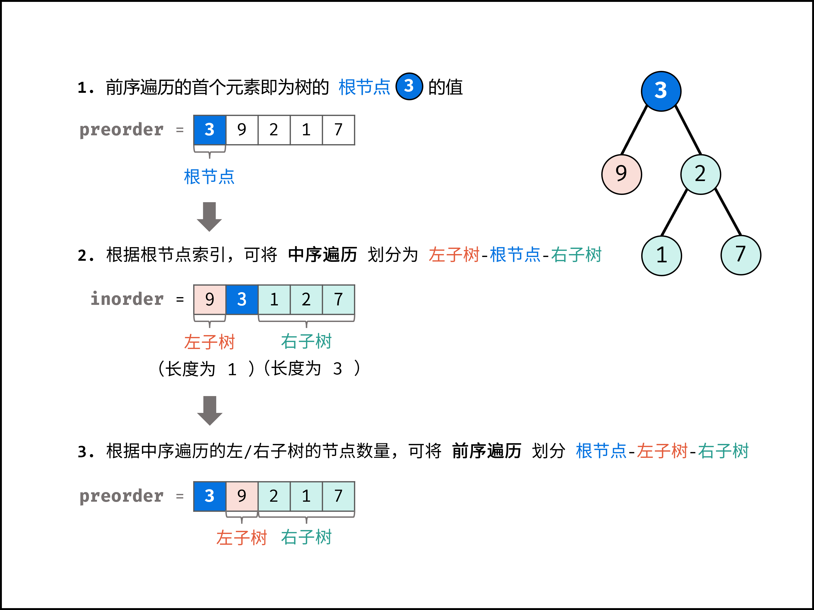
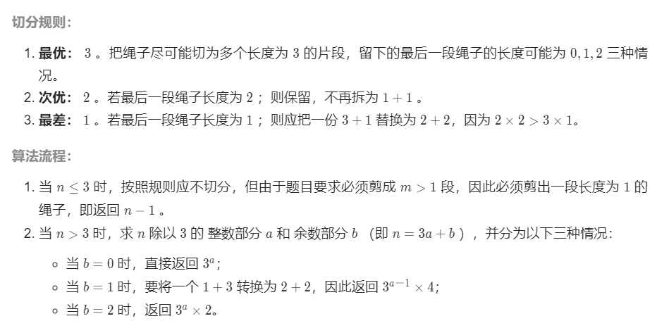
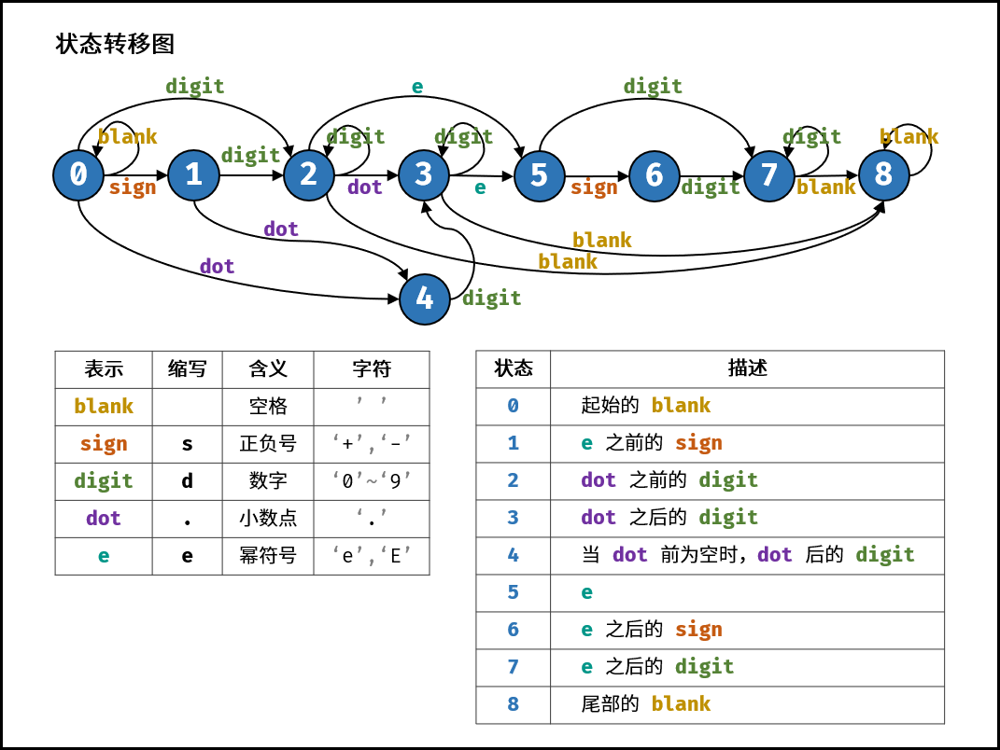

# 剑指offer

## 1.12 

### 03 数组中重复的数字

#### 字典

略。

#### 原地交换

利用题目条件：一个长度为 n 的数组 nums 里的所有数字都在 **0～n-1** 的范围内。

思路：不断在原地将元素交换至索引与值对应位，若原地元素已经完成交换，将指针移至下一位，若某元素要交换到的位置的值与该元素相等，说明为重复值。

```c#
public class Solution {
    public int FindRepeatNumber(int[] nums) {
        int i = 0;
        while(i<nums.Length){
            while(nums[i]==i) i++;
            if(nums[nums[i]]==nums[i]) return nums[i];
            int temp = nums[i];
            nums[i] = nums[temp];
            nums[temp] = temp;
        }
        return -1;
    }
}
```

### 04 二维数组中的查找

#### 每一行二分查找

```c#
public class Solution {
    public bool FindNumberIn2DArray(int[][] matrix, int target) {
        foreach(int[] item in matrix){
            if(BinarySearch(item,target)) return true;
        }
        return false;
    }
    private bool BinarySearch(int[] matrix,int target){
        int low = 0;
        int high = matrix.Length-1;
        while(low<=high){
            int mid = (low+high)/2;
            if(matrix[mid]==target) return true;
            else if(matrix[mid]<target) low = mid+1;
            else high = mid-1;
        }
        return false;
    }
}
```

#### Z字形查找


```c#
public class Solution {
    public bool FindNumberIn2DArray(int[][] matrix, int target) {
        if(matrix.Length==0||matrix[0].Length==0) return false;
        int row = 0;
        int col = matrix[0].Length-1;
        while(row<matrix.Length&&col>=0){
            if(matrix[row][col]==target) return true;
            else if(matrix[row][col]>target){
                col--;
            }else row++;
        }
        return false;
    }
}
```

### 05 替换空格

#### 遍历替换

```c#
public class Solution {
    public string ReplaceSpace(string s) {
        string res = "";
        for(int i=0;i<s.Length;i++){
            if(s[i]!=' ') res+=s[i];
            else res+="%20";
        }
        return res;
    }
}
```

#### str.Replace()

```c#
public class Solution {
    public string ReplaceSpace(string s) {
        s = s.Replace(" ","%20");
        return s;
    }
}
```

### 06 从尾到头打印链表

#### 递归

```c#
public class Solution {
    public int n;
    public int[] res;
    public int[] ReversePrint(ListNode head) {
        Method(head);
        return res;
    }
    private void Method(ListNode node){
        if(node==null){
            res = new int[n];
            n = 0;
            return;
        }
        n++;
        Method(node.next);
        res[n++] = node.val;
    }
}
```

#### 辅助栈

```c#
public class Solution {
    public int[] ReversePrint(ListNode head) {
        Stack<int> stack = new Stack<int>();
        while(head!=null){
            stack.Push(head.val);
            head = head.next;
        }
        int[] res = new int[stack.Count];
        int n=0;
        while(stack.Count!=0) res[n++] = stack.Pop();
        return res;
    }
}
```

### 07 重建二叉树

#### 递归



```c#
public class Solution {
    public int[] preorder;
    public int[] inorder;
    public Dictionary<int,int> dict;      //key-value：值-inorder下标  
    public TreeNode BuildTree(int[] preorder, int[] inorder) {
        if(preorder.Length==0) return null;
        this.preorder = preorder;
        this.inorder = inorder;
        dict = new Dictionary<int,int>();
        for(int i=0;i<inorder.Length;i++) dict.Add(inorder[i],i);
        TreeNode head = new TreeNode(preorder[0]);
        Method(head,0,0,inorder.Length-1);
        return head;
    }
    private void Method(TreeNode node,int n,int low,int high){
        //前序遍历：父|左子|右子;中序遍历：左子|父|右子
        int nNum = dict[preorder[n]];
        int leftSum = 0;
        if(low<nNum){
            leftSum = nNum - low;   //左子树大小
            node.left = new TreeNode(preorder[n+1]);
            Method(node.left,n+1,low,nNum-1);
        }
        if(high>nNum){
            node.right = new TreeNode(preorder[n+leftSum+1]);
            Method(node.right,n+leftSum+1,nNum+1,high);
        }
    }
}
```

#### 迭代（难*

```c#
public class Solution {
    public TreeNode BuildTree(int[] preorder, int[] inorder) {
        if(preorder.Length==0) return null;
        Stack<TreeNode> stack = new Stack<TreeNode>();
        TreeNode head = new TreeNode(preorder[0]);
        stack.Push(head);
        int inorderNum = 0;
        for(int i=1;i<preorder.Length;i++){
            int preorderVal = preorder[i];
            TreeNode node = stack.Peek();
            if (node.val != inorder[inorderNum]) {
                node.left = new TreeNode(preorderVal);
                stack.Push(node.left);
            } else {
                while (stack.Count!=0&& stack.Peek().val == inorder[inorderNum]) {
                    node = stack.Pop();
                    inorderNum++;
                }
                node.right = new TreeNode(preorderVal);
                stack.Push(node.right);
            }
        }
        return head;
    }
}
```

### 09 用两个栈实现队列

```c#
public class CQueue {
    Stack<int> a;
    Stack<int> b;
    public CQueue() {
        a = new Stack<int>();
        b = new Stack<int>();
    }
    
    public void AppendTail(int value) {
        while(b.Count!=0){
            a.Push(b.Pop());
        }
        a.Push(value);
    }
    
    public int DeleteHead() {
        while(a.Count!=0){
            b.Push(a.Pop());
        }
        return b.Count==0?-1:b.Pop();
    }
}
```

### 10-Ⅰ 斐波那契数列

```c#
public class Solution {
    //F(n)=F(n-1)+F(n-2)
    public int Fib(int n) {
        if(n==0) return 0;
        long mod = 1000000007;
        long left = 0;
        long right = 1;
        for(int i=2;i<=n;i++){
            long res = (left+right)%mod;
            left = right;
            right = res;
        }
        return (int)right;
    }
}
```

### 10-Ⅱ 青蛙跳台阶问题

```c#
public class Solution {
    //dp(n)=dp(n-1)+dp(n-2)
    public int NumWays(int n) {
        if(n==0||n==1) return 1;
        long left = 1;
        long right = 1;
        long mod = 1000000007;
        for(int i=2;i<=n;i++){
            long res = (left+right)%mod;
            left = right;
            right = res;
        }
        return (int)right;
    }
}
```

## 1.13

### 11 旋转数组的最小数字

位于最小数左侧的，一定大于等于最右侧元素，位于最小数右侧或者是最小数本身的，一定小于等于最右侧元素。

所以

- 当mid>numbers[high]，low = mid+1；
- 当mid<numbers[high]，high = mid;
- 当mid==numbers[high]，如果numbers[high]为最小值，也可保证最小值不丢失，high--;

```c#
public class Solution {
    public int MinArray(int[] numbers) {
        int low = 0;
        int high = numbers.Length-1;
        while(low<high){
            int mid = (low+high)/2;
            if(numbers[mid]<numbers[high]) high = mid;
            else if(numbers[mid]>numbers[high]) low = mid+1;
            else high--;  
        }
        return numbers[low];
    }
    
}
```

### 12 矩阵中的路径

```c#
public class Solution {
    public char[][] board;
    public string word;
    public bool res;
    public bool Exist(char[][] board, string word) {
        if(word.Length>board.Length*board[0].Length) return false;
        if(board.Length==0&&word.Length==0) return true;
        this.board = board;
        this.word = word;
        for(int i=0;i<board.Length;i++){
            for(int j=0;j<board[0].Length;j++){
                if(board[i][j]==word[0]){
                    DFS(i,j,0,new bool[board.Length,board[0].Length]);
                    if(res) return true;
                }
            }
        }
        return false;
    }
    private void DFS(int i,int j,int n,bool[,] state){
        if(i<0||j<0||i>=board.Length||j>=board[0].Length) return;
        if(state[i,j]||board[i][j]!=word[n]) return;
        if(n==word.Length-1){
            res = true;
            return;
        }
        state[i,j] = true;
        DFS(i-1,j,n+1,state);
        DFS(i+1,j,n+1,state);
        DFS(i,j-1,n+1,state);
        DFS(i,j+1,n+1,state);
        state[i,j] = false;
    }
}
```

### 14-Ⅰ 剪绳子

#### 动态规划

```c#
public class Solution {
    //k表示拆出来的第一条绳子，而对于剩下的绳子，可以选择拆，也可以选择不拆
    //dp[n] = Math.Max(k*(n-k),k*dp[n-k]);
    public int CuttingRope(int n) {
        int[] dp = new int[n+1];
        dp[0]=0;
        dp[1]=0;
        for(int i=2;i<=n;i++){
            for(int j=1;j<i;j++){
                dp[i] = Math.Max(Math.Max(j*(i-j),j*dp[i-j]),dp[i]);
            }
        }
        return dp[n];
    }
}
```

#### 数学法+贪心

两个推论

- 所有绳段相等时乘积最大。
- 最优绳段长度为3。



```c#
public class Solution {
    public int CuttingRope(int n) {
        if(n<=3) return n-1;
        int a = n/3,b = n%3;
        int res = (int)Math.Pow(3,a); 
        if(b==0) return res;
        else if(b==1) return res/3*4;
        return res*2;
    }
}
```

#### 数字法+贪心+快速幂

```c#
public class Solution {
    public int CuttingRope(int n) {
        if(n<=3) return n-1;
        int a = n/3-1, b = n%3;
        int res = 1, x = 3;
        while(a>0){
            if(a%2==1) res*=x;
            x*=x;
            a/=2;
        }
        if(b==0) return res*3;
        if(b==1) return res*4;
        return res*6;
    }
}
```

### 14-Ⅱ 剪绳子Ⅱ

#### 数学法+贪心

```c#
public class Solution {
    public int CuttingRope(int n) {
        if(n<=3) return n-1;
        int mod = (int)1e9+7;
        double res = 1;
        while(n>4){
            res = res*3%mod;
            n-=3;
        }
        return (int)(res*n%mod);
    }
}
```

#### 数字法+贪心+快速幂

```c#
public class Solution {
    public int CuttingRope(int n) {
        if(n<=3) return n-1;
        int a = n/3-1, b = n%3, mod = 1000000007;
        long res = 1, x = 3;
        while(a>0){
            if(a%2==1) res = res*x%mod;
            x = x*x%mod;
            a/=2;
        }
        if(b==0) return (int)(res*3%mod);
        if(b==1) return (int)(res*4%mod);
        return (int)(res*6%mod);
    }
}
```

### 15 二进制中1的个数

#### 循环查找

```c#
public class Solution {
    public int HammingWeight(uint n) {
        int res = 0;
        while(n>0){
            if((int)(n&1)==1) res++;
            n>>=1;
        }   
        return res;
    }
}
```

#### 与运算

n&(n-1)->去掉最低位1

```c#
public class Solution {
    public int HammingWeight(uint n) {
        int res = 0;
        while(n>0){
            n&=(n-1);
            res++;
        }
        return res;
    }
}
```

### 16 数值的整数次方

快速幂。

注意：-2147483648的负数还是-2147483648，因为整数溢出1会变成最小值（环形）。

```c#
public class Solution {
    public double MyPow(double x, int n) {
        long num = n;
        double res = 1;
        if(n<0){
            //不能写成(long)-n
            num = -(long)n;
            x = 1/x;
        }
        while(num>0){
            if(num%2==1) res*=x;
            x*=x;
            num/=2;
        }
        return res;
    }
}
```

### 17 打印从1到最大的n位数

```c#
public class Solution {
    public int[] PrintNumbers(int n) {
        int high = (int)Math.Pow(10,n)-1;
        int[] res = new int[high];
        for(int i=0;i<high;i++) res[i] = i+1;
        return res;
    }
}
```

### 18 删除链表的节点

```c#
public class Solution {
    public ListNode DeleteNode(ListNode head, int val) {
        ListNode pre = null;
        ListNode node = head;
        while(node!=null){
            if(node.val==val){
                if(pre==null) head = node.next;
                else pre.next = node.next;
                return head;
            }else{
                pre = node;
                node = node.next;
            }
        }
        return null;
    }
}
```

### 19 正则表达式匹配

#### 递归

```c#
public class Solution {
    public string s;
    public string p;
    public bool res;
    public bool IsMatch(string s, string p) {
        this.s = s;
        this.p = p;
        DFS(s.Length-1,p.Length-1);
        return res;
    }
    private void DFS(int left,int right){
        //结束递归
        if(res) return;
        if(left<0||right<0){
            while(right>0&&right%2==1){
                if(p[right]=='*') right-=2;
                else break;
            }
            if(left<0&&right<0) res = true;
            return;
        }
        //递归主体
        if(p[right]==s[left]||p[right]=='.') DFS(left-1,right-1);
        else if(p[right]=='*'){
            if(right==0) return;
            else if(p[right-1]=='.'){
                while(left>=0){
                    DFS(left,right-2);
                    left--;
                }
                DFS(left,right-2);
            }else{
                while(left>=0){
                    DFS(left,right-2);
                    //相等才能抵消
                    if(s[left]==p[right-1]) left--;
                    else break;
                }
                DFS(left,right-2);
            }
        }
    }
}
```

### 20 表示数值的字符串

#### 有限状态自动机

规定状态：

```
0：前面的空格
1：+/-
2：小数点或整数前的数字
3：小数点、（小数点后的数字）
4：（小数点前无数字的情况）小数点+数字
5：幂符号e/E
6：幂符号后的正负号+/-
7：幂符号后的数字
8：后面的空格
```

画出状态转移图：



```c#
public class Solution {
    public bool IsNumber(string s) {
        //终止状态应为：2或3或7或8
        List<Dictionary<int,int>> list = new List<Dictionary<int,int>>();
        list.Add( new Dictionary<int,int>(){{0,0},{1,1},{2,2},{3,4}} );  //状态0：前面的空格
        list.Add( new Dictionary<int,int>(){{2,2},{3,4}} );              //状态1：+/-
        list.Add( new Dictionary<int,int>(){{2,2},{3,3},{4,5},{0,8}} );  //状态2：小数点或整数前的数字
        list.Add( new Dictionary<int,int>(){{2,3},{4,5},{0,8}} );        //状态3：小数点和小数点后的数字
        list.Add( new Dictionary<int,int>(){{2,3}} );                    //状态4：（前面没有数字）小数点和小数点后的数字
        list.Add( new Dictionary<int,int>(){{1,6},{2,7}} );              //状态5：幂符号e/E
        list.Add( new Dictionary<int,int>(){{2,7}} );                    //状态6：幂符号后的+/-
        list.Add( new Dictionary<int,int>(){{2,7},{0,8}} );              //状态7：幂符号后的数字
        list.Add( new Dictionary<int,int>(){{0,8}} );                    //状态8：后面的空格
        int num = IsWhat(s[0]);
        int state = 0;
        if(num==0||num==1||num==2) state = num;
        else if(num==3) state = 4;
        else return false;
        for(int i=1;i<s.Length;i++){
            num = IsWhat(s[i]);
            if(!list[state].ContainsKey(num)) return false;
            state = list[state][num];
        }
        if(state==2||state==3||state==7||state==8) return true;
        return false;
    }
    private int IsWhat(char c){
        if(c==' ') return 0;
        if(c=='+'||c=='-') return 1;
        if(c>='0'&&c<='9') return 2;
        if(c=='.') return 3;
        if(c=='e'||c=='E') return 4;
        return -1;
    }
}
```

### 21 调整数组顺序使奇数位于偶数前面

```c#
public class Solution {
    public int[] Exchange(int[] nums) {
        int left = 0;
        int right = nums.Length-1;
        while(left<right){
            while(left<right&&nums[left]%2==1) left++;
            while(left<right&&nums[right]%2==0) right--;
            int temp = nums[left];
            nums[left] = nums[right];
            nums[right] = temp;
        }
        return nums;
    }
}
```

## 1.14

### 22 链表中倒数第k个节点

双指针

```c#
public class Solution {
    public ListNode GetKthFromEnd(ListNode head, int k) {
        ListNode left = head;
        ListNode right = head;
        while(k-1>0){
            right = right.next;
            k--;
        }
        while(right.next!=null){
            left = left.next;
            right = right.next;
        }
        return left;
    }
}
```

### 24 反转链表

双指针

```c#
public class Solution {
    public ListNode ReverseList(ListNode head) {
        ListNode left = null;
        ListNode right = head;
        while(right!=null){
            ListNode temp = right.next;
            right.next = left;
            left = right;
            right  =temp;
        }
        return left;
    }
}
```

### 25 合并两个排序的链表

```c#
public class Solution {
    public ListNode MergeTwoLists(ListNode l1, ListNode l2) {
        if(l1==null||l2==null){
            if(l1==null) return l2;
            else return l1;
        }
        ListNode head;
        ListNode node;
        if(l1.val<=l2.val){
            head = l1;
            l1 = l1.next;
        }else{
            head = l2;
            l2 = l2.next;
        }
        node = head;
        while(l1!=null&&l2!=null){
            if(l1.val<=l2.val){
                node.next = l1;
                l1 = l1.next;
            }else{
                node.next = l2;
                l2 = l2.next;
            }
            node = node.next;
        }
        if(l1!=null) node.next = l1;
        if(l2!=null) node.next = l2;
        return head;
    }
}
```

### 26 树的子结构

#### 查找+递归

```c#
public class Solution {
    public bool res;
    public bool IsSubStructure(TreeNode A, TreeNode B) {
        if(A==null||B==null) return false;
        DFS(A,B);
        return res;
    }
    private void DFS(TreeNode node,TreeNode B){
        if(res) return;
        if(node==null) return;
        if(node.val==B.val) if(IsB(node,B)) res = true;
        DFS(node.left,B);
        DFS(node.right,B);
    }
    private bool IsB(TreeNode a,TreeNode b){
        if(b==null) return true;
        if(a==null) return false;
        if(a.val!=b.val) return false;
        return IsB(a.left,b.left)&IsB(a.right,b.right);
    }
}
```

#### 简略版

```c#
public class Solution {
    public bool IsSubStructure(TreeNode A, TreeNode B) {
        return (A!=null&&B!=null)&&(IsB(A,B)||IsSubStructure(A.left,B)||IsSubStructure(A.right,B));
    }
    private bool IsB(TreeNode a,TreeNode b){
        if(b==null) return true;
        if(a==null||a.val!=b.val) return false;
        return IsB(a.left,b.left)&IsB(a.right,b.right);
    }
}
```

### 27 二叉树的镜像

#### 递归

```c#
public class Solution {
    public TreeNode MirrorTree(TreeNode root) {
        Mirror(root);
        return root;
    }
    private void Mirror(TreeNode node){
        if(node==null) return;
        TreeNode temp = node.left;
        node.left = node.right;
        node.right = temp;
        Mirror(node.left);
        Mirror(node.right);
    }
}
```

#### 迭代

```c#
public class Solution {
    public TreeNode MirrorTree(TreeNode root) {
        if(root==null) return null;
        Queue<TreeNode> queue = new Queue<TreeNode>();
        queue.Enqueue(root);
        while(queue.Count!=0){
            TreeNode node = queue.Dequeue();
            if(node.left==null&&node.right==null) continue;
            TreeNode temp = node.left;
            node.left = node.right;
            node.right = temp;
            if(node.left!=null) queue.Enqueue(node.left);
            if(node.right!=null) queue.Enqueue(node.right);
        }
        return root;
    }
}
```

### 28 对称的二叉树

```c#
public class Solution {
    public bool IsSymmetric(TreeNode root) {
        if(root==null||(root.left==null&&root.right==null)) return true;
        return IsSame(root.left,root.right);
    }
    private bool IsSame(TreeNode a,TreeNode b){
        if(a==null&&b==null) return true;
        if((a==null||b==null)||(a.val!=b.val)) return false;
        return IsSame(a.left,b.right)&IsSame(a.right,b.left);
    }
}
```

### 29 顺时针打印矩阵

```c#
public class Solution {
    public int[][] matrix;
    public bool[,] state;
    public int[] res;
    public int[] SpiralOrder(int[][] matrix) {
        if(matrix.Length==0||matrix[0].Length==0) return new int[0];
        this.matrix = matrix;
        state = new bool[matrix.Length,matrix[0].Length];
        res = new int[matrix.Length*matrix[0].Length];
        Find(0,0,0,0);
        return res;
    }
    //0:右 1:下 2:左 3:上
    //i行 j列
    private void Find(int i,int j,int n,int direct){
        if(state[i,j]) return;
        if(n==res.Length-1){
            res[n++] = matrix[i][j];
            return;
        }
        state[i,j] = true;
        res[n++] = matrix[i][j];
        if(direct==0){
            if(j+1<matrix[0].Length&&!state[i,j+1]) Find(i,j+1,n,0);
            else Find(i+1,j,n,1);
        }else if(direct==1){
            if(i+1<matrix.Length&&!state[i+1,j]) Find(i+1,j,n,1);
            else Find(i,j-1,n,2);
        }else if(direct==2){
            if(j-1>=0&&!state[i,j-1]) Find(i,j-1,n,2);
            else Find(i-1,j,n,3);
        }else{
            if(i-1>=0&&!state[i-1,j]) Find(i-1,j,n,3);
            else Find(i,j+1,n,0);
        }
    }
}
```

## 1.15

### 30 包含min函数的栈

```c#
public class MinStack {
    Stack<int> A;
    Stack<int> B;
    /** initialize your data structure here. */
    public MinStack() {
        A = new Stack<int>();
        B = new Stack<int>();
    }
    
    public void Push(int x) {
        A.Push(x);
        if(B.Count==0||(B.Count!=0&&B.Peek()>=x)) B.Push(x);
    }
    
    public void Pop() {
        if(B.Count!=0&&A.Peek()==B.Peek()) B.Pop();
        A.Pop();
    }
    
    public int Top() {
        return A.Peek();
    }
    
    public int Min() {
        return B.Peek();
    }
}
```

### 31 栈的压入、弹出序列

```c#
public class Solution {
    public bool ValidateStackSequences(int[] pushed, int[] popped) {
        Stack<int> stack = new Stack<int>();
        int j = 0;
        for(int i=0;i<pushed.Length;i++){
            stack.Push(pushed[i]);
            while(stack.Count!=0&&stack.Peek()==popped[j]){
                stack.Pop();
                j++;
            }
        }
        while(stack.Count!=0){
            if(stack.Peek()==popped[j]) j++;
            else return false;
        }
        return true;
    }
}
```

## 1.16 

### 32-Ⅰ 从上到下打印二叉树

```c#
public class Solution {
    public int[] LevelOrder(TreeNode root) {
        if(root==null) return new int[0];
        Queue<TreeNode> queue = new Queue<TreeNode>();
        queue.Enqueue(root);
        List<int> list = new List<int>();
        while(queue.Count!=0){
            int count = queue.Count;
            while(count>0){
                TreeNode temp = queue.Dequeue();
                list.Add(temp.val);
                if(temp.left!=null) queue.Enqueue(temp.left);
                if(temp.right!=null) queue.Enqueue(temp.right);
                count--;
            }
        }
        return list.ToArray();
    }
}
```

### 32-Ⅱ 从上到下打印二叉树Ⅱ

```c#
public class Solution {
    public IList<IList<int>> LevelOrder(TreeNode root) {
        IList<IList<int>> res = new List<IList<int>>();
        if(root==null) return res;
        Queue<TreeNode> queue = new Queue<TreeNode>();
        queue.Enqueue(root);
        while(queue.Count!=0){
            int count = queue.Count;
            List<int> list = new List<int>();
            while(count>0){
                TreeNode temp = queue.Dequeue();
                list.Add(temp.val);
                if(temp.left!=null) queue.Enqueue(temp.left);
                if(temp.right!=null) queue.Enqueue(temp.right);
                count--;
            }
            res.Add(list);
        }
        return res;
    }
}
```

### 32-Ⅲ 从上到下打印二叉树Ⅲ

```c#
public class Solution {
    public IList<IList<int>> LevelOrder(TreeNode root) {
        IList<IList<int>> res = new List<IList<int>>();
        Queue<TreeNode> queue = new Queue<TreeNode>();
        if(root!=null) queue.Enqueue(root);
        while(queue.Count!=0){
            int count = queue.Count;
            List<int> list = new List<int>();
            while(count>0){
                TreeNode temp = queue.Dequeue();
                if(res.Count%2==0) list.Add(temp.val);
                else list.Insert(0,temp.val);
                if(temp.left!=null) queue.Enqueue(temp.left);
                if(temp.right!=null) queue.Enqueue(temp.right);
                count--;
            }
            res.Add(list);
        }
        return res;
    }
}
```

### 33 二叉搜索树的后序遍历序列

#### 递归分治

```c#
public class Solution {
    public bool VerifyPostorder(int[] postorder) {
        return isTree(postorder,0,postorder.Length-1);
    }
    private bool isTree(int[] postorder,int i,int j){
        if(i>=j) return true;
        int p = i;
        while(postorder[p]<postorder[j]) p++;
        int m = p;
        while(postorder[p]>postorder[j]) p++;
        return p==j&&isTree(postorder,i,m-1)&&isTree(postorder,m,j-1);
    }
}
```

#### 单调栈

解释见题解。

```c#
public class Solution {
    public bool VerifyPostorder(int[] postorder) {
        Stack<int> stack = new Stack<int>();
        int root = int.MaxValue;
        for(int i=postorder.Length-1;i>=0;i--){
            if(postorder[i]>root) return false;
            while(stack.Count!=0&&stack.Peek()>postorder[i]){
                root = stack.Pop();
            }
            stack.Push(postorder[i]);
        }
        return true;
    }
}
```

## 1.17 

### 34 二叉树中和为某一值的路径

```c#
public class Solution {
    public IList<IList<int>> res;
    public IList<IList<int>> PathSum(TreeNode root, int target) {
        res = new List<IList<int>>();
        if(root==null) return res;
        FindPath(root,0,new List<int>(),target);
        return res;
    }
    private void FindPath(TreeNode node,int sum,List<int> list,int target){
        sum+=node.val;
        list.Add(node.val);
        if(node.left==null&&node.right==null){
            if(sum==target) res.Add(new List<int>(list));
            list.RemoveAt(list.Count-1);
            return;
        }
        if(node.left!=null) FindPath(node.left,sum,list,target);
        if(node.right!=null) FindPath(node.right,sum,list,target);
        list.RemoveAt(list.Count-1);
    }
}
```

### 35 复杂链表的复制

#### 字典

dict[i,j]：i为原始节点，j为新节点。

```c#
public class Solution {
    public Node CopyRandomList(Node head) {
        Dictionary<Node,Node> dict = new Dictionary<Node,Node>();
        Node res = null;
        if(head==null) return res;
        else res = new Node(head.val);
        Node node = res;
        Node temp = head;
        while(temp!=null){
            if(temp.next!=null) node.next = new Node(temp.next.val);
            dict.Add(temp,node);
            temp = temp.next;
            node = node.next;
        }
        node = res;
        while(head!=null){
            if(head.random!=null) node.random = dict[head.random];
            head = head.next;
            node = node.next;
        }
        return res;
    }
}
```

### 36 二叉搜索树与双向链表

```c#
public class Solution {
    //二叉搜索树的中序遍历
    public Node TreeToDoublyList(Node root) {
        if(root==null) return null;
        Stack<Node> a = new Stack<Node>();
        Stack<Node> b = new Stack<Node>();
        Node res = null;
        while(root!=null||a.Count!=0){
            while(root!=null){
                a.Push(root);
                root = root.left;
            }
            root = a.Pop();
            if(b.Count==0){
                b.Push(root);
                res = root;
            }else{
                b.Peek().right = root;
                root.left = b.Peek();
                b.Push(root);
            }
            if(root.right!=null) root = root.right;
            else root = null;
        }
        res.left = b.Peek();
        b.Peek().right = res;
        return res;
    }
}
```

### 37 序列化二叉树

```c#
public class Codec {
    // Encodes a tree to a single string.
    public string serialize(TreeNode root) {
        String res = "[";
        Queue<TreeNode> queue = new Queue<TreeNode>();
        if(root!=null) queue.Enqueue(root);
        while(queue.Count>0){
            TreeNode node = queue.Dequeue();
            if(node!=null){
                res+=node.val.ToString();
                res+=",";
                queue.Enqueue(node.left);
                queue.Enqueue(node.right);
            }else res+="null,";
        }
        res.Remove(res.Length-1);
        res+="]";
        return res;
    }

    // Decodes your encoded data to tree.
    public TreeNode deserialize(string data) {
        if(data=="[]") return null;
        String[] str = data.Substring(1,data.Length-2).Split(",");
        Queue<TreeNode> queue = new Queue<TreeNode>();
        TreeNode head = new TreeNode(int.Parse(str[0]));
        queue.Enqueue(head);
        int num = 1;
        while(queue.Count>0){
            TreeNode node = queue.Dequeue();
            if(str[num]!="null"){
                node.left = new TreeNode(int.Parse(str[num]));
                queue.Enqueue(node.left);
            }
            num++;
            if(str[num]!="null"){
                node.right = new TreeNode(int.Parse(str[num]));
                queue.Enqueue(node.right);
            }
            num++;
        }
        return head;
    }
}
```

## 1.20 

### 38 字符串的排列

#### 回溯

```c#
public class Solution {
    public List<string> list;
    public string s;
    public string[] Permutation(string s) {
        list = new List<string>();
        this.s = s;
        if(s.Length==0) return list.ToArray();
        DFS(0,new bool[s.Length],"");
        return list.ToArray();
    }
    //n代表当前填到第几位
    private void DFS(int n,bool[] state,string str){
        if(n==s.Length){
            list.Add(str);
            return;
        }
        //保证同一层不重复使用同一个元素
        List<int> temp = new List<int>();
        for(int i=0;i<s.Length;i++){
            if(!state[i]&&!temp.Contains(s[i])){
                state[i] = true;
                str+=s[i];
                DFS(n+1,state,str);
                str = str.Remove(str.Length-1);
                state[i] = false;
                temp.Add(s[i]);
            }
        }
    }
}
```

#### 回溯+原地交换

```c#
public class Solution {
    public List<string> list;
    public char[] c;
    public string[] Permutation(string s) {
        list = new List<string>();
        this.c = s.ToCharArray();
        DFS(0);
        return list.ToArray();
    }
    private void DFS(int x){
        if(x==c.Length){
            list.Add(new string(c));
            return;
        }
        List<int> temp = new List<int>();
        for(int i=x;i<c.Length;i++){
            if(temp.Contains(c[i])) continue;
            swap(x,i);
            DFS(x+1);
            swap(x,i);
            temp.Add(c[i]);
        }
    }
    private void swap(int a,int b){
        char temp = c[a];
        c[a] = c[b];
        c[b] = temp;
    }
}
```

### 39 数组中出现次数超过一半的数字

```c#
public class Solution {
    public int MajorityElement(int[] nums) {
        Array.Sort(nums);
        return nums[nums.Length/2];
    }
}
```

### 40 最小的k个数（TopK

#### 快排

```c#
public class Solution {
    public int[] arr;
    public int[] GetLeastNumbers(int[] arr, int k) {
        this.arr = arr;
        QuickSort(0,arr.Length-1);
        return arr[0..k];
    }
    //快速排序
    private void QuickSort(int left,int right){
        if(left>=right) return;
        int i = left;
        int j = right;
        while(i<j){
            while(i<j&&arr[j]>=arr[left]) j--;
            while(i<j&&arr[i]<=arr[left]) i++;
            if(i<j) swap(i,j);
        }
        swap(left,i);
        QuickSort(left,i-1);
        QuickSort(i+1,right);
    }
    private void swap(int a,int b){
        int temp = arr[a];
        arr[a] = arr[b];
        arr[b] = temp;
    }
}
```

#### 基于快排的数组划分

题目只要求返回最小的k个数，对这k个数的顺序并没有要求。因此，只需要将数组划分为 最小的k个数 和 其他数字 两部分即可，而快速排序的哨兵划分可完成此目标。

根据快速排序原理，如果某次哨兵划分后 基准数正好是第k+1小的数字 ，那么此时基准数左边的所有数字便是题目所求的 最小的k个数 。

根据此思路，考虑在每次哨兵划分后，判断基准数在数组中的索引是否等于k，若true则直接返回此时数组的前k个数字即可。

```c#
public class Solution {
    public int[] arr;
    public int k;
    public int[] GetLeastNumbers(int[] arr, int k) {
        this.arr = arr;
        this.k = k;
        return QuickSort(0,arr.Length-1);
    }
    //快速排序
    private int[] QuickSort(int left,int right){
        if(left>=right) return null;
        int i = left;
        int j = right;
        while(i<j){
            while(i<j&&arr[j]>=arr[left]) j--;
            while(i<j&&arr[i]<=arr[left]) i++;
            if(i<j) swap(i,j);
        }
        swap(left,i);
        if(i>k) QuickSort(left,i-1);
        if(i<k) QuickSort(i+1,right);
        return arr[0..k];
    }
    private void swap(int a,int b){
        int temp = arr[a];
        arr[a] = arr[b];
        arr[b] = temp;
    }
}
```

#### 优先队列

```c#
public class Solution {
    public int[] GetLeastNumbers(int[] arr, int k) {
        PriorityQueue<int,int> queue = new PriorityQueue<int,int>();
        for(int i=0;i<arr.Length;i++){
            queue.Enqueue(arr[i],-arr[i]);
            if(queue.Count>k) queue.Dequeue();
        }
        int[] res = new int[k];
        int n = 0;
        while(queue.Count>0){
            res[n++] = queue.Dequeue();
        }
        return res;
    }
}
```

## 1.21 

### 41 数据流中的中位数

```c#
public class MedianFinder {
    private PriorityQueue<int,int> min;  //存储小的一半，堆顶为其中最大的元素
    private PriorityQueue<int,int> max;  //存储大的一半，堆顶为其中最小的元素

    /** initialize your data structure here. */
    public MedianFinder() {
        min = new PriorityQueue<int,int>();
        max = new PriorityQueue<int,int>();
    }
    
    public void AddNum(int num) {
        if(min.Count==max.Count){
            max.Enqueue(num,num);
            int temp = max.Dequeue();
            min.Enqueue(temp,-temp);
        }else{
            min.Enqueue(num,-num);
            int temp = min.Dequeue();
            max.Enqueue(temp,temp);
        }
    }
    
    public double FindMedian() {
        if(min.Count==max.Count) return (double)(min.Peek()+max.Peek())/2;
        return (double)(min.Peek());
    }
}
```

### 42 连续子数组的最大和

```c#
public class Solution {
    //dp[n]:下标为n的数作为结尾时连续子数组的最大值
    public int MaxSubArray(int[] nums) {
        int dp = nums[0];
        int res = dp;
        for(int i=1;i<nums.Length;i++){
            dp = Math.Max(dp+nums[i],nums[i]);
            res = Math.Max(res,dp);
        }
        return res;
    }
}
```

### 43 1~n整数中1出现的次数

```c#
public class Solution {
    //cur为当前位，当前位1的出现次数为：
    //1.当cur==0，次数=high*10^cur
    //2.当cur==1，次数=high*10^cur+low+1
    //3.当cur==2...9，次数=(high+1)*10^cur
    public int CountDigitOne(int n) {
        int res = 0;
        int digit = 1;
        int high = n/10;
        int low = 0;
        while(n>0){
            int temp = n%10;
            if(temp==0) res+=high*digit;
            else if(temp==1) res+=(high*digit+low+1);
            else res+=(high+1)*digit;
            low+=temp*digit;
            digit*=10;
            high/=10;
            n/=10;
        }
        return res;
    }
}
```

### 46 把数字翻译成字符串

```c#
public class Solution {
    //dp[n]:前n位有几种翻译法
    //dp[n]=dp[n-1]+(dp[n-2])(当dp[n-1..n]<=25)
    public int TranslateNum(int num) {
        string str = num.ToString();
        int[] dp = new int[str.Length];
        dp[0] = 1;
        if(str.Length==1) return dp[0];
        dp[1] = 2;
        if(int.Parse(str[0..2])>25) dp[1]-=1;
        for(int i=2;i<str.Length;i++){
            dp[i]+=dp[i-1];
            int temp = int.Parse(str[(i-1)..(i+1)]);
            if(temp<=25&&temp>=10) dp[i]+=dp[i-2];
        }
        return dp[str.Length-1];
    }
}
```

## 2.8

### 47 礼物的最大价值

#### 动态规划

```c#
public class Solution {
    public int MaxValue(int[][] grid) {
        int[,] dp = new int[grid.Length,grid[0].Length];
        dp[0,0] = grid[0][0];
        for(int i=0;i<grid.Length;i++){
            for(int j=0;j<grid[0].Length;j++){
                if(i==0&&j==0) continue;
                if(i==0) dp[i,j] = dp[i,j-1]+grid[i][j];
                else if(j==0) dp[i,j] = dp[i-1,j]+grid[i][j];
                else dp[i,j] = Math.Max(dp[i-1,j],dp[i,j-1])+grid[i][j];
            }
        }
        return dp[grid.Length-1,grid[0].Length-1];
    }
}
```

### 48 最长不含重复字符的子字符串

#### 滑动窗口

```c#
public class Solution {
    public int LengthOfLongestSubstring(string s) {
        Dictionary<char,int> dict = new Dictionary<char,int>();
        int res = 0;
        int left = 0;
        for(int i=0;i<s.Length;i++){
            if(dict.ContainsKey(s[i])&&dict[s[i]]==1){
                res = Math.Max(res,(i-left));
                while(s[left]!=s[i]){
                    dict.Remove(s[left]);
                    left++;
                }
                left++;
            }else{
                dict.Add(s[i],1);
            }
        }
        return Math.Max(res,(s.Length-left));
    }
}
```

### 49 丑数

#### 优先队列

```c#
public class Solution {
    public int NthUglyNumber(int n) {
        PriorityQueue<long,long> queue = new PriorityQueue<long,long>();
        queue.Enqueue(1,1);
        HashSet<long> set = new HashSet<long>();
        set.Add(1);
        int[] state = new int[]{2,3,5};
        int res = 0;
        while(res<n-1){
            long temp = queue.Dequeue();
            res++;
            foreach(int item in state){
                long num = item*temp;
                if(!set.Contains(num)){
                    set.Add(num);
                    queue.Enqueue(num,num);
                }
            }
        }
        return (int)queue.Peek();
    }
}
```

#### 动态规划*

```c#
public class Solution {
    public int NthUglyNumber(int n) {
        int[] dp = new int[n+1];
        dp[1] = 1;
        int p2 = 1,p3 = 1,p5 = 1;
        for(int i=2;i<=n;i++){
            int num2 = dp[p2]*2, num3 = dp[p3]*3, num5 = dp[p5]*5;
            int min = Math.Min(Math.Min(num2,num3),num5);
            dp[i] = min;
            if(min==num2) p2++;
            if(min==num3) p3++;
            if(min==num5) p5++;
        }
        return dp[n];
    }
}
```

## 2.9

### 50 第一个只出现一次的字符

#### 队列

```c#
public class Solution {
    public char FirstUniqChar(string s) {
        int[] state = new int[26];
        Queue<char> queue = new Queue<char>();
        for(int i=0;i<s.Length;i++){
            int tmp = s[i]-'a';
            if(state[tmp]==0) queue.Enqueue(s[i]);
            else if(queue.Count>0&&queue.Peek()==s[i]) queue.Dequeue();
            state[tmp]++;
        }
        while(queue.Count!=0){
            int tmp = queue.Peek()-'a';
            if(state[tmp]==1) return queue.Peek();
            queue.Dequeue();
        }
        return ' ';
    }
}
```

### 52 两个链表的第一个公共节点

#### HashSet

```c#
/**
 * Definition for singly-linked list.
 * public class ListNode {
 *     public int val;
 *     public ListNode next;
 *     public ListNode(int x) { val = x; }
 * }
 */
public class Solution {
    public ListNode GetIntersectionNode(ListNode headA, ListNode headB) {
        HashSet<ListNode> set = new HashSet<ListNode>();
        while(headA!=null&&headB!=null){
            if(headA==headB) return headA;
            if(set.Contains(headA)) return headA;
            if(set.Contains(headB)) return headB;
            set.Add(headA);
            set.Add(headB);
            headA = headA.next;
            headB = headB.next;
        }
        while(headA!=null){
            if(set.Contains(headA)) return headA;
            headA = headA.next;
        }
        while(headB!=null){
            if(set.Contains(headB)) return headB;
            headB = headB.next;
        }
        return null;
    }
}
```

#### 双指针

```c#
public class Solution {
    public ListNode GetIntersectionNode(ListNode headA, ListNode headB) {
        if(headA==null||headB==null) return null;
        ListNode left = headA;
        ListNode right = headB;
        while(left!=right){
            left = left==null? headB:left.next;
            right = right==null? headA:right.next;
        }
        return left;
    }
}
```

### 53-Ⅰ 在排序数组中查找数字Ⅰ

#### 二分查找找左右边界

```c#
public class Solution {
    public int Search(int[] nums, int target) {
        return BinarySearch(nums,target)-BinarySearch(nums,target-1);
    }
    private int BinarySearch(int[] nums,int target){
        int left = 0,right = nums.Length-1;
        while(left<=right){
            int mid = (left+right)/2;
            if(nums[mid]<=target) left = mid+1;
            else right = mid-1;
        }
        return left;
    }
}
```


# 每日一题

## 1.13 

### 2287 重排字符形成目标字符串

```c#
public class Solution {
    public int RearrangeCharacters(string s, string target) {
        Dictionary<char,int> dictA = new Dictionary<char,int>();
        for(int i=0;i<target.Length;i++){
            if(!dictA.ContainsKey(target[i])) dictA.Add(target[i],1);
            else dictA[target[i]]++;
        }
        Dictionary<char,int> dictB = new Dictionary<char,int>();
        for(int i=0;i<s.Length;i++){
            if(dictA.ContainsKey(s[i])){
                if(!dictB.ContainsKey(s[i])) dictB.Add(s[i],1);
                else dictB[s[i]]++;
            }
        }
        int min = int.MaxValue;
        foreach(var item in dictA){
            if(!dictB.ContainsKey(item.Key)) return 0;
            dictB[item.Key] /= item.Value;
            min = Math.Min(dictB[item.Key],min);
        }
        return min;
    }
}
```

## 1.14 

### 1819 序列中不同最大公约数的数目

```c#
public class Solution {
    public int CountDifferentSubsequenceGCDs(int[] nums) {
        int max = nums.Max();
        bool[] state = new bool[max+1];
        foreach(int num in nums) state[num] = true;
        int res = 0;
        for(int i=1;i<=max;i++){
            int gcd = 0;
            for(int j=i;j<=max;j+=i){
                if(state[j]) gcd = GCD_3(gcd,j);
            }
            if(i==gcd) res++;
        }
        return res;
     }
    //更相减损法求最大公约数
    private int GCD(int i,int j){
        if(i==0||j==0) return i==0?j:i;
        while(i!=j){
            if(i<j) j = j-i;
            else i = i-j;
        }
        return i;
    }
    //辗转相除法求最大公约数
    //假设i<j
    private int GCD_2(int i,int j){
        return i==0?j:GCD(i,j%i);
    }
    private int GCD_3(int i,int j){
        while(i!=0){
            int temp = j;
            j = i;
            i = temp%i;
        }
        return j;
    }
}
```

## 1.15

### 2293 极大极小游戏

#### 模拟

```c#
public class Solution {
    public int MinMaxGame(int[] nums) {
        int n = nums.Length;
        while(n!=1){
            int[] newNums = new int[nums.Length/2];
            for(int i=0;i<newNums.Length;i++){
                if(i%2==0) newNums[i] = Math.Min(nums[2*i],nums[2*i+1]);
                else newNums[i] = Math.Max(nums[2*i],nums[2*i+1]);
            }
            nums = newNums;
            n = nums.Length;
        }
        return nums[0];
    }
}
```

#### 递归

```c#
public class Solution {
    public int MinMaxGame(int[] nums) {
        int n = nums.Length;
        if(n==1) return nums[0];
        int[] newNums = new int[n/2];
        for(int i=0;i<newNums.Length;i++){
            if(i%2==0) newNums[i] = Math.Min(nums[i*2],nums[i*2+1]);
            else newNums[i] = Math.Max(nums[i*2],nums[i*2+1]);
        }
        n/=2;
        return MinMaxGame(newNums);
    }
}
```

## 1.16 

### 1813 句子相似性Ⅲ

```c#
public class Solution {
    public bool AreSentencesSimilar(string sentence1, string sentence2) {
        //i表示从左边开始，两个字符串数组最多有几位相同
        //j表示从右边开始，两个字符串数组最多有几位相同
        //如果i+j=Math.Min(str1.Length,str2.Length)，那么两个字符串相似
        string[] str1 = sentence1.Split(" ");
        string[] str2 = sentence2.Split(" ");
        int i = 0,j = 0;
        while(i<str1.Length&&i<str2.Length&&str1[i]==str2[i]) i++;
        while(j<str1.Length-i&&j<str2.Length-i&&str1[str1.Length-1-j]==str2[str2.Length-1-j]) j++;
        return i+j==Math.Min(str1.Length,str2.Length)?true:false;
    }
}
```

## 1.17 

### 1814 统计一个数组中好对子的数目

```c#
public class Solution {
    public int CountNicePairs(int[] nums) {
        const int MOD = 1000000007;
        Dictionary<int,int> dict = new Dictionary<int,int>();
        long res = 0;
        foreach(int item in nums){
            int temp = item - Reversal(item);
            if(!dict.ContainsKey(temp)) dict.Add(temp,1);
            else {
                res = (res+dict[temp])%MOD;
                dict[temp]++;
            }
        }
        return (int)res;
    }
    private int Reversal(int n){
        int res = 0;
        while(n>0){
            res = res*10+n%10;
            n/=10;
        }
        return res;
    }
}
```

## 1.18 

### 1825 求出MK平均值

## 1.19 

### 2299 强密码检验

## 1.20 

### 1817 查找用户活跃分钟数

```c#
public class Solution {
    public int[] FindingUsersActiveMinutes(int[][] logs, int k) {
        if(k==0) return new int[0];
        int[] answer = new int[k];
        List<int> list = new List<int>();
        foreach(int[] item in logs){
            if(!list.Contains(item[0])){
                List<int> temp = new List<int>();
                foreach(int[] iem in logs){
                    if(iem[0]==item[0]&&!temp.Contains(iem[1])){
                        temp.Add(iem[1]);
                    }
                }
                list.Add(item[0]);
                answer[temp.Count-1]++;
            }
        }
        return answer;
    }
}
```

## 1.21

### 1824 最少侧跳次数

```c#
public class Solution {
    //dp[i,j]：青蛙跳到i点第j条跑道需要dp[i][j]次侧跳
    //dp[i,j] = Math.Min(dp[i-1,j],dp[i,k]+1),有障碍表示为int.MaxValue/2
    public int MinSideJumps(int[] obstacles) {
        const int INF = int.MaxValue/2;
        int[] dp = new int[3];
        dp[0] = 1;
        dp[2] = 1;
        for(int i=1;i<obstacles.Length;i++){
            int n = obstacles[i]-1;
            if(n>=0) dp[n] = INF;
            int min = INF;
            for(int j=0;j<3;j++){
                if(j!=n) min = Math.Min(min,dp[j]); 
            }
            for(int j=0;j<3;j++){
                if(j!=n) dp[j] = Math.Min(dp[j],min+1);
            }
        }
        return Math.Min(Math.Min(dp[0],dp[1]),dp[2]);
    }
}
```

## 2.1 

### 2325 解密消息

```c#
public class Solution {
    public string DecodeMessage(string key, string message) {
        Dictionary<char,char> dict = new Dictionary<char,char>();
        int n = 0;
        for(int i=0;i<key.Length;i++){
            if(key[i]==' ') continue;
            if(!dict.ContainsKey(key[i])){
                dict.Add(key[i],(char)('a'+n));
                n++;   
            }
        } 
        string res = "";
        for(int i=0;i<message.Length;i++){
            if(message[i]==' ') res+=" ";
            else res+=dict[message[i]];
        }
        return res;
    }
}
```

## 2.2 

### 1129 颜色交替的最短路径

```c#
public class Solution {
    public int[] ShortestAlternatingPaths(int n, int[][] redEdges, int[][] blueEdges) {
        //声明一个List<int>类型的二维数组，类比int[,] res = new int[,];
        //eages[0,1]：代表1的红色连接边，eages[1,1]：代表1的蓝色连接边
        List<int>[,] eages = new List<int>[2,n]; 
        for(int i=0;i<2;i++){
            for(int j=0;j<n;j++){
                eages[i,j] = new List<int>();
            }
        }
        foreach(int[] item in redEdges) eages[0,item[0]].Add(item[1]);
        foreach(int[] item in blueEdges) eages[1,item[0]].Add(item[1]);
        //dis[a,b]：a代表节点，b代表最后一条边的颜色，dis[a,b]代表0到a且最后一条边为b颜色时的距离
        int[,] dis = new int[n,2];
        for(int i=0;i<n;i++){
            dis[i,0] = int.MaxValue;
            dis[i,1] = int.MaxValue;
        }
        dis[0,0] = 0;
        dis[0,1] = 0;
        //[a,b]：a代表当前节点，b代表最后一条边颜色
        Queue<int[]> queue = new Queue<int[]>();
        queue.Enqueue(new int[]{0,0});
        queue.Enqueue(new int[]{0,1});
        while(queue.Count!=0){
            int[] tmp = queue.Dequeue();
            int cur = tmp[0],color = tmp[1];
            foreach(int item in eages[1-color,cur]){
                if(dis[item,1-color]!=int.MaxValue) continue;
                dis[item,1-color] = dis[cur,color]+1;
                queue.Enqueue(new int[]{item,1-color});
            }
        }
        int[] res = new int[n];
        for(int i=1;i<n;i++){
            res[i] = Math.Min(dis[i,0],dis[i,1]);
            if(res[i]==int.MaxValue) res[i] = -1;
        }
        return res;
    }
}
```

# Hot100

## 1.28

### 2 两数相加

```c#
public class Solution {
    public ListNode AddTwoNumbers(ListNode l1, ListNode l2) {
        if(l1==null||l2==null) return l1==null? l2:l1;
        Method(l1,l2,0);
        return l1;
    }
    private void Method(ListNode l1,ListNode l2,int isOver){
        ListNode tail = null;
        while(l1!=null){
            int sum;
            if(l2!=null) sum = l1.val+l2.val+isOver;
            else sum = l1.val+isOver;
            l1.val = sum%10;
            isOver = sum/10;
            tail = l1;
            l1 = l1.next;
            if(l2!=null) l2 = l2.next;
        }
        if(l2!=null){
            tail.next = l2;
            Method(tail.next,null,isOver);
        }
        else if(l1==null&&isOver==1) tail.next = new ListNode(1);
    }
}
```

### 3 无重复字符的最长字串

```c#
public class Solution {
    public int LengthOfLongestSubstring(string s) {
        HashSet<char> set = new HashSet<char>();
        int left = 0;
        int res = 0;
        for(int i=0;i<s.Length;i++){
            if(!set.Contains(s[i])) set.Add(s[i]);
            else{
                res = Math.Max(res,i-left);
                while(s[left]!=s[i]) set.Remove(s[left++]);
                left++;
            }
        }
        return Math.Max(res,s.Length-left);
    }
}
```

### 4 寻找两个正序数组的中位数

#### 遍历

时间复杂度为O(m+n)

```c#
public class Solution {
    public double FindMedianSortedArrays(int[] nums1, int[] nums2) {
        int count = nums1.Length+nums2.Length;
        int left = -1,right = -1;
        int a = 0,b = 0;
        //一共需要进行count/2+1次循环
        for(int i=0;i<=count/2;i++){
            left = right;  //记录上一个数
            if(b==nums2.Length||(a<nums1.Length&&nums1[a]<=nums2[b])) right = nums1[a++];
            else right = nums2[b++];
        }
        if(count%2==1) return right;
        return (double)(left+right)/2;
    }
}
```

#### 二分查找+中位数定义

解释见题解。

```c#
public class Solution {
    public double FindMedianSortedArrays(int[] nums1, int[] nums2) {
        int m = nums1.Length,n = nums2.Length;
        if(m>n) return FindMedianSortedArrays(nums2,nums1);
        int min = 0,max = m;
        int i = 0,j = 0;
        while(min<=max){
            i = (min+max)/2;
            j = (m+n+1)/2-i;
            if(j!=0&&i!=m&&nums1[i]<nums2[j-1]) min = i+1;
            else if(i!=0&&j!=n&&nums2[j]<nums1[i-1]) max = i-1;
            else{
                int left = 0;
                if(i==0) left = nums2[j-1];
                else if(j==0) left = nums1[i-1];
                else left = Math.Max(nums1[i-1],nums2[j-1]);
                if((m+n)%2==1) return (double)left;

                int right = 0;
                if(i==m) right = nums2[j];
                else if(j==n) right = nums1[i];
                else right = Math.Min(nums1[i],nums2[j]);
                return (double)(left+right)/2;
            }
        }
        return -1.0;
    }
}
```

## 1.31 

### 136 只出现一次的数字*

该题基于两条结论：

- 任何数异或自身等于0。
- 任何数异或0等于自身。

那么当数组内的所有数字异或，两两组合为0，最后结果会是数目为1的那个数。

```c#
public class Solution {
    public int SingleNumber(int[] nums) {
        int res = 0;
        for(int i=0;i<nums.Length;i++) res^=nums[i];
        return res;
    }
}
```

## 2.1 

### 5 最长回文子串*

```c#
public class Solution {
    //中心扩散法
    private string s;
    public string LongestPalindrome(string s) {
        this.s = s;
        int len = 0;
        int num = 0;
        for(int i=0;i<s.Length;i++){
            int temp = Math.Max(ExpandOnCenter(i,i,0)-1,ExpandOnCenter(i,i+1,0));
            if(temp>len){
                len = temp;
                num = i;
            }
        }
        if(len%2==1) return s[(num-len/2)..(num+len/2+1)];
        return s[(num-(len-2)/2)..(num+len/2+1)];
    }
    private int ExpandOnCenter(int left,int right,int res){
        if(left<0||right>=s.Length||s[left]!=s[right]) return res;
        res+=2;
        return ExpandOnCenter(left-1,right+1,res);
    }
}
```

### 11 盛最多水的容器*

S=Math.Min(height(left),height(right))*(right-left);

设双指针left=0,right=height.Length-1;

向内移动指针，(right-left)↓，那么如果想要S增大，那么只能选择向内移动短板，因为移动长板的话，S一定减小。

```c#
public class Solution {
    public int MaxArea(int[] height) {
        int left = 0;
        int right = height.Length-1;
        int res = 0;
        while(left<right){
            res = Math.Max(res,Math.Min(height[left],height[right])*(right-left));
            if(height[left]<height[right]) left++;
            else right--;
        }
        return res;
    }
}
```

### 17 电话号码的字母组合

回溯

```c#
public class Solution {
    private IList<string> list;
    private Dictionary<char,List<char>> dict;
    private string digits;
    public IList<string> LetterCombinations(string digits) {
        this.digits = digits;
        list = new List<string>();
        if(digits=="") return list;
        dict = new Dictionary<char,List<char>>();
        dict.Add('2',new List<char>(){'a','b','c'});
        dict.Add('3',new List<char>(){'d','e','f'});
        dict.Add('4',new List<char>(){'g','h','i'});
        dict.Add('5',new List<char>(){'j','k','l'});
        dict.Add('6',new List<char>(){'m','n','o'});
        dict.Add('7',new List<char>(){'p','q','r','s'});
        dict.Add('8',new List<char>(){'t','u','v'});
        dict.Add('9',new List<char>(){'w','x','y','z'});
        DFS(0,"");
        return list;
    }
    private void DFS(int n,string str){
        if(n>=digits.Length){
            string temp = string.Copy(str);
            list.Add(temp);
            return;
        }
        for(int i=0;i<dict[digits[n]].Count;i++){
            str+=dict[digits[n]][i];
            DFS(n+1,str);
            str = str.Remove(str.Length-1);
        }
    }
}
```

## 2.2 

### 23 合并K个升序链表

#### 一一合并

```c#
public class Solution {
    public ListNode MergeKLists(ListNode[] lists) {
        ListNode head = null;
        ListNode node = null;
        while(true){
            bool state = false;
            int min = 0;
            for(int i=0;i<lists.Length;i++){
                if(lists[i]==null) continue;
                state = true;
                if(lists[min]==null||(lists[i].val<lists[min].val)) min = i;
            }
            if(!state) break;
            if(head==null){
                head = lists[min];
                lists[min] = lists[min].next;
                node = head;
            }else{
                node.next = lists[min];
                node = node.next;
                lists[min] = lists[min].next;
            }
        }
        return head;
    }
}
```

#### 优先队列

##### 1

```c#
public class Solution {
    public ListNode MergeKLists(ListNode[] lists) {
        PriorityQueue<ListNode,int> queue = new PriorityQueue<ListNode,int>();
        foreach(ListNode item in lists){
            if(item!=null) queue.Enqueue(item,item.val);
        }
        ListNode head = new ListNode(0);
        ListNode node = head;
        while(queue.Count>0){
            ListNode temp = queue.Dequeue();
            Console.WriteLine(temp.val);
            node.next = temp;
            node = node.next;
            if(temp.next!=null) queue.Enqueue(temp.next,temp.next.val);
        }
        return head.next;
    }
}
```

##### 2 

```c#
public class Solution {
    public ListNode MergeKLists(ListNode[] lists) {
        PriorityQueue<ListNode,int> queue = new PriorityQueue<ListNode,int>();
        foreach(ListNode item in lists){
            ListNode temp = item;
            while(temp!=null){
                queue.Enqueue(temp,temp.val);
                ListNode tmp = temp;          //断开原结点
                temp = temp.next;
                tmp.next = null;
            }
        }
        ListNode head = new ListNode(0);
        ListNode node = head;
        while(queue.Count!=0){
            node.next = queue.Dequeue();
            node = node.next;
        }
        return head.next;
    }
}
```

### 31 下一个排列

```c#
public class Solution {
    public void NextPermutation(int[] nums) {
        bool state = false;
        int left = -1;
        int right = -1;
        for(int i=nums.Length-1;i>0;i--){
            for(int j=i-1;j>=0;j--){
                if(nums[j]<nums[i]){
                    state = true;
                    if(j>left){
                        left = j;
                        right = i;
                    }
                    break;
                }
            }
        }
        if(state){
            Swap(nums,left,right);
            QuickSort(nums,left+1,nums.Length-1);
        }else Array.Sort(nums);
    }
    private void Swap(int[] nums,int i,int j){
        int temp = nums[i];
        nums[i] = nums[j];
        nums[j] = temp;
    }
    //快排
    private void QuickSort(int[] nums,int left,int right){
        if(left>=right) return;
        int key = PartSort(nums,left,right);
        QuickSort(nums,left,key-1);
        QuickSort(nums,key+1,right);
    }
    private int PartSort(int[] nums,int left,int right){
        int temp = nums[left];
        while(left<right){
            while(left<right&&nums[right]>=temp) right--;
            nums[left] = nums[right];
            while(left<right&&nums[left]<=temp) left++;
            nums[right] = nums[left];
        }
        nums[left] = temp;
        return left;
    }
}
```

## 2.3 

### 32 最长有效括号*

#### 动态规划

```c#
public class Solution {
    //dp[i]：以i为结尾的最长字串长度
    public int LongestValidParentheses(string s) {
        int[] dp = new int[s.Length];
        int res = 0;
        for(int i=0;i<s.Length;i++){
            if(i==0||s[i]=='(') continue;
            if(s[i-1]=='('){
                dp[i] = 2;
                if(i-2>=0) dp[i]+=dp[i-2];
            }else{
                int left = i-dp[i-1]-1;
                if(left>=0&&s[left]=='('){
                    dp[i] = dp[i-1]+2;
                    if(left-1>=0) dp[i]+=dp[left-1];
                }
            }
            res = Math.Max(res,dp[i]);
        }
        return res;
    }
}
```

#### 栈

```c#
public class Solution {
    public int LongestValidParentheses(string s) {
        Stack<int> stack = new Stack<int>();
        stack.Push(-1);
        int res = 0;
        for(int i=0;i<s.Length;i++){
            if(s[i]=='(') stack.Push(i);
            else{
                stack.Pop();
                if(stack.Count==0){
                    stack.Push(i);
                }else{
                    res = Math.Max(res,(i-stack.Peek()));
                }
            }
        }
        return res;
    }
}
```

#### 双指针+双遍历

```c#
public class Solution {
    public int LongestValidParentheses(string s) {
        int res = 0;
        int left = 0;
        int right = 0;
        for(int i=0;i<s.Length;i++){
            if(s[i]=='(') left++;
            else right++;
            if(left==right) res = Math.Max(res,left+right);
            else if(right>left){
                left = 0;
                right = 0;
            }
        }
        left = 0;
        right = 0;
        for(int i=s.Length-1;i>=0;i--){
            if(s[i]=='(') left++;
            else right++;
            if(left==right) res = Math.Max(res,left+right);
            else if(left>right){
                left = 0;
                right = 0;
            }
        }
        return res;
    }
}
```

### 33 搜索旋转排序数组*

#### 二分查找

```c#
public class Solution {
    private int[] nums;
    private int target;
    private int res;
    public int Search(int[] nums, int target) {
        this.nums = nums;
        this.target = target;
        res = -1;
        BinarySearch(0,nums.Length-1);
        return res;
    }
    private void BinarySearch(int left,int right){
        if(left>right) return;
        int mid = (left+right)/2;
        if(nums[mid]==target){
            res = mid;
            return;
        }
        if(nums[left]<=nums[mid]){
            if(nums[left]<=target&&target<nums[mid]){
                BinarySearch(left,mid-1);
            }else{
                BinarySearch(mid+1,right);
            }
        }
        if(nums[left]>nums[mid]){
            if(nums[mid]<target&&target<=nums[right]){
                BinarySearch(mid+1,right);
            }else{
                BinarySearch(left,mid-1);
            }
        }
    }
}
```

### 39 组合总和*

#### 回溯+剪枝

```c#
public class Solution {
    private IList<IList<int>> res;
    private int[] candidates;
    private int target;
    public IList<IList<int>> CombinationSum(int[] candidates, int target) {
        res = new List<IList<int>>();
        this.candidates = candidates;
        this.target = target;
        Array.Sort(candidates);
        DFS(candidates.Length-1,new List<int>(),target);
        return res;
    }
    private void DFS(int n,List<int> list,int remain){
        if(remain==0){
            int[] temp = list.ToArray();
            res.Add(temp.ToList());
            return;
        }
        int pre = -1;
        for(int i=n;i>=0;i--){
            if(remain<candidates[i]||candidates[i]==pre) continue;
            pre = candidates[i];
            list.Add(candidates[i]);
            DFS(i,list,remain-candidates[i]);
            list.RemoveAt(list.Count-1);
        }
    }
}
```

### 234 回文链表

#### 双向列表

```c#
public class Solution {
    public bool IsPalindrome(ListNode head) {
        LinkedList<int> list = new LinkedList<int>();
        while(head!=null){
            list.AddLast(head.val);
            head = head.next;
        }
        while(list.Count>1){
            if(list.First.Value!=list.Last.Value) return false;
            list.RemoveFirst();
            list.RemoveLast(); 
        }
        return true;
    }
}
```

#### 递归*

```c#
public class Solution {
    private ListNode left;
    public bool IsPalindrome(ListNode head) {
        left = head;
        return Method(head);
    }
    private bool Method(ListNode right){
        if(right==null) return true;
        bool res = Method(right.next)&&(left.val==right.val);
        left = left.next;
        return res;
    }
}
```

## 2.5

### 101 对称二叉树

#### 递归

```c#
public class Solution {
    public bool IsSymmetric(TreeNode root) {
        if(root==null) return true;
        return Method(root.left,root.right);
    }
    private bool Method(TreeNode a,TreeNode b){
        if(a==null||b==null){
            if(a==null&&b==null) return true;
            else return false;
        }
        if(a.val!=b.val) return false;
        return Method(a.left,b.right)&&Method(a.right,b.left);
    }
}
```

#### 迭代(Queue)

```c#
public class Solution {
    public bool IsSymmetric(TreeNode root) {
        if(root==null) return true;
        Queue<TreeNode> queue = new Queue<TreeNode>();
        queue.Enqueue(root.left);
        queue.Enqueue(root.right);
        while(queue.Count!=0){
            TreeNode a = queue.Dequeue();
            TreeNode b = queue.Dequeue();
            if(a==null||b==null){
                if(a==null&&b==null) continue;
                else return false;
            }
            if(a.val!=b.val) return false;
            queue.Enqueue(a.left);
            queue.Enqueue(b.right);
            queue.Enqueue(a.right);
            queue.Enqueue(b.left);
        }
        return true;
    }
}
```

### 96 不同的二叉搜索树

#### 动态规划

```c#
public class Solution {
    //m(1<=m<=n)为root，1-(m-1)为左子树，(m+1)-n为右子树
    //dp[i]：i个节点二叉搜索树的种树
    public int NumTrees(int n) {
        int[] dp = new int[n+1];
        dp[0] = 0;
        dp[1] = 1;
        for(int i=2;i<=n;i++){
            for(int j=1;j<=i;j++){
                if(j==1||j==i) dp[i]+=dp[i-1];
                else dp[i]+=(dp[j-1]*dp[i-j]);
            }
        }
        return dp[n];
    }
}
```

## 2.7 

### 139 单词拆分

#### 记忆化回溯

```c#
public class Solution {
    private string s;
    private IList<string> wordDict;
    private Dictionary<int,bool> dict;
    public bool WordBreak(string s, IList<string> wordDict) {
        this.s = s;
        this.wordDict = wordDict;
        dict = new Dictionary<int,bool>();
        return DFS(0);
    }
    //当前从n开始匹配
    private bool DFS(int n){
        if(n==s.Length) return true;
        if(dict.ContainsKey(n)) return false;
        for(int i=n;i<s.Length;i++){
            if(wordDict.Contains(s[n..(i+1)])&&!dict.ContainsKey(i+1)){
                if(DFS(i+1)) return true;
                dict.Add((i+1),false);
            }
        }
        return false;
    }
}
```

#### 动态规划

```c#
public class Solution {
    public bool WordBreak(string s, IList<string> wordDict) {
        bool[] dp = new bool[s.Length+1];
        dp[0] = true;
        for(int i=1;i<=s.Length;i++){
            for(int j=0;j<i;j++){
                if(!dp[j]) continue;
                if(wordDict.Contains(s.Substring(j,(i-j)))){
                    dp[i] = true;
                    break;
                }
            }
        }
        return dp[s.Length];
    }
}
```

### 448 找到所有数组中消失的数字

```c#
public class Solution {
    public IList<int> FindDisappearedNumbers(int[] nums) {
        Array.Sort(nums);
        IList<int> list = new List<int>();
        int num = 1;
        for(int i=0;i<nums.Length;i++){
            if(nums[i]==num) num++;
            if(nums[i]>num){
                while(num!=nums[i]) list.Add(num++);
                num++;
            }
        }
        while(nums.Length>=num) list.Add(num++);
        return list;
    }
}
```

### 75 颜色分类

#### 快排

```c#
public class Solution {
    private int[] nums;
    public void SortColors(int[] nums) {
        this.nums = nums;
        QuickSort(0,nums.Length-1);
    }
    private void QuickSort(int left,int right){
        if(left>=right) return;
        int mid = PartSort(left,right);
        QuickSort(left,mid-1);
        QuickSort(mid+1,right);
    }
    private int PartSort(int left,int right){
        int temp = nums[left];
        while(left<right){
            while(left<right&&nums[right]>=temp) right--;
            Swap(left,right);
            while(left<right&&nums[left]<=temp) left++;
            Swap(left,right);
        }
        nums[left] = temp;
        return left;
    }
    private void Swap(int a,int b){
        int temp = nums[a];
        nums[a] = nums[b];
        nums[b] = temp;
    }
}
```

#### 双指针

```c#
public class Solution {
    public void SortColors(int[] nums) {
        int left = 0;
        int right = nums.Length-1;
        for(int i=0;i<=right;i++){
            if(nums[i]==0){
                Swap(nums,left,i);
                left++;
            }
            if(nums[i]==2){
                Swap(nums,i,right);
                right--;
                if(nums[i]!=1) i--;
            }
        }
    }
    private void Swap(int[] nums,int a,int b){
        int temp = nums[a];
        nums[a] = nums[b];
        nums[b] = temp;
    }
}
```

### 560 和为K的子数组

```c#
public class Solution {
    public int SubarraySum(int[] nums, int k) {
        int count = 0;
        int[] sum = new int[nums.Length];
        for(int i=0;i<nums.Length;i++){
            if(i==0) sum[i] = nums[i];
            else sum[i] = sum[i-1]+nums[i];
            if(sum[i]==k) count++;
            for(int j=0;j<i;j++){
                if(sum[i]-sum[j]==k) count++;
            }
        }
        return count;
    }
}
```

