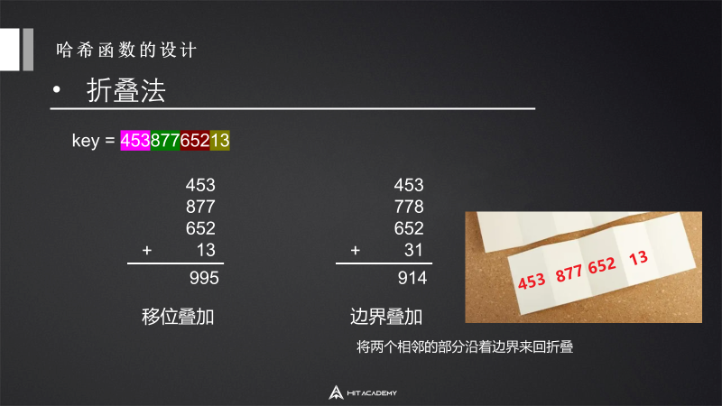

# 数据结构

## 1 数组

### 1.1 静态数组（Array

**数组是存放在连续内存空间上的相同类型数据的集合。**

数组使用内存管理器实现按下标访问元素，所以访问时间复杂度为O(1)，但查找和删除均为O(n)。

一维数组：

```c#
int[] array = new int[n];
```

二维数组：

```c#
int[,] array = new int[n,n];
int len = array.Length;       //len=n*n
```

交错数组：

```c#
int[][] array = new int[n][];
for(int i=0;i<n;i++) array[i] = new int[n];
int len1 = array.Length;
int len2 = array[0].Length;
```

### 1.2 动态数组（ArrayList&List

在C#中，由于数组都是固定长度的，所以常常不能满足我们开发的需求，因此出现了列表（可变长数组。

但其相关复杂度和数组相同，访问时间复杂度为O(1)，但查找和删除均为O(n)。

#### 1 ArrayList

ArrayList是可变长数组，其内部维护的数组，当长度不足时，会自动扩容为原来的两倍。

ArrayList存储的数据可以重复，通过索引（下标）进行访问。

但ArrayList有一个缺点，就是存入ArrayList的数据都是Object类型的，所以将值类型存入和取出时会发生装箱拆箱操作（值类型和引用类型之间的转换），这会影响程序性能。

于是在.Net2.0泛型出现以后，就提供了List。

#### 2 List

List<T>

List是ArrayList的泛型版本，它不存在装拆箱操作。不过需要在使用的时候先设置好类型。

List存储的数据可以重复，通过索引（下标）进行访问。

```c#
List<int> list = new List<int>();
```

#### 3 区别

ArrayList非泛型而List是泛型，ArrayList在值类型存取时存在装拆箱操作，List是泛型多线程不安全。

#### 4 List底层剖析

List内部是由数组实现的，当没有给予指定容量时，初始容量为0。

##### Add()

在List的Add()函数中，每添加一个元素，Add接口都会首先检查容量是否足够，如果不够，会调用EnsureCapacity()函数进行扩容。

在EnsureCapacity()函数中，有这样一行代码：

```c#
//_defaultCapacity：默认容量为4
//当list开始添加元素时，默认指定的最初容量为4，后续按2倍扩容
int newCapacity = _items.Length == 0? _defaultCapacity : _items.Length*2;
```

每次容量不够时，整个数组的容量都会扩充一倍，_defaultCapacity表示默认容量为4，因此整个扩充路线为4，8，16，32...以此类推。

List使用数组形式作为底层数据结构，优点是通过索引访问元素很快，缺点是在扩容时每次针对数组进行new操作都会造成内存垃圾，给垃圾回收（GC）带来了很多负担。

这里按2的指数扩容的方式，可以为GC减轻负担。但如果数组被连续申请扩容，还是会造成GC的不小负担。此外，如果数量使用不当，也会浪费大量空间，例如，当元素数量为520时，List会扩容到1024个元素，那么就会有504个空间单位被剩余，造成内存空间的大量浪费。

##### Remove()

原理是先使用一个IndexOf函数以O(n)复杂度找到目标元素索引，再在RemoveAt()函数内使用Array.Copy对数组进行覆盖。

Array.Sort()

```c#
//将array1从index1开始的len个元素复制到array2（从index2开始
Array.Sort(array1,index1,array2,index2,len);
```

```c#
...
_size--;
if(index<_size) Array.Sort(_items,index+1,_items,index,_size-index);
...
```

其他接口原理与Add()接口和Remove()接口相似，可以看到，List效率并不高，只是通用性较强而已，大部分算法使用的都是线性复杂度的算法。

另外也可以从源码中看出，List是线程不安全的，它并没有对多线程做任何加锁或其他同步操作。由于并发情况下无法判断_size++的执行顺序，因此当我们在多线程间使用List时应加上安全机制。


## 2 链表

### 2.1 分类

#### 1 单链表（ListDictionary

链表是一种通过指针串联在一起的线性结构，每一节点由两部分组成，一个是数据域一个是指针域（存放指向下一个节点的指针），最后一个节点的指针域指向null。


#### 2 双链表（LinkedList

LinkedList<T>

每一个节点有两个指针域，一个指向下一个节点，一个指向上一个节点。


#### 3 循环链表

循环链表，顾名思义，就是链表首尾相连。循环链表可以用来解决约瑟夫环问题。


### 2.2 链表的存储方式

链表中的节点在内存中不是连续分布的，而是散乱分布在内存中的某地址上，分配机制取决于操作系统的内存管理，各节点通过指针域的指针链接。


### 2.3 练习

#### 239 滑动窗口最大值（LinkedList

```c#
public class Solution {
    public int[] MaxSlidingWindow(int[] nums, int k) {
        LinkedList<int> list = new LinkedList<int>();
        for(int i=0;i<k;i++){
            while(list.Count!=0&&list.Last.Value<nums[i]) list.RemoveLast();
            list.AddLast(nums[i]);
        }
        List<int> res = new List<int>();
        res.Add(list.First.Value);
        for(int i=k;i<nums.Length;i++){
            if(nums[i-k]==list.First.Value) list.RemoveFirst();
            while(list.Count!=0&&list.Last.Value<nums[i]) list.RemoveLast();
            list.AddLast(nums[i]);
            res.Add(list.First.Value);
        }
        return res.ToArray();
    }
}
```

#### 160 相交链表

##### List

遍历统计，遍历对比。

##### 双指针*


```c#
public class Solution {
    public ListNode GetIntersectionNode(ListNode headA, ListNode headB) {
        ListNode a = headA;
        ListNode b = headB;
        while(a!=b){
            a = a!=null? a.next:headB;
            b = b!=null? b.next:headA;
        }
        return a;
    }
}
```

#### 148 环形链表

##### 列表

遍历记录并查找已被记录过的节点。

##### 快慢指针*

假设入环前路径长度为a，环头到环尾路径长度为b，那么如果要让某个指针停在环入口，那么它应该走的步数为：a+nb。

假设现在有两个指针，fast指针每次走两步，slow指针每次走一步。用f，s分别代表fast和slow行走的距离。

那么f = 2s。

两个指针第一次相遇时：

fast比slow多走了n个环的长度，即f = s+nb。

以上两式相减可得：f = 2nb，s = nb。

那么只要让两指针相遇后slow指针再走a步，就会到环的入口点。

```c#
public class Solution {
    public ListNode DetectCycle(ListNode head) {
        ListNode fast = head;
        ListNode slow = head;
        while(true){
            if(fast==null||fast.next==null) return null;
            fast = fast.next.next;
            slow = slow.next;
            if(fast==slow) break;
        }
        fast = head;
        while(fast!=slow){
            fast = fast.next;
            slow = slow.next;
        }
        return slow;
    }
}
```

## 3 堆栈和队列

### 3.1 堆栈（Stack

堆栈（Stack）代表了一个后进先出的对象集合。

```c#
Stack<object> stack = new Stack<object>();
```

相关方法：

```c#
void Clear();             //清除现有元素
bool Contains(object);    //判断某个元素是否在栈内
object Peek();            //获取顶部对象
void Push(Object);      //添加对象
object Pop();             //弹出顶部对象
object[] ToArray();       //复制stack到一个新的数组中
```

### 3.2 队列（Queue

#### 1 概念

队列（Queue）代表了一个先进先出的对象集合。

```c#
Queue<object> queue = new Queue<object>();
```

相关方法：

```c#
void Clear();
bool Contains(object);
void Enqueue(object);
object Dequeue();
object[] ToArray();
```

#### 2 优先队列（PriorityQueue

按优先级顺序弹出。

### 3.3 练习

#### **703 数据流中的第K大元素**（PriorityQueue

```c#
public class KthLargest {
    private PriorityQueue<int,int> queue;
    private int size;
    public KthLargest(int k, int[] nums) {
        queue = new PriorityQueue<int,int>();
        size = k;
        for(int i=0;i<nums.Length;i++){
            queue.Enqueue(nums[i],nums[i]);
            if(queue.Count>size) queue.Dequeue();
        }
    }
    
    public int Add(int val) {
        queue.Enqueue(val,val);
        if(queue.Count>size) queue.Dequeue();
        return queue.Peek();
    }
}
```

## 4 哈希表

### 4.1 哈希表（散列表

按哈希存储方式构造的存储结构称为哈希表，哈希表是通过关键码值直接访问的数据结构，它最大的特点是查找的时间复杂度是O(1)。

#### 1 哈希函数的设计

将数值转换为索引。

##### 1 数字分析法


##### 2 平方取中法


##### 3 折叠法



##### 4 除留余数法


#### 2 解决冲突的方法

哈希表会使用哈希函数将被查找的键转化为数组的索引，在理想的状态下，不同的键会被转化为不同的索引值，但实践中经常会出现不同的键生成相同的索引的情况，称为“哈希冲突”。

##### 1 链地址法


##### 2 开放地址法


#### 3 哈希碰撞攻击

我们知道如果哈希函数选择不当会使大量的键都会映射到相同的索引上，不管是采用拉链法还是开放寻址法解决冲突，在后面查找的时候都需要进行多次探测或者查找，在很多时候会使得哈希表的查找效率退化，而不再是常数时间。

哈希攻击就是通过精心构造哈希函数，使得所有的键进过函数函数后都会映射到同一个或者几个索引上，将哈希表退化为一个单链表，这样哈希表的各种操作，比如插入、查找都会从O(1)退化到了链表的查找操作，这样会消耗大量的CPU资源，导致系统无法响应，从而达到拒绝服务供给（Denial of Service,DOS）的目的。


### 4.2 HashTable Vs Dictionary

#### 1 HashTable

HashTable中的键值都是object类型，支持所有类型的键值对，在声明时不需要对键值指定类型。

```c#
using System.Collections.Generic;
Hashtable hstable = new Hashtable();
//添加数据
hstable.Add(1,"2");
hstable.Add("a",true);
//删除数据
hstable.Remove("a");
//判断是否存在key值|value值
bool t = hstable.ContainsKey("a");
bool i = hstable.ContainsValue(true);
//遍历哈希表
foreach(DictionaryEntry item in hstable){
	Debug.Log(item.key+" "+item.Value);
}
```

#### 2 Dictionary

hashtable不支持泛型，dictionary支持泛型。

```c#
Dictionary<int,int> dict = new Dictionary<int,int>();
//添加数据
dict.Add(key,value);
//删除数据
dict.Remove(key);
//判断是否存在
bool x = dict.ContainsKey(key);
bool y = dict.ContainsValue(value);
//清空
dict.Clear();
//遍历字典
foreach(var d in dict){
	Console.WriteLine(d.Key);
    Console.WriteLine(d.Value);
}
```

#### 3 对比

- 泛型
  - 哈希表不支持泛型，字典支持泛型。
- 元素类型
  - 哈希表的元素属于object类型，所以在存储和检索时经常发生装箱拆箱操作。
- 多线程及线程安全
  - 单线程用字典，有泛型优势，读取速度快，容量利用更充分。
  - 多线程用哈希表，默认哈希表允许单线程写入，多线程读取。对哈希表进一步调用ynchronized()方法可以获得完全线程安全的类型。而字典非线程安全，必须人为增加lock语句进行保护，影响效率。
- 数据插入顺序
  - 字典的排序就是按照插入的顺序排序（删除节点后就被打乱了），因此在需要体现顺序的情况下，字典更有效。
- 索引效率
  - 字典在单线程索引数据的时候效率比较高，读取速度快，但数据量大的时候效率会下降。
  - 哈希表的索引方式是经过散列处理的，在数据量大的时候处理效率更高，所以哈希表比较适合运用在做对象缓存，树递归算法的替代等各种需要提升效率的场合。
  - 在通过代码测试的时候发现key是整数型dictionary的效率比hashtable快，如果key是字符串型，hashtable的效率比dictionary快。
- 容量
  - 哈希表在指定capacity参数时，它并不只开出capacity个槽的内存空间，而是开出比 capacity / 0.72（默认装填因子） 大的最小素数个槽的空间
  - 而字典在指定capacity时，是开出 比capacity 大的最小素数个槽的空间。


### 4.3 HashSet

NET3.5多了个HashSet用来存储集合。从名称可以看出，它是基于Hash的。可以简单理解为没有Value的Dictionary<TKey,TValue>。其解决哈希冲突的方法为拉链法。

HashSet<T>不能用索引访问，不能存储重复数据。

它的优势在于它良好的检索性能，简单来说它的Contains方法的性能在大数据量时比List<T>好很多。HashSet<T>的Contains方法复杂度是O(1)，List<T>的Contains方法复杂度是O(n)。

而与很多数据结构不同，HashSet不能修改元素，如果需要修改，只能删除原来的元素，再添加新的元素。

RemoveWhere方法：

```c#
Public int RemoveWhere(Predicate<T> match);
//match是一个Predicate<T>委托，用于定义要移除元素应满足的条件
```

```c#
HashSet<int> hsSet = new HashSet<int>();
hsSet.Add(1);
hsSet.Remove(1);
hsSet.RemoveWhere(x=>(x==1));
```

CopyTo方法：

```c#
CopyTo();  //把集合中的元素复制到一个数组中
```

另外，HashSet最初的设计目的其实是为了方便集合计算，两个HashSet可以通过接口获取它们的交集、并集、补集、差集：

```c#
//交集：计算set1与set2交集并赋值给set1
set1.IntersectWith(set2);
//并集
set1.UnionWith(set2);
//补集
set1.SymmetricExceptWith(set2);
//差集
set1.ExceptWith(set2);
//判断参数传送的集合是否为子集
set1.IsSubsetOf(set2);
//判断参数传送的集合是否为超集
set1.IsSupersetOf(set2);
//判断参数传送的集合是否至少有一个元素与集中元素相同
set1.Overlaps(set2);
//判断参数传送的集合是否和集包含相同的元素
set1.SetEquals(set2);
```

### 4.4 练习

#### 349 两个数组的交集（HashSet

```c#
public class Solution {
    public int[] Intersection(int[] nums1, int[] nums2) {
        HashSet<int> set1 = new HashSet<int>();
        HashSet<int> set2 = new HashSet<int>();
        for(int i=0;i<nums1.Length;i++) set1.Add(nums1[i]);
        for(int i=0;i<nums2.Length;i++) set2.Add(nums2[i]);
        set1.IntersectWith(set2);
        int[] res = new int[set1.Count];
        set1.CopyTo(res);
        return res;
    }
}
```

### 4.5 Dictionary底层剖析

我们知道，Dictionary字典型数据结构是以关键字Key值和Value值进行一一映射的。

这种映射关系可以用一个Hash函数来建立，最简单的可以认为是余操作。

而对于实例对象和字符串来说，它们没有直接的数字作为Hash标准，因此它们需要通过内存地址计算一个Hash值，计算这个内存对象的函数就叫HashCode，它是基于内存地址计算得到的结果。

而对于不同的Key，在Hash计算时可能得到同一Hash地址，这种现象称为Hash冲突。Dictionary处理哈希冲突的方法为链地址法（拉链法）。

分析Dictionary的源码，可以发现Dictionary是以数组为底层数据结构的类，在数组的基础上进行动态扩容，新空间大小为大于等于原有空间大小两倍的最小质数。

**原因：质数使数据分布更均匀。**

在通过Hash函数得到Hash值后，还需要对数组大小进行取余操作，以确保索引地址落在Dictionary数组长度范围内，而我们可以推断出，当数组大小为质数时，哈希冲突减小，数据分布更均匀。

## 5 二叉树

### 5.1 概念

- 每个节点最多有两棵子树
- 二叉树的子树有左右之分，不可颠倒

### 5.2 特殊二叉树

- 满二叉树
  - 一个二叉树每一层的结点数都达到最大值
- 完全二叉树
  - 完全二叉树相比满二叉树，仅要求除最后一层外其他层数的节点数达到最大值，因此可以把满二叉树看成是特殊的完全二叉树

- 二叉搜索树
  - 也称有序二叉树，排序二叉树，是指一棵空树或者具有下列性质的二叉树
    - 左子树上所有结点的值均小于它的根结点的值
    - 右子树上所有结点的值均大于它的根节点的值

### 5.3 练习

#### 98 验证二叉搜索树

```c#
/**
 * Definition for a binary tree node.
 * public class TreeNode {
 *     public int val;
 *     public TreeNode left;
 *     public TreeNode right;
 *     public TreeNode(int val=0, TreeNode left=null, TreeNode right=null) {
 *         this.val = val;
 *         this.left = left;
 *         this.right = right;
 *     }
 * }
 */
public class Solution {
    public bool temp;
    public bool IsValidBST(TreeNode root) {
        temp = true;
        DFS(root,-10000000000,10000000000);
        return temp;
    }
    public void DFS(TreeNode root,long down,long up){
        if(!temp) return;
        if(root.left==null&&root.right==null) return;
        if(root.left!=null){
            if(root.left.val<root.val&&root.left.val>down){
                DFS(root.left,down,Math.Min(up,root.val));
            }else{
                temp = false;
            }
        }
        if(root.right!=null){
            if(root.right.val>root.val&&root.right.val<up){
                DFS(root.right,Math.Max(down,root.val),up);
            }else{
                temp = false;
            }
        }
    }
}
```

#### 235 二叉搜索树的最近公共祖先

```c#
public class Solution {
    public TreeNode LowestCommonAncestor(TreeNode root, TreeNode x, TreeNode y) {
        while(true){
            if(x.val<root.val&&y.val<root.val) root = root.left;
            else if(x.val>root.val&&y.val>root.val) root = root.right;
            else return root;
        }
        return null;
    }
}
```

#### 236 二叉树的最近公共祖先

```c#
public class Solution {
    public TreeNode LowestCommonAncestor(TreeNode root, TreeNode p, TreeNode q) {
        if(root==null||root==p||root==q) return root;
        TreeNode left = LowestCommonAncestor(root.left,p,q);
        TreeNode right = LowestCommonAncestor(root.right,p,q);
        if(left==null) return right;
        if(right==null) return left;
        return root;
    }
}
```

#### 94 二叉树的中序遍历

##### 递归

```c#
public class Solution {
    public IList<int> list;
    public IList<int> InorderTraversal(TreeNode root) {
        list = new List<int>();
        if(root==null) return list;
        DFS(root);
        return list;
    }
    private void DFS(TreeNode root){
        if(root.left==null&&root.right==null){
            list.Add(root.val);
            return;
        }
        if(root.left!=null) DFS(root.left);
        list.Add(root.val);
        if(root.right!=null) DFS(root.right);
    }
}
```

##### 迭代（栈

```c#
public class Solution {
    public IList<int> InorderTraversal(TreeNode root) {
        IList<int> list = new List<int>();
        if(root==null) return list;
        Stack<TreeNode> stack = new Stack<TreeNode>();
        while(root!=null||stack.Count!=0){
            while(root!=null){
                stack.Push(root);
                root = root.left;
            }
            root = stack.Pop();
            list.Add(root.val);
            root = root.right;
        }
        return list;
    }
}
```

#### 102 二叉树的层序遍历

##### 迭代（队列

```c#
public class Solution {
    public IList<IList<int>> LevelOrder(TreeNode root) {
        IList<IList<int>> list = new List<IList<int>>();
        if(root==null) return list;
        Queue<TreeNode> queue = new Queue<TreeNode>();
        queue.Enqueue(root);
        while(queue.Count!=0){
            int num = queue.Count;
            List<int> temp = new List<int>();
            while(num>0){
                TreeNode node = queue.Dequeue();
                temp.Add(node.val);
                if(node.left!=null) queue.Enqueue(node.left);
                if(node.right!=null) queue.Enqueue(node.right);
                num--;
            }
            list.Add(temp);
        }
        return list;
    }
}
```

#### 144 二叉树的前序遍历

##### 递归

```c#
public class Solution {
    public IList<int> list;
    public IList<int> PreorderTraversal(TreeNode root) {
        list = new List<int>();
        if(root==null) return list;
        DFS(root);
        return list;
    }
    private void DFS(TreeNode root){
        list.Add(root.val);
        if(root.left==null&&root.right==null) return;
        if(root.left!=null) DFS(root.left);
        if(root.right!=null) DFS(root.right);
    }
}
```

##### 迭代（栈

```c#
public class Solution {
    public IList<int> PreorderTraversal(TreeNode root) {
        IList<int> list = new List<int>();
        if(root==null) return list;
        Stack<TreeNode> stack = new Stack<TreeNode>();
        stack.Push(root);
        while(stack.Count!=0){
            TreeNode node = stack.Pop();
            list.Add(node.val);
            if(node.right!=null) stack.Push(node.right);
            if(node.left!=null) stack.Push(node.left);
        }
        return list;
    }
}
```

#### 145 二叉树的后序遍历

##### 递归

```c#
public class Solution {
    public IList<int> list;
    public IList<int> PostorderTraversal(TreeNode root) {
        list = new List<int>();
        if(root==null) return list;
        DFS(root);
        return list;
    }
    private void DFS(TreeNode root){
        if(root.left==null&&root.right==null){
            list.Add(root.val);
            return;
        }
        if(root.left!=null) DFS(root.left);
        if(root.right!=null) DFS(root.right);
        list.Add(root.val);
    }
}
```

##### 迭代（栈

```c#
public class Solution {
    public IList<int> PostorderTraversal(TreeNode root) {
        IList<int> list = new List<int>();
        if(root==null) return list;
        Stack<TreeNode> stack = new Stack<TreeNode>();
        while(root!=null||stack.Count!=0){
            while(root!=null){
                stack.Push(root);
                root = root.left;
            }
            root = stack.Peek();
            if(root.right==null||(list.Count!=0&&root.right.val==list[list.Count-1])){
                list.Add(stack.Pop().val);
                root = null;
            }else{
                root = root.right;
            }
        }
        return list;
    }
}
```

## 6 字典树

Trie树，又称单词查找树或键树。

### 6.1 概念

用途：经常被搜索引擎系统用于词频推荐。


结点无含义，边存储字符。

用空间换时间，利用字符串的公共前缀降低查询时间的开销以达到提高效率的目的。

### 6.2 练习

#### 208 实现Trie（前缀树

```c#
public class Trie {
    Trie[] son;
    bool isEnd;
    public Trie() {
        son = new Trie[26];
        isEnd = false;
    }
    
    public void Insert(string word) {
        Trie node = this;
        for(int i=0;i<word.Length;i++){
            int n = word[i]-'a';
            if(node.son[n]==null){
                Trie temp = new Trie();
                node.son[n] = temp;
            }
            node = node.son[n];
        }
        node.isEnd = true;
    }
    
    public bool Search(string word) {
        Trie node = this;
        for(int i=0;i<word.Length;i++){
            int n = word[i]-'a';
            if(node.son[n]==null) return false;
            else node = node.son[n];
        }
        if(node.isEnd) return true;
        return false;
    }
    
    public bool StartsWith(string prefix) {
        Trie node = this;
        for(int i=0;i<prefix.Length;i++){
            int n = prefix[i]-'a';
            if(node.son[n]==null) return false;
            else node = node.son[n];
        }
        return true;
    }
}
```

#### 212 单词搜索Ⅱ

字典树

## 7 并查集

### 7.1 概念

并查集（union&find）是一种树型的数据结构，用于处理一些不交集的合并及查询问题。

Find：确定元素属于哪一个子集，它可以被用来确定两个元素是否属于同一个子集。

Union：将两个子集合并为一个集合。

生活中的例子

- 小弟->老大（属于谁的手下

- 帮派识别
- 两种优化方式

并查集初始化：

```c#
public class QuickUnionUF{
	private int[] roots;
	public QuickUnionUF{
		roots = new int[n];
		for(int i=0;i<n;i++) 
            roots[i] = i;  //初始状态：我的老大是我本人，各自为营
	}
}
```


操作：

```伪代码
//伪代码
function MakeSet(x)
	x.parent := x;
function Find(x)
	if x.parent ==x
		return x
	else
		return Find(x.parent)
fuction Union(x,y)
	xRoot := Find(x)
	yRoot := Find(y)
	xRoot.parent := yRoot
```


### 7.2 优化方式

1）使树的总深度更低，从而提高查找效率

方式：在合并时选择较小深度树合并到较大深度树的合并方法。


```伪代码
//深度：rank
fuction MakeSet(x)
	x.parent := x
	x.rank := 0
fuction Union(x,y)
	xRoot := Find(x)
	yRoot := Find(y)
	if xRoot == yRoot
		return
	if xRoot.rank < yRoot.rank
		xRoot.parent := yRoot
	else if xRoot.rank > yRoot.rank
		yRoot.parent := xRoot
	else 
		yRoot.parent := xRoot
		xRoot.rank := xRoot.rank + 1
```

2）路径压缩


```c#
public class QuickUnionUF{
	private int[] roots;
	public QuickUnionUF(int n){
		roots = new int[n];
		for(int i=0;i<n;i++)
			roots[i] = i;
	}
	private int FindRoot(int i){
		int root = i;
		//找祖先
		while(root!=roots[root])
			root = roots[root];
		//路径压缩
		while(i!=roots[i]){
			int temp = roots[i];
			roots[i] = root;
			i = temp;
		}
		return root;
	}
	...
}
```

### 7.3 练习

#### 200 岛屿数量

##### DFS

```c#
public class Solution {
    public char[][] grid;
    public int NumIslands(char[][] g) {
        grid = g;
        int res = 0;
        for(int i=0;i<grid.Length;i++){
            for(int j=0;j<grid[0].Length;j++){
                if(grid[i][j]=='1'){
                    DFS(i,j);
                    res++;
                }
            }
        }
        return res;
    }
    private void DFS(int i,int j){
        if(i<0||j<0||i>=grid.Length||j>=grid[0].Length) return;
        if(grid[i][j]=='0') return;
        grid[i][j]='0';
        DFS(i-1,j);
        DFS(i+1,j);
        DFS(i,j-1);
        DFS(i,j+1);
    }
}
```

##### 并查集

```c#
public class QuickUnionUF{
    private int[] roots;   //祖先
    private int[] ranks;   //深度
    private int count;     //连通分量数目
    public QuickUnionUF(char[][] grid){
        int m = grid.Length;
        int n = grid[0].Length;
        roots = new int[m*n];
        ranks = new int[m*n];
        for(int i=0;i<m;i++){
            for(int j=0;j<n;j++){
                if(grid[i][j]=='1'){
                    roots[i*n+j] = i*n+j;
                    count++;
                }
            }
        }
    }
    public int FindRoot(int n){
        if(roots[n]!=n) return FindRoot(roots[n]);
        return n;
    }
    public void Union(int x,int y){
        int xRoot = FindRoot(x);
        int yRoot = FindRoot(y);
        if(xRoot!=yRoot){
            if(ranks[xRoot]<ranks[yRoot]) roots[xRoot] = yRoot;
            else if(ranks[xRoot]>ranks[yRoot]) roots[yRoot] = xRoot;
            else{
                roots[yRoot] = xRoot;
                ranks[xRoot]++;
            }
            count--;
        }
    }
    public int GetCount(){
        return count;
    }
}
public class Solution {
    public int NumIslands(char[][] grid) {
        QuickUnionUF uf = new QuickUnionUF(grid);
        int m = grid.Length;
        int n = grid[0].Length;
        for(int i=0;i<m;i++){
            for(int j=0;j<n;j++){
                if(grid[i][j]=='1'){
                    if(i-1>=0&&grid[i-1][j]=='1') uf.Union((i-1)*n+j,i*n+j);
                    if(i+1<m&&grid[i+1][j]=='1') uf.Union((i+1)*n+j,i*n+j);
                    if(j-1>=0&&grid[i][j-1]=='1') uf.Union(i*n+j-1,i*n+j);
                    if(j+1<n&&grid[i][j+1]=='1') uf.Union(i*n+j+1,i*n+j);
                }
            }
        }
        return uf.GetCount();
    }
}
```

#### 547 省份数量

```c#
public class QuickUnionUF{
    public int[] roots;
    public int[] ranks;
    public int count;
    public QuickUnionUF(int n){
        roots = new int[n];
        ranks = new int[n];
        for(int i=0;i<n;i++){
            roots[i] = i;
            count++;
        }
    }
    public int FindRoot(int n){
        if(roots[n]!=n) return FindRoot(roots[n]);
        return n;
    }
    public void Union(int x,int y){
        int xRoot = FindRoot(x);
        int yRoot = FindRoot(y);
        if(xRoot!=yRoot){
            if(ranks[xRoot]<ranks[yRoot]) roots[xRoot] = yRoot;
            else if(ranks[xRoot]>ranks[yRoot]) roots[yRoot] = xRoot;
            else{
                roots[yRoot] = xRoot;
                ranks[xRoot]++;
            } 
            count--;
        }

    }
}
public class Solution {
    public int FindCircleNum(int[][] isConnected) {
        int n = isConnected.Length;
        QuickUnionUF uf = new QuickUnionUF(n);
        for(int i=0;i<n;i++){
            for(int j=0;j<n;j++){
                if(i!=j&&isConnected[i][j]==1){
                    uf.Union(i,j);
                }
            }
        }
        return uf.count;
    }
}
```

#### 990 等式方程的可满足性

```c#
public class QuickUnionUF{
    private int[] roots;   //祖先
    private int[] ranks;   //深度
    public QuickUnionUF(){
        roots = new int[26];
        ranks = new int[26];
        for(int i=0;i<26;i++)
            roots[i] = i;
    }
    public int FindRoot(int n){
        if(roots[n]!=n) return FindRoot(roots[n]);
        return n;
    }
    public void Union(int m,int n){
        int mRoot = FindRoot(m);
        int nRoot = FindRoot(n);
        if(ranks[mRoot]<ranks[nRoot]) roots[mRoot] = nRoot;
        else if(ranks[mRoot]>ranks[nRoot]) roots[nRoot] = mRoot;
        else{
            roots[mRoot] = nRoot;
            ranks[nRoot]++;
        }
    }
}
public class Solution {
    public bool EquationsPossible(string[] equations) {
        QuickUnionUF uf = new QuickUnionUF();
        for(int i=0;i<equations.Length;i++){
            int a = equations[i][0]-'a';
            int b = equations[i][3]-'a';
            if(equations[i][1]=='=') uf.Union(a,b);
            else if(uf.FindRoot(a)==uf.FindRoot(b)) return false;
        }
        for(int i=0;i<equations.Length;i++)
            if(equations[i][1]=='!'&&(uf.FindRoot(equations[i][0]-'a')==uf.FindRoot(equations[i][3]-'a')))
                return false;
        return true;
    }
}
```

#### 399 除法求值

```c#
public class Solution {
    public double[] CalcEquation(IList<IList<string>> equations, double[] values, IList<IList<string>> queries) {
        QuickUnionUF uf = new QuickUnionUF(equations,values);
        double[] result = new double[queries.Count];
        for(int i=0;i<queries.Count;i++){
            string a = queries[i][0];
            string b = queries[i][1];
            if(!uf.roots.ContainsKey(a)||!uf.roots.ContainsKey(b)){
                result[i] = -1.0;
            }else{
                if(uf.FindRoot(a)!=uf.FindRoot(b)){
                    result[i] = -1.0;
                }else{
                    result[i] = uf.relation[a]/uf.relation[b];
                }
            }
        }
        return result;
    }
    private class QuickUnionUF{
        public Dictionary<string,string> roots;  
        public Dictionary<string,double> relation;
        public QuickUnionUF(IList<IList<string>> equations, double[] values){
            roots = new Dictionary<string,string>();
            relation = new Dictionary<string,double>();
            for(int i=0;i<equations.Count;i++){
                string a = equations[i][0];
                string b = equations[i][1];
                if(roots.ContainsKey(a)&&roots.ContainsKey(b)){
                    if(FindRoot(a)!=FindRoot(b)){
                        Union(a,b,values[i]);
                    }
                }else if(roots.ContainsKey(a)){
                    roots.Add(b,a);
                    relation.Add(b,1/values[i]);
                    string res = FindRoot(b);
                }else if(roots.ContainsKey(b)){
                    roots.Add(a,b);
                    relation.Add(a,values[i]);
                    string res = FindRoot(a);
                }else{
                    roots.Add(a,b);
                    relation.Add(a,values[i]);
                    roots.Add(b,b);
                    relation.Add(b,1);
                }
            }
        }
        public string FindRoot(string a){
            Stack<string> stack = new Stack<string>();
            //1.找祖先
            while(roots[a]!=a){
                stack.Push(a);
                a = roots[a];
            }
            //2.路径压缩
            while(stack.Count>0){
                string temp = stack.Pop();
                relation[temp] = relation[temp]*relation[roots[temp]];
                roots[temp] = a;
            }
            return a;
        }
        public void Union(string a,string b,double value){
            string aRoot = FindRoot(a);
            string bRoot = FindRoot(b);
            roots[aRoot] = bRoot;
            relation[aRoot] = value/relation[a]*relation[b];
            string res = FindRoot(a);
        }
    }
}
```

## 8 LRU Cache

### 8.1 概念

#### 1 Cache 缓存

- 记忆
- 钱包、储物柜（容量比较小
- 代码模块

#### 2 CPU Socket

三级缓存。


#### 3 LRU Cache

- Least Recently Used（最近最少使用页面置换算法）（最近用的是啥）
- Double LinkedList（数据结构
- O(1) 查询（因为Cache一般查最前面的，所以就是O(1)，并不是说查所有元素都是O(1)
- O(1) 修改、更新


#### 4 LFU Cache

- Least Frequently Used（最近最不常用页面置换算法）（频次）
- 注意F替换掉E的时候，说明优先级还是有考虑最近查找的元素


### 8.2 练习

#### 146 LRU缓存

```c#
public class LRUCache {
    public class LinkedListNode{
        public int key;
        public int value;
        public LinkedListNode pre;
        public LinkedListNode next;
        public LinkedListNode(){}
        public LinkedListNode(int key,int value){this.key = key; this.value = value;}
    }
    int capacity;
    int size;
    public LinkedListNode first,last;
    Dictionary<int,LinkedListNode> dict;

    public LRUCache(int capacity) {
        this.capacity = capacity;
        first = new LinkedListNode();
        last = new LinkedListNode();
        first.next = last;
        last.pre = first;
        dict = new Dictionary<int,LinkedListNode>();
    }
    
    public int Get(int key) {
        if(dict.ContainsKey(key)){
            Delete(key);
            ToFirst(key);
            return dict[key].value;
        }
        return -1;
    }
    
    public void Put(int key, int value) {
        if(dict.ContainsKey(key)){
            LinkedListNode cur = dict[key];
            cur.value = value;
            Delete(key);
            ToFirst(key);
        }else{
            LinkedListNode cur = new LinkedListNode(key,value);
            dict.Add(key,cur);
            ToFirst(key);
            if(size==capacity){
                int temp = last.pre.key;
                Delete(temp);
                dict.Remove(temp);
            }else{
                size++;
            }
        }
    }

    private void Delete(int key){
        LinkedListNode cur = dict[key];
        cur.pre.next = cur.next;
        cur.next.pre = cur.pre;
    }

    private void ToFirst(int key){
        LinkedListNode cur = dict[key];
        cur.next = first.next;
        first.next.pre = cur;
        first.next = cur;
        cur.pre = first;
    }
}

/**
 * Your LRUCache object will be instantiated and called as such:
 * LRUCache obj = new LRUCache(capacity);
 * int param_1 = obj.Get(key);
 * obj.Put(key,value);
 */
```

## 9 布隆过滤器

Bloom Filter。

一个很长的二进制向量和一个映射函数。

用来检索一个元素是否在一个集合中，如果它检索一个元素不在一个集合中，那么这个元素100%不在这个集合中，但如果它检索一个元素在一个集合中，那么这个元素**有概率不在**这个集合中。

它的优点是空间效率和查询时间都远远超过一般的算法，缺点是有一定的误识别率和删除困难。


将元素按映射函数映射到二进制向量的相应位。

w：按映射函数检索，发现有一位不为1，那么w这个元素一定不在该集合中，但如果都为1，不一定代表这个元素在（有可能是其他元素的映射）。

# 算法

## 1 性能

### 1.1 时间复杂度

#### 1 概念

**时间复杂度是一个函数，它定性描述该算法的运行时间。**

通常会估算算法的操作单元数量来代表程序消耗的时间，这里默认CPU的每个单元运行消耗的时间都是相同的。

假设算法的问题规模为n，操作单元数量表示为f(n)，随着n的增大，算法执行时间的增长率和f(n)的增长率相同，这称为算法的渐近时间复杂度，简称时间复杂度，记为O(f(n))。

其中大O代表上界，我们平时主要关心一般数据规模下的时间复杂度。

在选择算法时，并不是时间复杂度越低越好（因为简化后的时间复杂度忽略了常数项等），要考虑数据规模。

时间复杂度排行：

```
O(1)常数阶<O(logn)对数阶<O(n)线性阶<O(n^2)平方阶<O(n^3)立方阶<O(2^n)指数阶
```

PS：logn是忽略底数的描述，可能以任何数为底。

#### 2 递归的时间复杂度

**题目：Pow(x,n)**

时间复杂度为O(n^2)的递归：

```c#
public class Solution {
    //如果n存在数据int.MinValue，那么要用long类型，防止在取-n时溢出
    public double MyPow(double x, int n) {
        if(n==0) return 1;
        if(n<0) return 1/MyPow(x,-n);
        return x*MyPow(x,n-1);
    }
}
```

时间复杂度为O(logn)的递归：

```c#
public class Solution {
    //如果n存在数据int.MinValue，那么要用long类型，防止在取-n时溢出
    public double MyPow(double x,int n){
        if(n==0) return 1;
        if(n<0) return 1/Pow(x,-n);
        if(n%2==1) return x*Pow(x*x,n/2);
        return Pow(x*x,n/2);
    }
}
```

### 1.2 空间复杂度

**空间复杂度是对一个算法在运行过程中占用内存空间大小的量度。**

## 2 排序

### 2.1 稳定性

排序后，如果两个相等的数可以保持原先的顺序，即该排序算法具有稳定性。

### 2.2 评价指标

- 时间复杂度
- 辅助空间
  - 除了原先存储待排序数据的空间外，执行算法所需的空间。

### 2.3 插入排序


```c#
int[] temp = new int[]{2,3,1};
//{}内为有序序列
//初始 {2},3,1
//一次 {2,3},1
//二次 {1,2,3}
```

```c#
int[] temp = new int[2,3,1];
for(int i=1;i<temp.Length;i++){
    int value = temp[i];
    int j;
    for(j=i-1;j>=0;j--){
        if(temp[j]>value) temp[j+1] = temp[j];
        else break;
    }
    temp[j+1] = value;
}
```

**评价**

- 稳定

- 时间复杂度

  - $$
    1+2+3+...+(n-1)=\frac{n^2}{2}=O(n^2)
    $$

    

- 空间复杂度

  - O(1)

### 2.4 希尔排序

比较相隔较远距离（增量）的数，使得数移动时能跨过多个元素，则进行一次比较就可能消除多个元素交换。


```c#
int[] temp = new int[]{2,3,1};
int gap = 1;  //计算增量
while(gap<temp.Length) gap = gap*3+1;
while(gap>0){
	for(int i=gap;i<temp.Length;i++){
		int b = temp[i];
		int a = i-gap;
		//分区间进行插入排序
		while(a>=0&&temp[a]>b){
			temp[a+gap] = temp[a];
			a-=gap;
		}
		temp[a+gap] = b;
	}
	gap/=3;
}
```

**评价**

- 不稳定

- 时间复杂度（取决于增量选择

  - $$
    O(n^{1.3...2})
    $$

- 空间复杂度

  - O(1)

### 2.5 冒泡排序


```c#
int[] temp = new int[]{2,3,1};
for(int i=0;i<temp.Length;i++){
    bool isSort = true;
	for(int j=0;j<temp.Length-1-i;j++){
		if(temp[j]>temp[j+1]){
			int tmp = temp[j];
			temp[j] = temp[j+1];
			temp[j+1] = tmp;
            isSort = false;
		}
	}
    if(isSort) break;
}
```

**评价**

- 稳定

- 时间复杂度

  - $$
    O(n^2)
    $$

- 空间复杂度

  - O(1)

### 2.6 快速排序

#### 1 基本快排


**一轮排序**


**代码**

```c#
public void QuickSort(int[] a,int left,int right){
	if(left>=right) return;
	int key = PartSort(a,left,right);  //排序
	QuickSort(a,left,key-1);           //对左区间进行递归调用
	QuickSort(a,key+1,right);          //对右区间进行递归调用
}
private int PartSort(int[] a,int low,int high){
	//选择第一个元素作为支点
	int num = a[low];
	//low和high没相遇时执行
	while(low<high){
		while(low<high&&a[high]>=num){
			high--;
		}
		a[low] = a[high];
		while(low<high&&a[low]<=num){
			low++;
		}
		a[high] = a[low];
	}
	a[low] = num;
	return low;
}
```

**评价**

- 不稳定
- 时间复杂度：O(nlogn)
  - 排序轮数取决于递归树的深度
  - 速度最快
- 空间复杂度：O(logn~n)
  - 递归树的深度

#### 2 快排优化

##### 1 随机基准


##### 2 三数取中


### 2.7 练习

#### 452 用最少数量的箭引爆气球

##### PriorityQueue

```c#
public class Solution {
    public int FindMinArrowShots(int[][] points) {
        PriorityQueue<int[],int> queue = new PriorityQueue<int[],int>();
        foreach(int[] item in points) queue.Enqueue(item,item[1]);
        int res = 0;
        int[] a = queue.Dequeue();
        int num = a[1];
        res = 1;
        while(queue.Count>0){
            while(queue.Count>0){
                int[] temp = queue.Dequeue();
                if(num<temp[0]||num>temp[1]){
                    num = temp[1];
                    res++;
                    break;
                }
            }
        }
        return res;
    }
}
```

##### Array.Sort()

```c#
Array.Sort(points, (a, b) => {
    if(a[1]==b[1]) return 0;
    else return a[1]<b[1]? -1:1; //返回-1代表还按原来升序的原理进行排序
});
```

```c#
public class Solution {
    public int FindMinArrowShots(int[][] points) {
        Array.Sort(points,(a,b)=>{
            if(a[1]==b[1]) return 0;
            else return a[1]<b[1]? -1:1;
        });
        int res = 1;
        int num = points[0][1];
        for(int i=1;i<points.Length;i++){
            if(num<points[i][0]||num>points[i][1]){
                num = points[i][1];
                res++;
            }
        }
        return res;
    }
}
```

### 2.8 归并排序

思想：将两个或两个以上有序表合并成一个新的有序表。


```c#
public static void MergeSort(int[] nums,int left,int right) {
	if (left >= right) return;
    int mid = (left + right) / 2;
    MergeSort(nums, left, mid);
    MergeSort(nums, mid + 1, right);
    Merge(nums, left, right);
}
 private static void Merge(int[] nums,int left,int right) {
    int mid = (left + right) / 2;
    int i = left;
    int j = mid + 1;
    int[] temp = new int[right - left + 1];
    int k = 0;
    while (i <= mid && j <= right) {
    	if (nums[i] <= nums[j]) temp[k++] = nums[i++];
        	else temp[k++] = nums[j++];
        }
    while (i <= mid) temp[k++] = nums[i++];
    while (j <= right) temp[k++] = nums[j++];
    for (int p = 0; p < temp.Length; p++) nums[left + p] = temp[p];
}
```

**评价**

- 稳定
- 时间复杂度：O(nlogn)
- 空间复杂度：O(n)

### 2.9 选择排序


```c#
int[] temp = new int[]{2,1,3};
for(int i=0;i<temp.Length-1;i++){
	int minNum = i;
	for(int j=i+1;j<temp.Length;j++){
		if(temp[j]<temp[minNum]){
			minNum = j;
		}
	}
	if(minNum!=i){
		Swap(ref temp[i],ref temp[minNum]);
	}
}
```

**评价**

- 不稳定的（31 31 7：当7和第一个31交换，31的前后顺序被破坏

- 时间复杂度

  - $$
    O(n^2)
    $$

- 空间复杂度：O(1)

### 2.10 堆排序

基本思想：堆对应一棵完全二叉树，且所有非叶结点的值均不大于（或不小于）其子女的值，根结点（堆顶元素）的值是最小（或最大）的，每次都取堆顶的元素，将其放在序列最后面，然后将剩余的元素重新调整为最小（大）堆，依次类推，最终得到排序的序列。

堆排序分为大顶堆和小顶堆排序。**大顶堆**：堆对应一棵完全二叉树，且所有非叶结点的值均不小于其子女的值，**根结点（堆顶元素）的值是最大的**。而**小顶堆**正好相反，小顶堆：堆对应一棵完全二叉树，且所有非叶结点的值均不大于其子女的值，**根结点（堆顶元素）的值是最小的。**

实现堆排序需解决两个问题：

- 如何将n个待排序的数建成堆?
- 输出堆顶元素后，怎样调整剩余n-1个元素，使其成为一个新堆?

首先讨论第二个问题：输出堆顶元素后，怎样对剩余n-1元素重新建成堆？

调整小顶堆的方法：

- 设有m 个元素的堆，输出堆顶元素后，剩下m-1 个元素。将堆底元素送入堆顶（（最后一个元素与堆顶进行交换），堆被破坏，其原因仅是根结点不满足堆的性质。
- 将根结点与左、右子树中较小元素的进行交换。
- 若与左子树交换：如果左子树堆被破坏，即左子树的根结点不满足堆的性质，则重复方法 （2）.
- 若与右子树交换，如果右子树堆被破坏，即右子树的根结点不满足堆的性质。则重复方法 （2）.
- 继续对不满足堆性质的子树进行上述交换操作，直到叶子结点，堆被建成。

　　称这个自根结点到叶子结点的调整过程为筛选。如图：


再讨论第一个问题，如何将n 个待排序元素初始建堆？建堆方法：对初始序列建堆的过程，就是一个反复进行筛选的过程。

- n 个结点的完全二叉树，则最后一个结点是第n/2个结点的子树。

- 筛选从第n/2个结点为根的子树开始，该子树成为堆。
- 之后向前依次对各结点为根的子树进行筛选，使之成为堆，直到根结点。

　　如图建堆初始过程：无序序列：（49，38，65，97，76，13，27，49）


```c#
//堆排序 小->大
//每次都取堆顶元素，将其放在序列最后，然后将剩余元素重新调整为大顶堆
public static void HeapSort(int[] nums){
	CreateHeap(nums);
	//从最后的节点进行调整
	for(int i=arr.Length-1;i>0;i--){
		Swap(nums,0,i);
		//每次交换进行调整
		AdjustHeap(nums,0,i-1);
	}
}
//建堆方法
private static void CreateHeap(int[] nums){
    int length = nums.Length-1;
    //从最后一个非叶子节点开始进行堆调整
	for(int i=(length-1)/2;i>=0;i--){
		AdjustHeap(nums,i,length);
	}
}
//调整堆
private static void AdjustHeap(int[] nums,int start,int length){
	int root = start;
	int child = root*2+1;
	while(child<=length){
		//子节点指标在范围内才做比较
		if(child<length&&nums[child]<nums[child+1]){
			//先比较两个子节点大小，选择最大的
			child++;
		}
		//如果父节点大于子节点代表调整完毕，直接跳出函数
		if(nums[root]>nums[child]) return;
		//否则交换父子内容再继续子节点和孙节点比较
		else{
			Swap(nums,root,child);
			root = child;
			child = root*2+1;
		}
	}
	
}
//交换
private static void Swap(int[] nums,int a,int b){
    int temp = nums[a];
    nums[a] = nums[b];
    nums[b] = temp;
}
```

**评价**

- 不稳定
- 时间复杂度：O(nlogn)
- 空间复杂度：O(1)

### 2.11 练习

#### LCP30 魔塔游戏

```c#
public class Solution {
    public int MagicTower(int[] nums) {
        //先求总和
        //如果总和为负数，那么一定到不了最后一个房间；
        //如果总和为正数，一定到得了，此时考虑最少调整次数；
        long sum = 1;
        foreach(int item in nums) sum+=(long)item;
        if(sum<=0) return -1;
        PriorityQueue<int,int> queue = new PriorityQueue<int,int>();
        long blood = 1;
        int res = 0;
        foreach(int item in nums){
            if(item<0){
                queue.Enqueue(item,item);
                if(blood+(long)item<=0){
                    blood = blood+(long)item-(long)queue.Dequeue();
                    res++;
                }else blood+=(long)item;
            }else blood+=(long)item;
        }
        return res;
    }
}
```

#### 1094 拼车

```c#
public class Solution {
    public bool CarPooling(int[][] trips, int capacity) {
        //根据上车时间进行排序
        Array.Sort(trips, (a, b) => {
            if(a[1]==b[1]) return 0;
            else return a[1]<b[1]? -1:1; //返回-1代表还按原来升序的原理进行排序
        });
        //计算
        PriorityQueue<int[],int> queue = new PriorityQueue<int[],int>();
        foreach(int[] item in trips){
            //执行下车操作
            while(queue.Count!=0){
                int[] temp = queue.Peek();
                if(temp[1]<=item[1]){
                    queue.Dequeue();
                    capacity+=temp[0];
                }else break;
            }
            capacity-=item[0];
            if(capacity<0) return false;
            queue.Enqueue(new int[]{item[0],item[2]},item[2]);
        }
        return true;
    }
}
```

## 3 查找

在大量信息中找到特定信息。

### 3.1 顺序查找

从序列表的一端开始，依次把关键字和元素进行比较。

```c#
//特定元素：special
for(int i=0;i<nums.Length;i++){
	if(nums[i]==special) return i;
}
return -1;
```

### 3.2 二分查找（BinarySearch

#### 1 概念

序列必须有序。

```
int BinarySearch(int[] nums,int low,int high,int target){
	if(low<=high){
		int mid = (low+high)/2;
		if(target<nums[mid]) return BinarySearch(nums,low,mid-1,target);
		else if(target>nums[mid]) return BinarySearch(nums,mid+1,high,target);
		else return mid;
	}
}
```

### 3.3 练习

#### 34 在排序数组中查找元素的第一个和最后一个位置*

```c#
public class Solution {
    public int[] SearchRange(int[] nums, int target) {
        int left = Find(nums,target,true);
        int right = Find(nums,target,false);
        return new int[]{left,right};
    }
    private int Find(int[] nums,int target,bool isLeft){
        int res = -1;
        int left = 0;
        int right = nums.Length-1;
        while(left<=right){
            int mid = (left+right)/2;
            if(nums[mid]==target){
                res = mid;
                if(isLeft) right = mid-1;
                else left = mid+1;
            }
            else if(nums[mid]<target) left = mid+1;
            else right = mid-1;
        }
        return res;
    }
}
```

#### 367 有效的完全平方数

##### 二分查找

```c#
public class Solution {
    public bool IsPerfectSquare(int num) {
        int left = 1;
        int right = num;
        while(left<=right){
            int mid = (left+right)/2;
            if((long)mid*mid==num) return true;
            else if((long)mid*mid<num) left = mid+1;
            else right = mid-1;
        }
        return false;
    }
}
```

##### 牛顿迭代法*

牛顿迭代公式：
$$
x_{n+1}=x_n-\frac{f(x_n)}{f'(x_n)}
$$


```c#
public class Solution {
    public bool IsPerfectSquare(int num) {
        int x0 = num;
        while(true){
            int x1 = (x0+num/x0)/2;
            if(x0-x1<1e-6){
                x0 = x1;
                break;
            }
            x0 = x1;
        }
        return x0*x0==num;
    }
}
```

### 3.4 分块查找

分块有序。

比如：所有左边块元素<中间块元素<右边块元素。


### 3.5 查找树

#### 1 二叉查找树


二叉搜索树的中序遍历就是排序后的结果。

#### 2 四叉树

在一维的世界里，我们用二分查找。

二维的世界里，我们可以用四分查找，把屏幕分成四份，找不到就再分四份。

游戏开发里应用比较广泛，例如2d碰撞检测等。


#### 3 八叉树


### 3.6 滑动窗口

通常用于解决字符串问题。


### 3.7 练习

#### 387 字符串中的第一个唯一字符

```c#
public class Solution {
    public int FirstUniqChar(string s) {
        Dictionary<int,int> dict = new Dictionary<int,int>();
        for(int i=0;i<s.Length;i++){
            //非唯一值将保存的索引值改为-1
            if(dict.ContainsKey(s[i])) dict[s[i]] = -1;
            else dict.Add(s[i],i);
        }
        int min = int.MaxValue;
        //找到除-1外索引值里最小的值，没有则返回-1
        foreach(var item in dict){
            if(item.Value!=-1) min = Math.Min(min,item.Value);
        }
        return min==int.MaxValue?-1:min;
    }
}
```

#### 219 存在重复元素Ⅱ

##### 字典

```c#
public class Solution {
    public bool ContainsNearbyDuplicate(int[] nums, int k) {
        Dictionary<int,int> dict = new Dictionary<int,int>();
        for(int i=0;i<nums.Length;i++){
            if(dict.ContainsKey(nums[i])){
                if(Math.Abs(dict[nums[i]]-i)<=k){
                    return true;
                }else dict[nums[i]] = i;
            }else dict.Add(nums[i],i);
        }
        return false;
    }
}
```

##### 滑动窗口+队列

```c#
public class Solution {
    public bool ContainsNearbyDuplicate(int[] nums, int k) {
        //k为窗口长度
        Queue<int> queue = new Queue<int>();
        for(int i=0;i<nums.Length;i++){
            if(queue.Count==k+1) queue.Dequeue();
            if(queue.Contains(nums[i])) return true;
            queue.Enqueue(nums[i]);
        }
        return false;
    }
}
```

#### 904 水果成篮（滑动窗口

```c#
public class Solution {
    public int TotalFruit(int[] fruits) {
        Dictionary<int,int> dict = new Dictionary<int,int>();
        int left = 0;
        int res = 0;
        for(int right=0;right<fruits.Length;right++){
            if(dict.ContainsKey(fruits[right])) dict[fruits[right]]++;
            else{
                if(dict.Count==2){
                    res = Math.Max(res,(right-left));
                    while(dict.Count==2){
                        int temp = fruits[left];
                        dict[temp]--;
                        if(dict[temp]==0) dict.Remove(temp);
                        left++;
                    }
                }
                dict.Add(fruits[right],1);
            }
        }
        return Math.Max(res,(fruits.Length-left));
    }
}
```

## 4 递归&分治

### 4.1 递归

递归是一种通过函数体自我调用实现的循环。

PS：递归和DFS（递归是一种算法结构，回溯是一种算法思想，DFS是回溯搜索的一种）。

### 4.2 分治

把一个大问题分成很多个子问题，然后对子问题一一进行分析。

### 4.3 练习

#### 50 Pow(x,n)

计算x的整数n次幂。

##### 分治

```c#
public class Solution {
    public double MyPow(double x, int n) {
        return n>0? Method(x,n):1/Method(x,-(long)n);
    }
    public double Method(double x,long n){
        if(n==0) return 1;
        if(n%2!=0) return x*Method(x,n-1);
        double y = Method(x,n/2);
        return y*y;
    }
}
```

##### 二进制位运算

```c#
public class Solution {
    public double MyPow(double x, int n) {
        long b = n;
        if(b<0){
            b = -b;
            x = 1/x;
        }
        double res = 1;
        while(b>0){
            if((b&1)==1) res*=x;
            x*=x;
            b>>=1;
        }
        return res;
    }
}
```

#### 169 多数元素

##### 排序

位于nums.Length/2下标的数一定是众数。

```c#
public class Solution {
    public int MajorityElement(int[] nums) {
        Array.Sort(nums);
        return nums[nums.Length/2];
    }
}
```

##### 抵消法

多数元素的数量比其他所有元素的总数还多，那么多数元素的数量可以抵消其他所有元素的数量。

从前往后遍历，遇到相同元素，计数 +1 ，遇到不同元素，计数-1，当旧数的出现次数减到0，新数替换旧数。直至遍历完成，最终剩下的那个数，就是多数元素。

```c#
public class Solution {
    public int MajorityElement(int[] nums) {
        int n=0;
        int m=0;
        for(int i=0;i<nums.Length;i++){
            if(n==0){
                n++;
                m=nums[i];
            }else{
                if(m==nums[i]) n++;
                else n--;
            }
        }
        return m;
    }
}
```

## 5 贪心

### 5.1 概念

Greedy。

指的是在对问题求解时，总是做出在当前看来是最好的选择。


每次都选最大的面值。

但按照贪心法其实并不一定能得到正确的答案。

适用贪心算法的场景：

问题能够分解成子问题来解决，子问题的最优解能递推到最终问题的最优解。

贪心算法与动态规划的不同在于它对每个子问题的解决方案都做出选择，不能回退。动态规划则会保存以前的运算结果，并根据以前的结果对当前进行选择，有回退功能。

### 5.2 练习

#### 122 买卖股票的最佳时机Ⅱ

贪心算法

每一天都买进并卖出昨天的，如果是正数，那么加入利润。

```c#
public class Solution {
    public int MaxProfit(int[] prices) {
        int res = 0;
        for(int i=1;i<prices.Length;i++){
            int temp = prices[i]-prices[i-1];
            if(temp>0) res+=temp;
        }
        return res;
    }
}
```

动态规划

定义状态dp[i] [0]表示第i天交易完后手里没有股票的最大利润，dp[i] [1]表示第i天交易完后手里有股票的最大利润。

考虑dp[i] [0]的转移方程，此时手里没有股票，那么有两种情况，前一天持有今天卖掉了或者是前一天也没有持有。

即：dp[i] [0] = Math.Max(dp[i-1] [0],dp[i-1] [1]+prices[i])。

考虑dp[i] [1]的转移方程，此时手里持有股票，那么有两种情况，前一天持有且今天没有卖掉或者前一天没有持有今天买入。

即：dp[i] [1] = Math.Max(dp[i-1] [0]-prices[i],dp[i-1] [1])。

初始状态：

dp[0] [0] = 0,dp[0] [1] = -prices[0]。

最后答案即为dp[n-1] [0]。

```c#
public class Solution {
    public int MaxProfit(int[] prices) {
        int[,] dp = new int[prices.Length,2];
        dp[0,0] = 0;
        dp[0,1] = -prices[0];
        for(int i=1;i<prices.Length;i++){
            dp[i,0] = Math.Max(dp[i-1,0],dp[i-1,1]+prices[i]);
            dp[i,1] = Math.Max(dp[i-1,0]-prices[i],dp[i-1,1]);
        } 
        return dp[prices.Length-1,0];
    }
}
```

## 6 DFS&BFS

### 6.1 概念


### 6.2 练习

#### 104 二叉树的最大深度

DFS

```c#
public class Solution {
    public int res;
    public int MaxDepth(TreeNode root) {
        res = 0;
        if(root==null) return res;
        DFS(root,0);
        return res;
    }
    private void DFS(TreeNode root,int dep){
        dep++;
        if(root.left==null&&root.right==null){
            res = Math.Max(res,dep);
            return;
        }
        if(root.left!=null) DFS(root.left,dep);
        if(root.right!=null) DFS(root.right,dep);
    }

}
```

#### 111 二叉树的最小深度

```c#
public class Solution {
    public int res;
    public int MinDepth(TreeNode root) {
        res = 100000;
        if(root==null) return 0;
        DFS(root,0);
        return res;
    }
    private void DFS(TreeNode root,int dep){
        dep++;
        if(dep>=res) return;
        if(root.left==null&&root.right==null) res = dep;
        if(root.left!=null) DFS(root.left,dep);
        if(root.right!=null) DFS(root.right,dep);
    }
}
```

#### 22 括号生成

```c#
public class Solution {
    public IList<string> list;
    public int num;
    public IList<string> GenerateParenthesis(int n) {
        list = new List<string>();
        num = n;
        if(n==0) return list;
        DFS("",0,0);
        return list;
    }
    private void DFS(String str,int left,int right){
        if(left==num&&right==num){
            list.Add(str);
            return;
        }
        if(left<num) DFS(str+"(",left+1,right);
        if(right<left) DFS(str+")",left,right+1);
    }
}
```

## 7 剪枝

### 7.1 概念

略。

### 7.2 练习

#### 51 N皇后

```c#
public class Solution {
    public IList<IList<string>> list;
    public int num;
    public IList<IList<string>> SolveNQueens(int n) {
        list = new List<IList<string>>();
        num = n;
        if(n==0) return list;
        int[] col = new int[n];
        int[] fro = new int[n*2-1];
        int[] rev = new int[n*2-1];
        Method(col,fro,rev,0,"");
        return list;
    }
    private void Method(int[] col,int[] fro,int[] rev,int n,string str){
        if(n==num){
            ToList(str);
            return;
        }
        for(int i=0;i<num;i++){
            if(col[i]==0&&fro[i+n]==0&&rev[i-n+num-1]==0){
                col[i]=1;
                fro[i+n]=1;
                rev[i-n+num-1]=1;
                Method(col,fro,rev,n+1,str+i.ToString()+",");
                col[i]=0;
                fro[i+n]=0;
                rev[i-n+num-1]=0;
            }
        }
    }
    private void ToList(string str){
        string[] temp = str.Split(",");
        List<string> l = new List<string>();
        for(int i=0;i<num;i++){
            String res = "";
            int x = int.Parse(temp[i]);
            int b = 0;
            while(b<num){
                if(b!=x) res = res+".";
                else res = res+"Q";
                b++;
            }
            l.Add(res);
        }   
        list.Add(l);
    }
}
```

#### 52 N皇后Ⅱ

```c#
public class Solution {
    public int num;
    public int res;
    public int TotalNQueens(int n) {
        if(n==0) return 0;
        num = n;
        res = 0;
        int[] col = new int[n];
        int[] fro = new int[n*2-1];
        int[] rev = new int[n*2-1];
        Method(col,fro,rev,0);
        return res;
    }
    private void Method(int[] col,int[] fro,int[] rev,int n){
        if(n==num){
            res++;
            return;
        }
        for(int i=0;i<num;i++){
            if(col[i]==0&&fro[i+n]==0&&rev[i-n+num-1]==0){
                col[i]=1;
                fro[i+n]=1;
                rev[i-n+num-1]=1;
                Method(col,fro,rev,n+1);
                col[i]=0;
                fro[i+n]=0;
                rev[i-n+num-1]=0;
            }
        }
    }
}
```

#### 36 有效的数独

```c#
public class Solution {
    public bool IsValidSudoku(char[][] board) {
        bool[,] row = new bool[9,10];  //第几行数字几是否出现
        bool[,] col = new bool[9,10];  //第几行数字几是否出现
        bool[,] lat = new bool[9,10];  //第几个格子数字几是否出现
        for(int i=0;i<board.Length;i++){
            for(int j=0;j<board[0].Length;j++){
                if(board[i][j]!='.'){
                    int n = board[i][j]-'0';
                    if(row[i,n]||col[j,n]||lat[Number(i,j),n]) return false;
                    else{
                        row[i,n] = true;
                        col[j,n] = true;
                        lat[Number(i,j),n] = true;
                    }
                }
            }
        }
        return true;
    }
    private int Number(int i,int j){
        if(i<3){
            if(j<3) return 0;
            if(j>=3&&j<6) return 1;
            if(j>=6) return 2;
        }else if(i>=3&&i<6){
            if(j<3) return 3;
            if(j>=3&&j<6) return 4;
            if(j>=6) return 5;
        }else if(i>=6){
            if(j<3) return 6;
            if(j>=3&&j<6) return 7;
            if(j>=6) return 8;
        }
        return -1;
    }
}
```

#### 37 解数独

```c#
public class Solution {
    public char[][] res;
    public void SolveSudoku(char[][] board) {
        //初始化状态      
        res = board;
        bool[,] row = new bool[9,10];  //第几行数字几是否出现
        bool[,] col = new bool[9,10];  //第几行数字几是否出现
        bool[,] lat = new bool[9,10];  //第几个格子数字几是否出现
        for(int i=0;i<board.Length;i++){
            for(int j=0;j<board[0].Length;j++){
                if(board[i][j]!='.'){
                    int n = board[i][j]-'0';
                    row[i,n] = true;
                    col[j,n] = true;
                    lat[Number(i,j),n] = true;
                }
            }
        }
        //填入数字
        DFS(0,0,row,col,lat,board);
        board = res;
    }
    //方法1：DFS找答案
    //每一行依次搜索
    private bool DFS(int i,int j,bool[,] row,bool[,] col,bool[,] lat,char[][] board){
        if(i==9){
            res = board;
            return true;
        }
        if(j==9){
            return DFS(i+1,0,row,col,lat,board);
        }
        if(board[i][j]=='.'){
            for(int k=1;k<=9;k++){
                if(!row[i,k]&&!col[j,k]&&!lat[Number(i,j),k]){
                    row[i,k] = true;
                    col[j,k] = true;
                    lat[Number(i,j),k] = true;
                    board[i][j] = (char)(k+'0');
                    if(DFS(i,j+1,row,col,lat,board)){
                        return true;
                    }
                    row[i,k] = false;
                    col[j,k] = false;
                    lat[Number(i,j),k] = false;
                    board[i][j] = '.';
                }
            }
        }else{
            return DFS(i,j+1,row,col,lat,board);
        }
        return false;
    }
    //方法2：判断位于哪个3x3宫格，0-8
    private int Number(int i,int j){
        if(i<3){
            if(j<3) return 0;
            if(j>=3&&j<6) return 1;
            if(j>=6) return 2;
        }else if(i>=3&&i<6){
            if(j<3) return 3;
            if(j>=3&&j<6) return 4;
            if(j>=6) return 5;
        }else if(i>=6){
            if(j<3) return 6;
            if(j>=3&&j<6) return 7;
            if(j>=6) return 8;
        }
        return -1;
    }
}
```

## 8 位运算

### 8.1 概念


常用的位运算操作

```c#
1)x&1==1 or x&1==0 用来判断奇偶（即二进制的最后一位是否为1
2)x=x&(x-1) 清零最低位的1
eg:101000&100111=100000
3)x&-x 得到最低位的1
eg:-x是取反再加1
```

### 8.2 练习

#### 191 位1的个数

位运算1

```c#
public class Solution {
    public int HammingWeight(uint n) {
        int res = 0;
        while(n>0){
            res+=(int)(n&1);
            n>>=1;
        }
        return res;
    }
}
```

位运算2

```c#
public class Solution {
    public int HammingWeight(uint n) {
        int res = 0;
        while(n!=0){
            n &= n-1;
            res++;
        }
        return res;
    }
}
```

#### 231 2的幂

```c#
public class Solution {
    public bool IsPowerOfTwo(int n) {
        return n>0&&(n&(n-1))==0;
    }
}
```

#### 338 比特位计数

```c#
public class Solution {
    public int[] CountBits(int n) {
        int[] res = new int[n+1];
        for(int i=0;i<=n;i++){
            if(i==0) res[i] = 0;
            else if((i&1)==0) res[i] = res[i/2];
            else if((i&1)==1) res[i] = res[i-1]+1;
        }
        return res;
    }
}
```

## 9 动态规划

### 9.1 概念

 找状态转移方程。

eg：斐波那契数列。


递归写法（但有很多重复计算）：

从起始位置出发的可能性等于向下走的可能性和向右走的可能性之和。

```c#
public int Count(bool[][] grid,int row,int col){
	if(!VaildSquare(grid,row,col)) return 0;
	if(isAtEnd(grid,row,col)) return 1;
	return Count(grid,row+1,col) + Count(grid,row,col+1);
}
```

动态规划（递推）：

状态转移方程。

```c#
if(a[i,j]=='空地'):
	opt[i,j] = opt[i-1,j] + opt[i,j-1];
else
	opt[i,j] = 0;
```

DP vs 回溯 vs 贪心

- 回溯（递归）- 重复计算
- 贪心 - 永远局部最优
- DP - 记录局部最优子结构

### 9.2 练习

#### 70 爬楼梯

```c#
public class Solution {
    //dp[n]=dp[n-1]+dp[n-1]
    public int ClimbStairs(int n) {
        if(n==1||n==2) return n;
        int[] dp = new int[n+1];
        dp[1] = 1;
        dp[2] = 2;
        for(int i=3;i<=n;i++){
            dp[i] = dp[i-1]+dp[i-2];
        }
        return dp[n];
    }
}
```

#### 120 三角形的最小路径和

##### 二维数组版本

```c#
public class Solution {
    //dp[i,j]:到第i行第j个结点的最小路径和
    //dp[i,j]=Math.Min(dp[i-1,j-1],dp[i-1,j])+num;
    public int MinimumTotal(IList<IList<int>> triangle) {
        int[,] dp = new int[triangle.Count,triangle.Count+1];
        dp[0,0] = triangle[0][0];
        for(int i=1;i<triangle.Count;i++){
            for(int j=0;j<triangle[i].Count;j++){
                if(j==0) dp[i,j] = dp[i-1,j]+triangle[i][j];
                else if(j==triangle[i].Count-1) dp[i,j] = dp[i-1,j-1]+triangle[i][j];
                else dp[i,j] = Math.Min(dp[i-1,j-1],dp[i-1,j])+triangle[i][j];
            }
        }
        int res = 1000000;
        for(int i=0;i<triangle[triangle.Count-1].Count;i++){
            res = Math.Min(dp[triangle.Count-1,i],res);
        }
        return res;
    }
}
```

##### 空间优化版本

因为dp[i,j]只与dp[i-1,...]有关而和dp[i-2,...]以及之前的无关，所以只需要用一维数组。

```c#
public class Solution {
    public int MinimumTotal(IList<IList<int>> triangle) {
        int[] dp = new int[triangle.Count];
        dp[0] = triangle[0][0];
        for(int i=1;i<triangle.Count;i++){
            int[] temp = new int[triangle.Count];
            for(int j=0;j<triangle[i].Count;j++){
                if(j==0) temp[j] = dp[j]+triangle[i][j];
                else if(j==triangle[i].Count-1) temp[j] = dp[j-1]+triangle[i][j];
                else temp[j] = Math.Min(dp[j-1],dp[j])+triangle[i][j];
            }
            dp = temp;
        }
        int res = 100000;
        for(int i=0;i<triangle.Count;i++){
            res = Math.Min(res,dp[i]);
        }
        return res;
    }
}
```

#### 152 乘积最大子数组

```c#
public class Solution {
    public int MaxProduct(int[] nums) {
        int[] min = new int[nums.Length];
        int[] max = new int[nums.Length];
        min[0] = nums[0];
        max[0] = nums[0];
        for(int i=1;i<nums.Length;i++){
            min[i] = Math.Min(Math.Min(nums[i],min[i-1]*nums[i]),max[i-1]*nums[i]);
            max[i] = Math.Max(Math.Max(nums[i],min[i-1]*nums[i]),max[i-1]*nums[i]);
        }
        int res = max[0];
        for(int i=1;i<max.Length;i++) res = Math.Max(res,max[i]);
        return res;
    }
}
```

#### 300 最长递增子序列

动态规划

```c#
public class Solution {
    public int LengthOfLIS(int[] nums) {
        int[] dp = new int[nums.Length];
        dp[0] = 1;
        int res = 1;
        for(int i=1;i<nums.Length;i++){
            dp[i] = 1;
            for(int j=0;j<i;j++){
                if(nums[j]<nums[i]){
                    dp[i] = Math.Max(dp[i],dp[j]+1); 
                    res = Math.Max(res,dp[i]); 
                }
            }
        }
        return res;
    }
}
```

#### 322 零钱兑换

动态规划

dp[amount]=min{dp[amount-coins[i]]}+1;

```c#
public class Solution {
    public int CoinChange(int[] coins, int amount) {
        int[] dp = new int[amount+1];
        dp[0] = 0;
        for(int i=1;i<=amount;i++){
            int min = 100000;
            for(int j=0;j<coins.Length;j++){
                int temp = i-coins[j];
                if(temp>=0&&dp[temp]!=-1) min = Math.Min(min,dp[temp]);
            }
            if(min!=100000) dp[i] = min+1;
            else dp[i] = -1;
        }
        return dp[amount];
    }
}
```

#### 72 编辑距离

```c#
public class Solution {
    public int MinDistance(string word1, string word2) {
        //dp[i][j]:word1的前i个字母到word2的前j个字母的编辑距离
        //最后一次操作：
        //1）word1删除(即word2插入)：dp[i][j]=dp[i][j-1]+1;
        //2）word1插入：dp[i][j]=dp[i-1][j]+1;
        //3）word1替换word2：dp[i][j]=dp[i-1][j-1]+1;
        //4）word1和word2最后一个字母相同：dp[i][j]=dp[i-1][j-1];
        //3&4矛盾，二选一
        int[,] dp = new int[word1.Length+1,word2.Length+1];
        for(int i=1;i<=word1.Length;i++) dp[i,0] = i;
        for(int j=1;j<=word2.Length;j++) dp[0,j] = j;
        for(int i=1;i<=word1.Length;i++){
            for(int j=1;j<=word2.Length;j++){
                int a = dp[i,j-1]+1;
                int b = dp[i-1,j]+1;
                int c = dp[i-1,j-1];
                if(word1[i-1]!=word2[j-1]) c++;
                dp[i,j] = Math.Min(Math.Min(a,b),c);
            }
        }
        return dp[word1.Length,word2.Length];
    }
}

```

### 9.3 买卖股票合集

#### 121 买卖股票的最佳时机Ⅰ

买卖一次。

```c#
public class Solution {
    public int MaxProfit(int[] prices) {
        //状态：持有/不持有
        //持有：之前买的/刚买的
        //不持有：本来就没有/之前卖的/刚卖的
        int hold = -prices[0];
        int lose = 0;          //代表了一直没有的状态
        for(int i=1;i<prices.Length;i++){
            int a = Math.Max(hold,-prices[i]);
            int b = Math.Max(lose,(hold+prices[i]));
            hold = a;
            lose = b;
        }
        return lose;
    }
}
```

#### 122 买卖股票的最佳时机Ⅱ

买卖无数次。

和买卖一次的区别是hold的前一个状态，买卖一次hold的前一个状态只能是hold或者0，买卖无数次hold的前一个状态可能是lose。

##### 动态规划

```c#
public class Solution {
    public int MaxProfit(int[] prices) {
        //状态：持有/不持有
        //持有：本来就有/刚有(前一个状态是没有或卖了)
        //不持有：本来就没有(一直没有或之前卖了)/刚没有
        int hold = -prices[0];
        int lose = 0;           //代表了一直没有的状态
        for(int i=1;i<prices.Length;i++){
            int a = Math.Max(hold,lose-prices[i]);
            int b = Math.Max(lose,hold+prices[i]);
            hold = a;
            lose = b;
        }
        return lose;
    }
}
```

##### 其他算法

```c#
public class Solution {
    public int MaxProfit(int[] prices) {
        int res = 0;
        for(int i=1;i<prices.Length;i++){
            if(prices[i]-prices[i-1]>0) res+=(prices[i]-prices[i-1]);
        }
        return res;
    }
}
```

#### 123 买卖股票的最佳时机Ⅲ

买卖两次。

##### 动态规划

```c#
public class Solution {
    public int MaxProfit(int[] prices) {
        //dp[state,k] 第一个参数代表状态，第二个参数代表交易次数
        int[,] dp = new int[2,3];     
        for(int i=0;i<3;i++) dp[1,i] = -prices[0];
        for(int i=1;i<prices.Length;i++){
            int[,] temp = new int[2,3];
            for(int j=0;j<3;j++){
                if(j==0) temp[0,j] = 0;
                else temp[0,j] = Math.Max(dp[0,j],(dp[1,j-1]+prices[i]));
                temp[1,j] = Math.Max(dp[1,j],(dp[0,j]-prices[i]));
            }
            dp = temp;
        }   
        int res = dp[0,0];
        for(int i=1;i<3;i++){
            res = Math.Max(res,dp[0,i]);
        }
        return res;
    }
}
```

##### 空间优化版本

```c#
public class Solution {
    public int MaxProfit(int[] prices) {
        //四个状态：只进行过一次买操作，完成了一笔交易，完成了一笔交易的前提下又进行了一次买操作，完成了两笔交易
        int buy1 = -prices[0];
        int sell1 = 0;
        int buy2 = -prices[0];
        int sell2 = 0;
        for(int i=1;i<prices.Length;i++){
            buy1 = Math.Max(buy1,-prices[i]);
            sell1 = Math.Max(sell1,buy1+prices[i]);
            buy2 = Math.Max(buy2,sell1-prices[i]);
            sell2 = Math.Max(sell2,buy2+prices[i]);
        }
        return Math.Max(sell1,sell2);
    }
}
```

#### 188 买卖股票的最佳时机Ⅳ

买卖k次。

##### 动态规划

```c#
public class Solution {
    //dp[0,...]：手上无股票 dp[1,...]：手上有股票
    public int MaxProfit(int k, int[] prices) {
        int[,] dp = new int[2,k+1];
        for(int i=0;i<=k;i++) dp[1,i] = -prices[0];
        for(int i=1;i<prices.Length;i++){
            int[,] temp = new int[2,k+1];
            for(int j=0;j<=k;j++){
                if(j==0) temp[0,j] = 0; 
                else temp[0,j] = Math.Max((dp[1,j-1]+prices[i]),dp[0,j]);
                temp[1,j] = Math.Max(dp[1,j],(dp[0,j]-prices[i]));
            }
            dp = temp;
        }
        int res = 0;
        for(int i=0;i<=k;i++){
            res = Math.Max(res,dp[0,i]);
        }
        return res;
    }
}
```

#### 309 最佳买卖股票时机含冷冻期

卖出的后一天不能买入。

```c#
public class Solution {
    public int MaxProfit(int[] prices) {
        int hold = -prices[0];     //持有
        int sell = 0;              //因为卖不持有
        int empty = 0;             //不持有
        for(int i=1;i<prices.Length;i++){
            int a = Math.Max(hold,empty-prices[i]);
            int b = hold+prices[i];
            int c = Math.Max(empty,sell);
            hold = a;
            sell = b;
            empty = c;
        }
        return Math.Max(sell,empty);
    }
}
```

#### 714 买卖股票的最佳时机含手续费

每笔交易支付一次手续费。

```c#
public class Solution {
    public int MaxProfit(int[] prices, int fee) {
        int hold = -prices[0];
        int lose = Math.Max(0,-fee);
        for(int i=1;i<prices.Length;i++){
            int a = Math.Max(hold,lose-prices[i]);
            int b = Math.Max(lose,hold+prices[i]-fee);
            hold = a;
            lose = b;
        }
        return lose;
    }
}
```

## 10 图论

### 10.1 组成

- 顶点（Vertex
- 边（Edge
- 邻接点（无向图
- 度（与顶点相关联的边的数目
  - 入度
  - 出度

### 10.2 图的存储

- 邻接矩阵

  - ```
    int[,] Graph;
    ```

- 邻接表

  - ```
    Dictionary<int,List<int>> Graph;
    ```


### 10.3 回路

#### 1 欧拉回路

从一个点出发，刚好**经过每条边一次**，然后回到原点，每个点要有进有出，即每个点的度必须是偶数。

eg：一笔画问题。

#### 2 汉密尔顿回路

从一个点出发，沿着边走，刚好**经过每个顶点一次**，之后回到出发点。

### 10.4 拓扑排序

有向无环图里所有顶点的线性序列，其中：

- 所有顶点出现且只出现一次
- 若存在一条A->B的路径，序列中A一定在B前面


如何找拓扑排序：

- 从图里选择一个没有前驱（入度为0）的顶点
- 从该图中删除该顶点和以它为起点的有向边

每个有向无环图有一个或多个拓扑排序。

### 10.5 练习

#### 1791 找出星型图的中心节点

```c#
public class Solution {
    public int FindCenter(int[][] edges) {
        return (edges[0][0]==edges[1][0])||(edges[0][0]==edges[1][1])? edges[0][0]:edges[0][1];
    }
}
```

#### 997 找到小镇的法官

```c#
public class Solution {
    public int FindJudge(int n, int[][] trust) {
        int[] res = new int[n+1];
        for(int i=0;i<trust.Length;i++){
            res[trust[i][0]] = -1;
            if(res[trust[i][1]]==-1) continue;
            else res[trust[i][1]]++;
        }
        for(int i=1;i<=n;i++){
            if(res[i]==n-1) return i;
        }
        return -1;
    }
}
```

#### LCP07 传递消息

```c#
public class Solution {
    public int NumWays(int n, int[][] relation, int k) {
        //dp[i]表示传递到i需要几轮，dp[i]=All(dp[j]) j:所有一步到达i的人
        int[] dp = new int[n];
        for(int i=0;i<relation.Length;i++) if(relation[i][0]==0) dp[relation[i][1]]=1;
        for(int i=1;i<k;i++){
            int[] temp = new int[n];
            for(int j=0;j<relation.Length;j++){
                int a = relation[j][0];
                int b = relation[j][1];
                temp[b]+=dp[a];
            }
            dp = temp;
        }
        return dp[n-1];
    }
}
```

#### 2101 引爆最多的炸弹

```c#
public class Solution {
    public int[][] bombs;
    public List<List<int>> list;      //list[0]:第0号炸弹可以引爆的炸弹
    public int MaximumDetonation(int[][] bombs) {
        this.bombs = bombs;
        list = new List<List<int>>();
        //先算每一颗炸弹都能引爆什么炸弹
        for(int i=0;i<bombs.Length;i++){
            List<int> temp = new List<int>();
            for(int j=0;j<bombs.Length;j++){
                if(i!=j&&CanIDetonateJ(i,j)){
                    temp.Add(j);
                }
            }
            list.Add(temp);
        }
        int res = 0;
        for(int i=0;i<bombs.Length;i++){
            res = Math.Max(res,BFS(i));
        }
        return res;
    }
    private bool CanIDetonateJ(int i,int j){
        long a = bombs[i][0]-bombs[j][0];
        long b = bombs[i][1]-bombs[j][1];
        double dis = Math.Sqrt(a*a+b*b);
        if((double)bombs[i][2]>=dis) return true;
        return false;
    }
    private int BFS(int n){
        //是否已经引爆
        bool[] state = new bool[bombs.Length];
        state[n] = true;
        int count = 0;
        Queue<int> queue = new Queue<int>();
        queue.Enqueue(n);
        while(queue.Count!=0){
            int b = queue.Count;
            while(b>0){
                int temp = queue.Dequeue();
                count++;
                for(int i=0;i<list[temp].Count;i++){
                    if(!state[list[temp][i]]){
                        queue.Enqueue(list[temp][i]);
                        state[list[temp][i]] = true;
                    }
                }
                b--;
            }
        }
        return count;
    }
}
```

#### 207 课程表

```c#
public class Solution {
    public bool CanFinish(int numCourses, int[][] prerequisites) {
        int[] count = new int[numCourses];                                 //入度统计
        Dictionary<int,List<int>> dict = new Dictionary<int,List<int>>();  //dict[0]:0可以到达的数字的列表
        for(int i=0;i<prerequisites.Length;i++){
            int pre = prerequisites[i][1];
            int next = prerequisites[i][0];
            count[next]++;
            if(!dict.ContainsKey(pre)) dict.Add(pre,new List<int>());
            dict[pre].Add(next);
        }
        //拓扑排序
        bool[] delete = new bool[numCourses];
        while(true){
            //删除入度为0的结点以及以它为起点的边
            bool exist = false;
            for(int i=0;i<numCourses;i++){
                if(count[i]==0&&!delete[i]){
                    exist = true;
                    delete[i] = true;
                    if(dict.ContainsKey(i)){
                        for(int j=0;j<dict[i].Count;j++){
                            count[dict[i][j]]--;
                        }
                    }
                }
            }
            if(!exist) break;
        }
        for(int i=0;i<numCourses;i++) if(count[i]!=0) return false;
        return true;
    }
}
```

#### 1584 连接所有点的最小费用

prim算法。

```c#
public class Solution {
    public int[][] points;
    public int MinCostConnectPoints(int[][] points) {
        this.points = points;
        int[,] dis = new int[points.Length,points.Length];
        for(int i=0;i<points.Length;i++){
            for(int j=i+1;j<points.Length;j++){
                int temp = Distance(i,j);
                dis[i,j] = temp;
                dis[j,i] = temp;
            }
        }
        bool[] state = new bool[points.Length];
        int res = 0;
        state[0] = true;
        while(true){
            int min = 0;
            int minNum = 0;
            bool exist = false;
            for(int i=0;i<state.Length;i++){
                if(state[i]){
                    for(int j=0;j<state.Length;j++){
                        if(!state[j]&&(min==0||(min!=0&&min>dis[i,j]))){
                            exist = true;
                            min = dis[i,j];
                            minNum = j;
                        }
                    }
                }
            }
            if(exist){
                res+=min;
                state[minNum] = true;
            }else break;
        }
        return res;
    }
    private int Distance(int i,int j){
        int a = Math.Abs(points[i][0]-points[j][0]);
        int b = Math.Abs(points[i][1]-points[j][1]);
        return a+b;
    }
}
```

### 10.6 最小生成树

最小生成树使图联通并且所有边的权值之和最小。


#### 1 Prim算法

- 从任意节点出发来寻找最小生成树
- 某个点加入到被选取的点中后，解锁这个点出发的所有新的边
- 在所有解锁的边中选最小的边，然后看看这个边会不会形成环
- 如果会，不要当前边，继续考察剩下解锁的边中最小的边，重复3）
- 如果不会，要当前边，将该边的指向点加入到被选取的点中，重复2
- 当所有点都被选取，最小生成树就得到了

#### 2 Kruskal算法

- 总是从权值最小的边开始考虑，依次考察权值依次变大的边
- 当前的边要么进入最小生成树的集合，要么丢弃
- 如果当前的边进入最小生成树的集合中不会形成环，就要当前边
- 如果当前的边进入最小生成树的集合中会形成环，就不要当前边
- 考察完所有边之后，最小生成树的集合也得到了

### 10.7 练习

#### 1584 连接所有点的最小费用

##### Prim算法

```c#
public class Solution {
    public int[][] points;
    public int[] distance;
    public int MinCostConnectPoints(int[][] points) {
        this.points = points;
        distance = new int[points.Length];
        int con = int.MaxValue;
        for(int i=0;i<points.Length;i++) distance[i] = con;
        int k = 0;
        int res = 0;
        int n = points.Length-1;
        while(n>0){
            distance[k] = 0;
            int min = con;
            int minNum = 0;
            for(int i=0;i<points.Length;i++){
                distance[i] = Math.Min(distance[i],Calculation(k,i));
                if(distance[i]!=0&&distance[i]<min){
                    min = distance[i];
                    minNum = i;
                }
            }
            k = minNum;
            res+=min;
            n--;
        }
        return res;
    }
    private int Calculation(int m,int n){
        return Math.Abs(points[m][0]-points[n][0])+Math.Abs(points[m][1]-points[n][1]);
    }
}
```

##### Kruskal 算法+并查集+优先队列

```c#
public class QuickUnionUF{
    private int[] roots;
    private int[] ranks;
    public QuickUnionUF(int[][] points){
        roots = new int[points.Length];
        ranks = new int[points.Length];
        for(int i=0;i<roots.Length;i++) roots[i] = i;
    }
    public int FindRoot(int n){
        if(roots[n]!=n) return FindRoot(roots[n]);
        return n;
    }
    public bool IsConnect(int m,int n){
        if(FindRoot(m)==FindRoot(n)) return true;
        return false;
    }
    public void Union(int m,int n){
        int mRoot = FindRoot(m);
        int nRoot = FindRoot(n);
        if(ranks[mRoot]<ranks[nRoot]) roots[mRoot] = nRoot;
        else if(ranks[mRoot]>ranks[nRoot]) roots[nRoot] = mRoot;
        else{
            roots[mRoot] = nRoot;
            ranks[nRoot]++;
        }
    }
}
public class Solution {
    public int[][] points;
    public int MinCostConnectPoints(int[][] points) {
        //初始化
        this.points = points;
        int[,] distance = new int[points.Length,points.Length];
        PriorityQueue<int[], int> pq = new PriorityQueue<int[], int>();
        int k = 0;
        for(int i=0;i<points.Length;i++){
            for(int j=k;j<points.Length;j++){
                int temp = Calculation(i,j);
                distance[i,j] = temp;
                distance[j,i] = temp;
                pq.Enqueue(new int[]{i,j,temp},temp);
            }
            k++;
        }
        QuickUnionUF uf = new QuickUnionUF(points);
        int res = 0;
        while(pq.Count>0){
            int[] temp = pq.Dequeue();
            if(!uf.IsConnect(temp[0],temp[1])){
                res+=temp[2];
                uf.Union(temp[0],temp[1]);
            }
        }
        return res;
    }
    private int Calculation(int m,int n){
        return Math.Abs(points[m][0]-points[n][0])+Math.Abs(points[m][1]-points[n][1]);
    }
}
```

### 10.8 最短路径

某点到某点的最短路径。

#### 1 Floyd算法

特点：多源算法，一次性计算出所有点之间相互的最短距离，可以处理负权边。

Floyd算法的核心是动态规划，阐述为：i到j的最短距离要么等于i直接到j的距离，要么等于i间接到j的距离。

即：
$$
dis[i][j] = Math.Min(dis[i][j],dis[i][k]+dis[k][j]);
$$

```c#
for(int k=0;k<n;k++){
	for(int i=0;i<n;i++){
		for(int j=0;j<n;j++){
			if(dis[i][k]+dis[k][j]<dis[i][j]){
                dis[i][j] = dis[i][k]+dis[k][j];
                path[i][j] = path[k][j];
            }
		}
	}
}
```

PS：

path数组应这样初始化：


#### 2 Bellman-Ford算法

特点：单源算法，动态规划，可以处理负权边。

松弛操作：只经过一条边可以到达哪些点。


#### 3 Dijkstra算法

单源算法，不可以处理负权边，因为dijkstra的本质是贪心，如果出现负权边，那么已经完成过最短路径更新的点可能被推翻。

不断选择离已经相连的点最近的点。


#### 4 区别

|              | **Floyd**              | **Bellman-Ford**       | **Dijkstra**           |
| ------------ | ---------------------- | ---------------------- | ---------------------- |
| 时间复杂度   | O(V3)                  | O(V*E)                 | O(V2)                  |
| 空间复杂度   | O(V2)                  | O(V)                   | O(V2)                  |
| 源数         | 多源                   | 单源                   | 单源                   |
| 负权处理能力 | 负权边  √  负权回路  × | 负权边  √  负权回路  × | 负权边  ×  负权回路  × |

### 10.9 练习

#### 787 K站中转内最便宜航班

##### Bellman-Ford算法

```c#
public class Solution {
    public int FindCheapestPrice(int n, int[][] flights, int src, int dst, int k) {
        //Bellman-Ford算法
        //k站以内中转=走k+1条边=做k+1次松弛
        int[] dis = new int[n];
        int INF = 0x3f3f3f3f;
        for(int i=0;i<n;i++) dis[i] = INF;
        dis[src] = 0;
        while(k+1>0){
            int[] temp = new int[n];
            Array.Copy(dis,temp,dis.Length);
            foreach (int[] f in flights) {
                int x = f[0], y = f[1], w = f[2];
                dis[y] = Math.Min(dis[y], temp[x] + w);
            }
            k--;
        }
        if(dis[dst]!=INF) return dis[dst];
        return -1;
    }
}
```

#### 743 网络延迟时间

##### Dijkstra算法

```c#
public class Solution {
    public int NetworkDelayTime(int[][] times, int n, int k) {
        //单源Dijkstra算法
        int[] dis = new int[n];
        int INF = 0x3f3f3f3f;
        for(int i=0;i<n;i++) dis[i] = INF;
        dis[k-1] = 0;
        bool[] state = new bool[n];
        state[k-1] = true;
        int res = INF;
        while(true){
            int min = INF;
            int minNum = 0;
            int[] temp = new int[n];
            Array.Copy(dis,temp,n);
            foreach(int[] item in times){
                int a = item[0]-1,b = item[1]-1,value = item[2];
                if(state[a]&&!state[b]){
                    dis[b] = Math.Min(dis[b],temp[a]+value);
                    if(dis[b]<min){
                        min = dis[b];
                        minNum = b;
                    }
                }
            }
            if(min==INF) break;
            res = min;
            state[minNum] = true;
        }
        for(int i=0;i<n;i++) if(!state[i]) return -1;
        return res;
    }
}
```

### 10.10 A*

> https://blog.csdn.net/u014541881/article/details/127757135

#### 1 概念

A*算法是一种启发式搜索算法，是静态路网（网格图）中求解最短路径的最有效的直接搜索方法，是游戏里最常用的算法。

Dijkstra&A*

- Dijkstra的优化方向在于：从当前未完成最短路径更新的点中选择dis[i]最小的点，也就是说Dijkstra的优先级取决于dis[i]。
- 而A*的优先级公式为：f(n) = g(n) + h(n)。
  - g(n)：结点距离起点的代价
  - h(n)：结点距离终点的代价
  - 若h(n)=0，则A*退化为Dijkstra


#### 2 算法过程

##### 无障碍


...

##### 有障碍

h(n)计算的时候不考虑障碍，就是离终点的直线距离。


